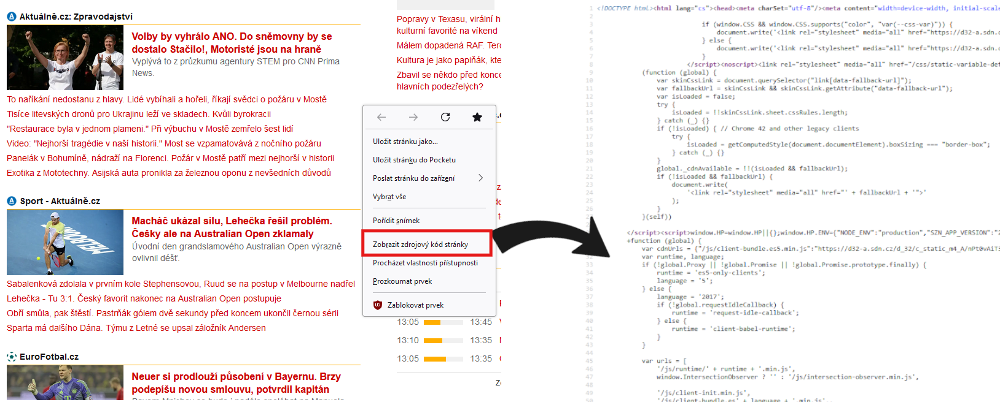
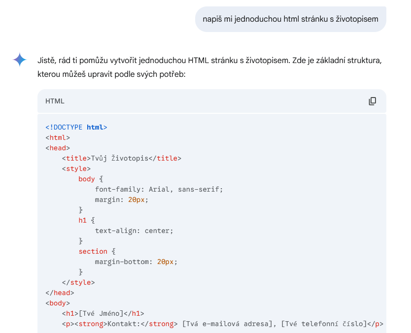
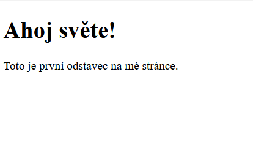
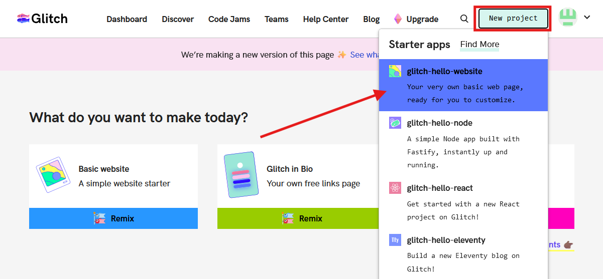
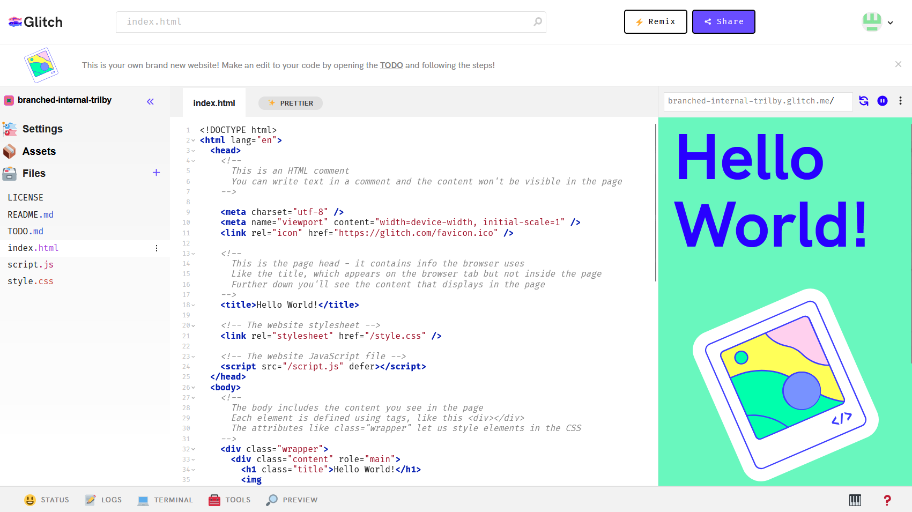
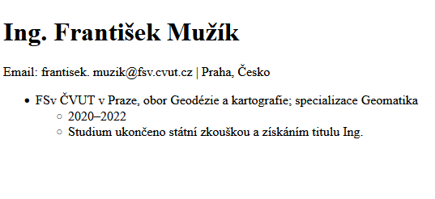
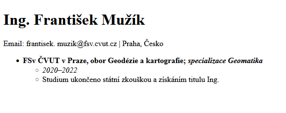
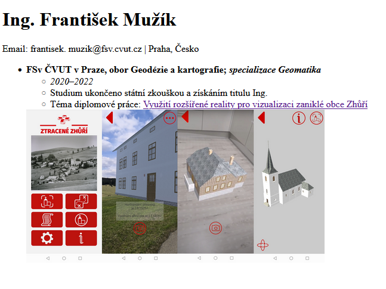
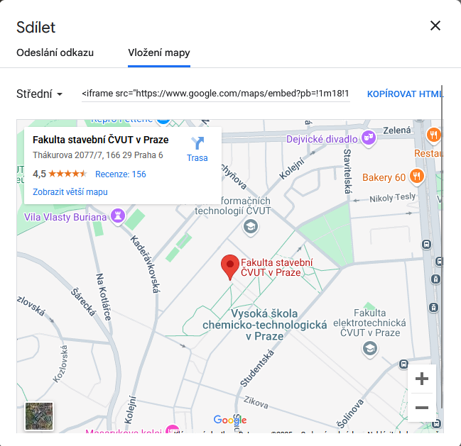
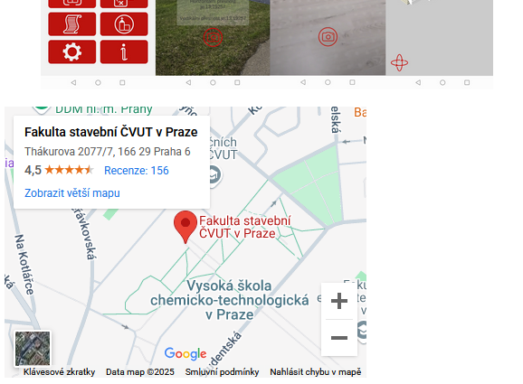

## Základní popis tvorby webové stránky

Každá stránka je na disku nebo na serveru uložena ve formě zdrojového kódu. Ten kód je psaný v jazyce HTML.

Kód HTML se upravuje pomocí editoru. V tomto cvičení se seznámíme s webovým prostředím [Glitch](https://glitch.com/), nicméně po většinu semestru budeme pracovat ve [VS Code](https://code.visualstudio.com/). Zdrojový kód se uchovává na disku, ze kterého je otevřen v prohlížeči.

**Stránka se skládá ze 3 základních částí kódu:**

- **HTML (HyperText Markup Language)**
    - definice základní struktury stránky
    - využití značkového zápisu (tagy) pro označení různých částí stránky(např. `<h1>`, `<p>`, ``) 

        ```html
        <h1>Moje první webová stránka</h1>
        <p>Toto je odstavec textu.</p>

        <!-- Toto je komentář v html-->
        
        ```

- **CSS (Cascading Style Sheets)**
    - editace stylu stránky
    - definice barev, typů písma, fontů, velikostní či rozložení
    - CSS kód může být vložen přímo do HTML nebo na něj lze odkázat a udržovat kód v odděleném souboru
    - kaskádové styly
        ```css
        /* Toto je komentář v CSS */
        body {
        background-color: lightblue;
        }

        h1 {
        color: navy;
        text-align: center;
        }
        ```
    

- **JavaScript**
    - přidává do webové stránky dynamiku a interaktivitu
    - Umožňuje reagovat na uživatelské akce (kliknutí, pohyb myši), měnit obsah stránky a vytvářet animace

        ```js
        // Toto je komentář v JS
        function zmenBarvu() {
        document.body.style.backgroundColor = "pink";
        }
        ```

???+ note "&nbsp;<span style="color:#448aff">Zobrazení zdrojového kódu stránky</span>"
    Pokud si chceme prohlédnout zdrojový kúd dané stránky, stačí kliknout pravým tlačítkem a zobrazit zdrojový kód v novém okně. 

    Pro pokročilejší zobrazení včetně konzole a vývojářských nastavení vyvoláme stiskem klávesy **F12**. 

    <figure markdown>
    { width="800" }
        <figcaption>Zobrazení zdrojového kódu stránky</figcaption>
    </figure>

## Popis HTML
HTML (Hypertext Markup Language), je **hypertextový značkovací jazyk** určený k vytváření jednoduchých webových stránek. Od přelomu 80. a 90. let je vyvíjen a nepřetržitě používán. Aktuálně využívaná verze je HTML 5.

Společně s jazykem HTML vznikl **HTTP protokol**, který zajišťuje komunikaci mezi servery a přenosy souborů. Zabezpečená verze protokolu **HTTPS** je novější verze zajišťující komunikaci mezi webovým serverem a počítačem. Oproti původní verzi HTTP **šifruje přenášená data**, čímž **snižuje riziko zneužití** osobních údajů nebo odposlech komunikace.

HTML kód se z velké části skládá z tagů, neboli definovaných značek. Tagům přiřazujeme atributy a hodnoty, jež jednotlivým prvkům stránky přikládají určitou roli. Prostřednictvím HTML tagů tak například určujeme, kde budou odkazy a kam budou odkazovat nebo kde bude obrázek a odkud je bude prohlížeč čerpat.

Tagy se vládají do špičatých závorek, přičemž je dělíme na párové a nepárové.

- **párové tagy**, se kterými se setkáme nejčastěji, musejí být ukončeny lomítkem a původním tagem
    ```html
    <h1> Toto je nadpis </h1> 
    ```

- **nepárové tagy** ukončení druhým tagem nepotřebují
    ``` html
     
    ```

Tagy je do sebe možné vzájemně vkládat, přičemž důležité je dbát na správnou syntax, čitelnost kódu a nezapomínat párové tagy ukončovat.
```html
<header>
    <h1>Ing. František Mužík</h1>
</header>
```

???+ note "&nbsp;<span style="color:#448aff">Využití AI pro usnadnění psaní HTML</span>"
    Psaní HTML kódu je ideální příležitostí pro uplatnění umělé inteligence ([ChatGPT](https://chatgpt.com/), [Gemini](https://gemini.google.com)). 
    
    Tyto nástroje pomáhají v hledání chyb nebo třeba pro vygenerování základní struktury stránky, kterou lze dále upavit pomocí vlastních znalostí. 

    **AI nenahradí vaše znalosti, pouze pomůže v jejich efektivnější aplikaci!**

    <figure markdown>
    { width="600" }
        <figcaption>Ukázka návrhu jednoduché HTML stránky pomocí AI Gemini</figcaption>
    </figure>

### Základní struktura webové stránky v html
```html
<!DOCTYPE html> <!-- Deklarace typu dokumentu -->
<html> <!-- Kořenový element, který zastřešuje celý dokument -->
<head> <!-- Hlavička určující metadata. Typicky obsahuje, scripty, odkaz na CSS či titulek -->
    <meta charset="UTF-8"> <!-- Kódování textu -->
    <meta name="viewport" content="width=device-width, initial-scale=1.0">
    <title>Moje první HTML stránka</title> <!-- Titulek stránky zobrazený v názvu okna -->
</head>
<body> <!-- Zde je zapsán obsah stránky -->

    <h1>Ahoj světe!</h1> <!-- Nadpis -->
    <p>Toto je první odstavec na mé stránce.</p> <!-- Odstavec textu -->

</body>
</html>
```

<figure markdown>
{ width="400" }
    <figcaption>Obsah webové stránky vytvořený kódem výše</figcaption>
</figure>

## Popis prostředí Glitch
[Glitch.com](https://glitch.com/) je online platforma, která umožňuje snadno vytvářet, upravovat a sdílet webové projekty. V podstatě se jedná o online editor, ve kterém lze psát kód, vidět výsledky okamžitě a dokonce spolupracovat s ostatními. 

Po registraci vytvoříme nový projekt stisknutím tlačítka *New project* -> možnost *glitch-hello-website*.

Veškeré naše projekty najdeme na hlavní stránce v záložce *Dashboard*.

<figure markdown>
{ width="800" }
    <figcaption>Obsah webové stránky vytvořený kódem výše</figcaption>
</figure>

Po vygenerování stránky je možné v záložce *Settings* -> *Edit project details* změnit její název na něco rozumného, přičemž stránka vždy bude hostovaná na doméně Glitch a odkaz bude vypadat zhruba takto: <https://muj-test.glitch.me/>

V levé části stránky se nacházejí záložky *Settings* (nastavení), *Assets* (sem se umisťují využité soubory - např. obrázky) a *Files* (pracovní soubory).

V prostřední části se zobrazuje editor kódu a v pravé se zobrazuje výsledek v podobě náhledu stránky. Pokud není náhled zobrazený, zapneme ho tlačítkem *Preview* v dolní části obrazovky. Úpravy se ukládají automaticky.

<figure markdown>
{ width="800" }
    <figcaption>Editace stránky v prostředí Glitch</figcaption>
</figure>

## Tvorba webové stránky s vlastním životopisem

Začneme základním kódem, který následně rozvineme.

``` html
<!DOCTYPE html> 
<html> 
<head> 
    <meta charset="UTF-8"> 
    <meta name="viewport" content="width=device-width, initial-scale=1.0">
    <title>Moje první HTML stránka</title> 
</head>
<body> 

    <h1>Ahoj světe!</h1> 
    <p>Toto je první odstavec na mé stránce.</p> 

</body>
</html>
```

#### 1) Strukturování obsahu pomocí tagů

Využijeme tagů pro naplnění životopisu obsahem. Pro jméno využijeme ```<h1>```, dále pro text bude určen tag ```<p>```. Vše vpisujeme do tagu ```<body>```.

```html
...
<body> 

    <h1>Ing. František Mužík</h1> 
    <p>Email: frantisek. muzik@fsv.cvut.cz | Praha, Česko</p> 

</body>
...
```

Dále doplníme sekci ```<section>``` se vzděláním vzdělání, ve které využijeme tagu  ```<h2>``` pro jednotlivé nadpisy a odrážek pro popis. 

Pro popis využijeme nečíslovaný seznam (unordered list) ```<ul>```, do kterého vkládáme jednotlivé položky tagem ```<li>```. Jestliže chceme vytvořit další odskočenou řádku v seznamu, použijeme znovu předešlé tagy. Je velmi důležité dodržovat pořádek v hierarchii, jinak se v kódu lze rychle ztratit.

```html
...
<body>
<h1>Ing. František Mužík</h1>
<p>Email: frantisek. muzik@fsv.cvut.cz | Praha, Česko</p>

<section>
    <ul>
    <li>
        FSv ČVUT v Praze, obor Geodézie a kartografie; specializace Geomatika
        <ul>
        <li>2020–2022</li>
        </ul>
        <ul>
        <li>Studium ukončeno státní zkouškou a získáním titulu Ing.</li>
        </ul>
    </li>
    </ul>
</section>
</body>
...
```

<figure markdown>
{ width="400" }
    <figcaption>Výsledek kompilovaného kódu se seznamy</figcaption>
</figure>

#### 2) Změna stylu písma

Pokud chceme nějakou část textu zvýraznit, případně upravit kurzívou, pak opět využijeme příslušné tagy.

- tučné písmo: ```<b>``` 

- kurzíva: ```<i>```

- zalomení řádku: ```<br>```

```html
...
<body>
<h1>Ing. František Mužík</h1>
<p>Email: frantisek. muzik@fsv.cvut.cz | Praha, Česko</p>

<section>
    <ul>
    <li>
        <b>FSv ČVUT v Praze, obor Geodézie a kartografie; <i>specializace Geomatika</i> </b>
        <ul>
        <li> <i>2020–2022</i> </li>
        </ul>
        <ul>
        <li>Studium ukončeno státní zkouškou a získáním titulu Ing.</li>
        </ul>
    </li>
    </ul>
    
</section>
</body>

...
```

<figure markdown>
{ width="400" }
    <figcaption>Výsledek kompilovaného kódu se seznamy</figcaption>
</figure>

#### 2) Přidání odkazů a obrázku

Do webové stránky lze jednoduše přidat odkazy na jinou stránku či obrázek. Na obrázek je možné odkazovat jak přes jeho umístění na disku, tak přes odkaz na webu.

Odkaz na webovou stránku přidáme pomocí tagu ```<a>```.

```  <a href="https://geomatics.fsv.cvut.cz/">Webové stránky katedry geomatiky</a>  ```

Obrázek se přidává tagem ``````, ve kterém lze upravit popis obrázku či jeho velikost v pixelech. 

```  ```

Implementace v životopise může tedy vypadat následovně:

```html
...
<section>
    <ul>
    <li>
        <b
        >FSv ČVUT v Praze, obor Geodézie a kartografie;
        <i>specializace Geomatika</i>
        </b>
        <ul>
        <li><i>2020–2022</i></li>
        </ul>
        <ul>
        <li>Studium ukončeno státní zkouškou a získáním titulu Ing.</li>
        </ul>

        <ul>
        <li>Téma diplomové práce:
        <a href="https://dspace.cvut.cz/handle/10467/102826" alt="Zhůří"
            >Využití rozšířené reality pro vizualizaci zaniklé obce Zhůří</a>
        </li>
        </ul>
    </li>
    
    </ul>
</section>
...
```

<figure markdown>
{ width="600" }
    <figcaption>Přidání odkazů a obrázků</figcaption>
</figure>


#### 3) Doplnění stránky o interaktivní mapu

Do životopisu můžeme dále přidat jednoduchou interaktivní mapu s lokalitou FSv ČVUT z Google Maps. V tuto chvíli tedy nebudeme tvořit vlastní aplikaci, jen využijeme ```<embed>```, což je kontejner pro externí prvky (např. webovou stránku, přehrávač médií či mapu).

Na [Google Maps](https://www.google.com/maps) vyhledáme FSv ČVUT v Praze, klikneme na tlačítko *Sdílet* a vybereme záložku *Vložení mapy*.

<figure markdown>
{ width="400" }
    <figcaption>Sdílení výřezu Google Maps do HTML</figcaption>
</figure>

Vybereme velikost mapy a zkopísujeme vygenerovaný HTML kód. Ten vložíme na požadované místo do body.

```html
...
<iframe
    src="https://www.google.com/maps/embed?pb=!1m18!1m12!1m3!1d2559.044009632525!2d14.386225475700655!3d50.1041832122365!2m3!1f0!2f0!3f0!3m2!1i1024!2i768!4f13.1!3m3!1m2!1s0x470b953bc00ed77d%3A0x43d70d04924c48ed!2sFakulta%20stavebn%C3%AD%20%C4%8CVUT%20v%20Praze!5e0!3m2!1scs!2scz!4v1736791843368!5m2!1scs!2scz"
    width="400"
    height="300"
    style="border: 0"
    allowfullscreen=""
    loading="lazy"
    referrerpolicy="no-referrer-when-downgrade"
></iframe>
...
```

<figure markdown>
{ width="400" }
    <figcaption>Vložená mapa ve stránce</figcaption>
</figure>

???+ note "&nbsp;<span style="color:#448aff">Užitečné odkazy</span>"
    - základy HTML: <https://www.w3schools.com/html/html_basic.asp>

    - další základy HTML: <https://www.jakpsatweb.cz/zaklady-html.html>

    - a do třetice: <https://www.rascasone.com/cs/blog/html-pro-zacatecniky-jak-psat-web>

    - seznamy: <https://www.jakpsatweb.cz/html/seznamy.html>

    - formátování textu: <https://www.w3schools.com/html/html_formatting.asp>

