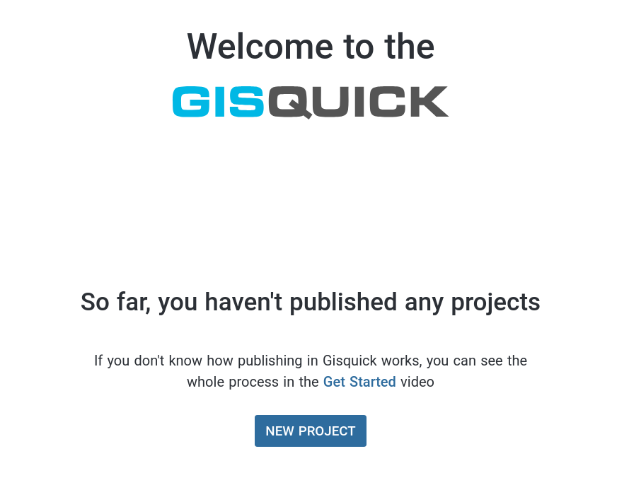
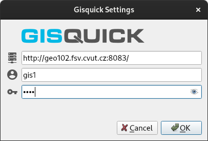
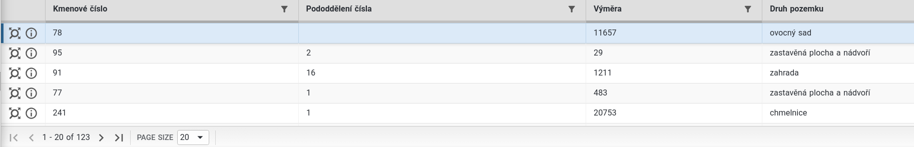

- [**QGIS**](https://qgis.org) – jeden z nejpoužívanějších open source GIS nástrojů v praxi
- [**Gisquick**](https://gisquick.org/) – jedna z volně dostupných publikačních open source platforem pro QGIS

## Příprava projektu v QGIS

Nejprve musíme připravit základní projekt v QGIS. V ideálním případě si připravíme několik vektorových vrstev a připojenou WMS vrstvu.

## Publikace projektu

Podklady: [dokumentace Gisquick](https://gisquick.readthedocs.io)

!!! warning "Důležité"

    Pro účel výuky budeme používat vlastní instanci publikačního serveru Gisquick provozované na **<http://geo102.fsv.cvut.cz:8083/>**.

Po [přihlášení](http://geo102.fsv.cvut.cz:8083/user/) se objeví profil uživatele:

Vytvoříme nový projekt. Objeví se žádost o instalaci zásuvného modulu:

!!! note "Poznámka"

    Pokud se výše uvedená stránka neobjeví, tak ji najdete na <https://gisquick.org/plugin/>

Při instalaci postupuje podle [návodu](https://gisquick.readthedocs.io/en/latest/user-manual/before-publishing.html#qgis-gisquick-plugin) v dokumentaci Gisquick.

Jelikož pracujeme v projektu s formátem GeoPackage, tak nainstalujeme
verzi zásuvného modulu Gisquick s podporou dbhash. Tato verze
zásuvného modulu zamezí znovu nahrávání datových zdrojů ve formátu
GeoPackage například při změně viditelnosti vrstvy.

Poté se pomocí zásuvného modulu přihlásíme do prostředí publikační
platformy Gisquick (`Web > Publish in Gisquick`). 

Do publikačního prostředí platformy Gisquick nás přesměruje tlačítko `Open Browser`:

Po vytvoření projektu se objeví úvodní formulář se seznamem vrstev určených k publikaci:

Nejprve opravíme případné chyby (`Manage Layers Names` > `Generate Names` > `Update QGIS Project`):

Dále povolíme WFS, abychom umožnili uživateli se dotazovat na vektorové vrstvy:

Datové vrstvy nahrajeme na publikační server:

Nastavíme titulek projektu:

Projdeme jednotlivá nastavení projektu:

A provedeme následující změny v nastavení:

- prostorový rozsah nastavíme z vrstvy "Obce":

    
- nastavíme vhodnou měřítkovou sadu:

    

- v záložce `Layers` přesuňte vrstvy ze skupiny "WMS" do `Base Layers` (je nutné přesunout celou skupinu)

!!! tip "Tip pro pokročilé uživatele"

    Ke zrychlení načítání vrstev může dojít při vhodně zvolené měřítkové sadě dle [specifikace ČÚZK](https://geoportal.cuzk.cz/Dokumenty/Dlazdicove_sluzby_CR_v1.1.pdf). Případně lze použít WMTS s měřítkovou sadou Google Maps.
    

A připravený projekt publikujeme (`Publish`). Po publikaci projektu se objeví tlačítko

které nás přesměruje do mapové aplikace:

!!! tip

    Ve výchozím nastavení je projekt nastaven jako soukromý. Toto nastavení lze změnit v `Permissions`:
    
    

#### Další nastavení projektu

Zkusme změnit následující nastavení projektu:
    
- skryjeme CSV tabulky v záložce `Layers`

- nastavíme viditelnost zvolených atributů u vrstvy "Parcely" (kmenové
  číslo, pododdělení čísla, výměra a druh pozemku)
  
Nejprve v QGISu nastavíme u zvolených atributů aliasy (`Attributes Form` ve vlastnostech vrstvy).

Změny v QGIS projektu uložíme. V nastavení Gisquick projektu provedeme aktualizaci.

Viditelnost atributů nastavíme z záložce `Layers`.

Po uložení změn (`Save`) znovu načteme mapovou aplikaci.

Po uložení změn se mezi podkladovými vrstvami jednoduše přepínat.

Ukázkovou mapovou aplikaci najdete na adrese <http://geo102.fsv.cvut.cz:8083/?PROJECT=gis1/cv10>