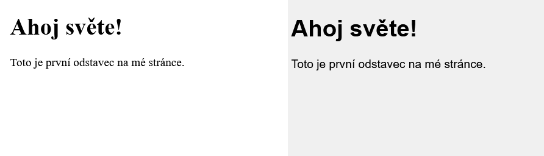
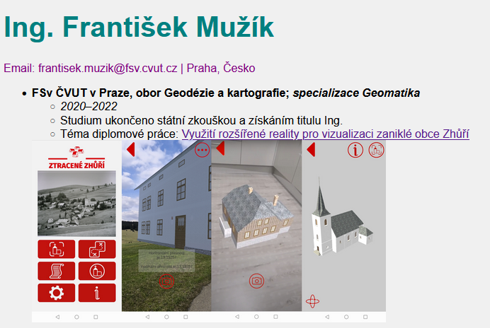
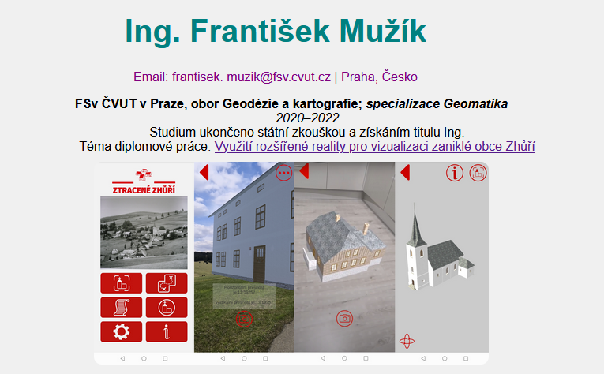

Náplň tohoto cvičení navazuje na [předchozí cvičení](https://k155cvut.github.io/weka/cviceni/cviceni1/#tvorba-webove-stranky-s-vlastnim-zivotopisem).

### Základ CSS
- editace stylu stránky
- definice barev, typů písma, fontů, velikostní či rozložení
- CSS kód může být vložen přímo do HTML nebo na něj lze odkázat a udržovat kód v odděleném souboru
- kaskádové styly
    ```css
    /* Toto je komentář v CSS */
    body {
    background-color: lightblue;
    }

    h1 {
    color: navy;
    text-align: center;
    }
    ```

### Zápis CSS
Jestliže máme HTML kód:
```html
<h1>Text</h1>
```

Jemuž upravujeme styl pomocí CSS:
```css
h1 {
  color: red;
}
```

Pak platí, že: 

- **```h1```** je tzv. **CSS selektor**, který vybere prvek na stránce. Pomocí tohoto selektoru jsou vybrány všechny tagy (značky) na stránce.

- **```{}```** složené závorky, které obalují zápis stylu pro daný selektor

- **```color```** je **CSS vlastnost** upravující barvu

- **```:```** dvojtečkou se přiřazuje hodnota CSS vlastnosti

- **```red```** je **CSS hodnota** přiřazená k vlastnosti před dvojtečkou

- **```;```** středník odděluje více párů *vlastnost–hodnota*; za poslední dvojicí se psát nemusí, ale je lepší na něj nezapomínat

**Úprava stylu stránky pomocí CSS může být k HTML souboru připojena dvěma způsoby:**

- **přímo součástí kódu** - využití tagu ```<style>```
```html
<!DOCTYPE html> 
<html> 
<head> 
    <meta charset="UTF-8"> 
    <meta name="viewport" content="width=device-width, initial-scale=1.0">
    <title>Moje první HTML stránka</title> 
    <style>
      body {
        font-family: Arial, sans-serif;
        background-color: #f0f0f0;
        }
    </style>
</head>
<body> 

    <h1>Ahoj světe!</h1> 
    <p>Toto je první odstavec na mé stránce.</p> 

</body>
</html>
```

- **v odděleném souboru** -> vložení do HTML přes referenci

    HTML kód:
```html
<!DOCTYPE html> 
<html> 
<head> 
    <meta charset="UTF-8"> 
    <meta name="viewport" content="width=device-width, initial-scale=1.0">
    <title>Moje první HTML stránka</title> 
    <link rel="stylesheet" href="style.css">

</head>
<body> 

    <h1>Ahoj světe!</h1> 
    <p>Toto je první odstavec na mé stránce.</p> 

</body>
</html>
```

    CSS kód:
```css
body {
  font-family: Arial, sans-serif;
  background-color: #f0f0f0;
  }
```

<figure markdown>
{ width="600" }
    <figcaption>Rozdíl mezi stránkou bez využití CSS (vlevo) a s editací stylu pomocí CSS (vpravo).</figcaption>
</figure>

Výsledek bude stejný. Pokud budeme styl upravovat pouze málo, stačí zápis přímo v HTML. Jestliže ale chceme editaci stylu v CSS rozepsat více, je vhodnější vytvoření samostatného souboru. Mimo přehlednosti pak můžeme jeden CSS soubor připojit k více HTML souborům, čímž můžeme zachovat stejný styl napříč několika stránkami.

Pokud je třeba, lze změnit pouze styl v určitém HTML tagu, ale takový kód se špatně udržuje.

```html
<h1 style="color: red">Červený text</h1>
```
#### 1) Úprava CSS v životopise

Pro editaci stylu v životopise zvolíme možnost psaní CSS kódu v samostatném souboru. Do HTML jej tedy připojíme odkazem na zdrojový soubor skrze tag ```<link>```.
```html
...
<head>
    <meta charset="UTF-8" />
    <meta name="viewport" content="width=device-width, initial-scale=1.0" />
    <title>Životopis</title>
    <link rel="stylesheet" href="style.css">
</head>
...
```

V CSS souboru změníme font, barvu pozadí a barvu textu. Pro určení HTML kódu barvy můžeme použít [online nástroje](https://www.w3schools.com/colors/colors_picker.asp). [Základní barvy](https://www.jakpsatweb.cz/archiv/barvy-zakladni.html) je možné zadávat pomocí RGB kódu či jménem.

Například <span style="color:red">červenou</span> barvu lze zapsat jako ```color: red``` nebo ```color: #FF0000```.

Upravený CSS soubor ```style.css``` bude vypadat následovně:
```css
body {
  font-family: Arial, sans-serif;
  background-color: #f0f0f0;
  }

h1 {
  color: #008080;
  font-size: 40px;
}

p {
  color: #800080;
}
```

<figure markdown>
{ width="600" }
    <figcaption>Užití editace stylu CSS</figcaption>
</figure>


#### 2) Pokročilejší úpravy

Stránku můžeme upravit dle našich preferencí celou řadou způsobů. Níže je doplnění CSS kódu o vypnutí značek pro odrážky, vystředění textu, zaoblení obrázku a jeho oddělení od textu.

```css
body {
  font-family: Arial, sans-serif;
  background-color: #f0f0f0;
  text-align: center;
  }

h1 {
  color: #008080;
  font-size: 40px;
}

p {
  color: #800080;
}

ul {
  list-style-type: none;
}

img {
  padding: 10px;
  border-radius: 20px;
}
```

<figure markdown>
{ width="600" }
    <figcaption>Další editace stylu CSS</figcaption>
</figure>


???+ note "&nbsp;<span style="color:#448aff">Užitečné odkazy</span>"
    - základy CSS: <https://jecas.cz/css-zaklady>

    - úpravy obrázků: <https://www.w3schools.com/css/css3_images.asp>

<br><br>

# Úvod do JavaScriptu

JavaScript je dynamicky typovaný skriptovací jazyk, který se používá k přidání interaktivních a dynamických prvků na webové stránky. Díky JavaScriptu můžeme vytvářet webové aplikace, hry, animace a mnoho dalšího. Je to jeden z nejpoužívanějších programovacích jazyků na světě a jeho znalost je pro webové vývojáře nezbytná.

JavaScript se spouští v prohlížeči a umožňuje manipulovat s obsahem a vzhledem webové stránky. Jeho hlavní síla spočívá v tom, že dokáže reagovat na akce uživatele, měnit obsah stránky v reálném čase a komunikovat s webovým serverem bez nutnosti opětovného načítání celé stránky. To otevírá dveře k tvorbě moderních a dynamických webových aplikací, které se chovají podobně jako desktopové aplikace.

**Mezi typické úlohy, které JavaScript řeší, patří:**

- Změna obsahu stránky: Zobrazování a skrývání prvků, aktualizace textu, animace.
- Reakce na události: Kliknutí myší, najetí kurzorem, stisk klávesy, odeslání formuláře.
- Validace formulářů: Kontrola vstupních dat od uživatele, např. zda je emailová adresa platná.
- Animace a efekty: Vytváření animací, přechodů a dalších vizuálních efektů.
- Komunikace s webovým serverem: Načítání dat ze serveru (např. aktualizace novinek), odesílání dat na server (např. ukládání formuláře).

JavaScript je klíčovou technologií pro moderní web a jeho znalost je pro webové vývojáře nezbytná. Díky JavaScriptu můžeme vytvářet webové aplikace, které jsou interaktivní, dynamické a uživatelsky přívětivé.

### Základní syntaxe
Syntaxe JavaScriptu je podobná jazyku C a Java. Kód se píše do souborů s příponou .js, které se pak vkládají do HTML stránky pomocí tagu &lt;script&gt;.

```html
    <!DOCTYPE html>
    <html>
    <head>
      <title>Moje stránka</title>
    </head>
    <body>

      <h1>Ahoj světe!</h1>

      <script src="mujSkript.js"></script>

    </body>
    </html>
```    

V tomto příkladu je soubor *mujSkript.js* vložen do HTML stránky a bude se spouštět v prohlížeči.

### Proměnné
Proměnné se používají pro ukládání dat. Deklarují se pomocí klíčového slova let, const (pro konstantní hodnoty) nebo var (starší způsob). Názvy proměnných by měly být popisné a psané v camelCase notaci (např. mojePromenna).

```js
let mojePromenna = "Ahoj!";
const PI = 3.14159;
var starsiPromenna = 123;
```

### Datové typy
JavaScript má dynamické typování, což znamená, že typ proměnné se určuje automaticky podle hodnoty, kterou do ní uložíme. JavaScript má několik datových typů, jako například:

**Number (čísla):** Používají se pro ukládání číselných hodnot.

```js
let cislo = 123;
let desetinneCislo = 3.14;
```

**String (textové řetězce):** Používají se pro ukládání textu. Text se uzavírá do uvozovek nebo apostrofů.

```js
    let text = "Ahoj světe!";
    let jmeno = 'Jan';
```

**Boolean (logické hodnoty):** Mohou nabývat dvou hodnot: true (pravda) nebo false (nepravda). Používají se pro logické operace a podmínky.

```js
    let pravda = true;
    let nepravda = false;
```

**Object (objekty):** Objekty jsou kolekce vlastností (klíč-hodnota). Vlastnosti mohou být různého datového typu.

```js
let osoba = {
jmeno: "Jan",
vek: 30,
mesto: "Praha"
};
```

**Array (pole): **Pole jsou kolekce prvků stejného datového typu.

```js
let cisla = [1, 2, 3, 4, 5];
let jmena = ["Jan", "Petr", "Lucie"];
```

**Null (prázdná hodnota):** Reprezentuje úmyslnou neexistenci objektu.

```js
let nic = null;
```

**Undefined (nedefinovaná hodnota): **Proměnná, která nebyla inicializována, má hodnotu undefined.

```js
let nedefinovanaPromenna;
```

### Operátory
JavaScript podporuje různé operátory pro práci s daty:

**Aritmetické operátory:** + (sčítání), – (odčítání), * (násobení), / (dělení), % (modulo – zbytek po dělení)

```js
let soucet = 5 + 3; // 8
let rozdil = 10 - 4; // 6
let soucin = 2 * 7; // 14
let podil = 15 / 3; // 5
let zbytek = 10 % 3; // 1
```

**Porovnávací operátory:** == (rovná se), != (nerovná se), === (striktně rovná se), !== (striktně nerovná se), > (větší než), < (menší než), >= (větší nebo rovno), <= (menší nebo rovno)

```js
let a = 5;
let b = 3;
console.log(a == b); // false
console.log(a > b); // true
console.log(a !== 5); // false
```

**Logické operátory:** && (logický AND - a zároveň), || (logický OR - nebo), ! (logický NOT - negace)

```js
let x = true;
let y = false;
console.log(x && y); // false
console.log(x || y); // true
console.log(!x); // false
```

**Přiřazovací operátory:** = (přiřazení), += (přičtení a přiřazení), -= (odečtení a přiřazení), *= (násobení a přiřazení), /= (dělení a přiřazení)

```js
let cislo = 10;
cislo += 5; // cislo je nyní 15
cislo *= 2; // cislo je nyní 30
```

### Podmínky
Podmínky (if, else if, else) se používají pro rozhodování a řízení toku programu. Podle splnění (nebo nesplnění) podmínky se provede odpovídající blok kódu.

```js
let vek = 20;

if (vek >= 18) {
  console.log("Jsi dospělý.");
} else {
  console.log("Nejsi dospělý.");
}
```
V tomto příkladu se vypíše "Jsi dospělý.", protože proměnná vek má hodnotu 20, což je větší nebo rovno 18.

### Cykly
Cykly (for, while, do...while) se používají pro opakované provádění bloku kódu.

**for cyklus:** Používá se, když předem víme, kolikrát se má cyklus opakovat.

```js
for (let i = 0; i < 5; i++) {
  console.log(i); // Vypíše 0, 1, 2, 3, 4
}
```

**while cyklus:** Používá se, když předem nevíme, kolikrát se má cyklus opakovat, a opakuje se, dokud je podmínka splněna.

```js
let i = 0;
while (i < 5) {
  console.log(i); // Vypíše 0, 1, 2, 3, 4
  i++;
}
```

**do...while** cyklus: Podobný jako while cyklus, ale blok kódu se provede alespoň jednou, i když podmínka není splněna.

```js
let i = 0;
do {
  console.log(i); // Vypíše 0, 1, 2, 3, 4
  i++;
} while (i < 5);
```

### Funkce
Funkce jsou bloky kódu, které se dají opakovaně volat. Definují se pomocí klíčového slova function.

```js
function pozdrav(jmeno) {
  console.log("Ahoj, " + jmeno + "!");
}

pozdrav("Jano"); // Vypíše "Ahoj, Jano!"
pozdrav("Petře"); // Vypíše "Ahoj, Petře!"
```

V tomto příkladu je definována funkce pozdrav, která bere jeden parametr jmeno a vypíše pozdrav s daným jménem. Funkce se pak dvakrát volá s různými argumenty.

### Objekty
Objekty jsou kolekce vlastností (klíč-hodnota). Vlastnosti mohou být různého datového typu.

```js
let auto = {
  znacka: "Škoda",
  model: "Octavia",
  barva: "červená",
  rokVyroby: 2020
};

console.log(auto.znacka); // Vypíše "Škoda"
console.log(auto["model"]); // Vypíše "Octavia"

```

V tomto příkladu je definován objekt auto s vlastnostmi znacka, model, barva a rokVyroby. K vlastnostem objektu se přistupuje pomocí tečkové notace (např. auto.znacka) nebo pomocí hranatých závorek (např. auto["model"]).

### Pole
Pole jsou kolekce prvků stejného datového typu.

```js
let cisla = [1, 2, 3, 4, 5];

console.log(cisla[0]); // Vypíše 1
console.log(cisla.length); // Vypíše 5

cisla.push(6); // Přidá číslo 6 na konec pole
console.log(cisla); // Vypíše [1, 2, 3, 4, 5, 6]
```

V tomto příkladu je definováno pole cisla s pěti prvky. K prvkům pole se přistupuje pomocí indexu (např. cisla[0] pro první prvek). Vlastnost length vrací délku pole. Metoda push() přidává prvek na konec pole.

### Události
Události jsou akce, které se dějí na webové stránce, například kliknutí myší, najetí myší, odeslání formuláře atd. V JavaScriptu se dají definovat funkce, které se mají provést při dané události.


```html
<button onclick="zobrazAlert()">Klikni na mě</button>

<script>
function zobrazAlert() {
  alert("Kliknul jsi na tlačítko!");
}
</script>
```

V tomto příkladu je definováno tlačítko, které při kliknutí spustí funkci zobrazAlert(). Tato funkce zobrazí upozornění (alert) s textem "Kliknul jsi na tlačítko!".

### DOM (Document Object Model)
DOM je objektová reprezentace HTML dokumentu. V JavaScriptu se dá s DOM manipulovat pro změnu obsahu, struktury a stylu webové stránky.

```html
<p id="mujOdstavec">Toto je odstavec.</p>

<script>
let odstavec = document.getElementById("mujOdstavec");
odstavec.innerHTML = "Toto je **nový** text odstavce.";
</script>
```

V tomto příkladu je definován odstavec s id "mujOdstavec". JavaScript kód pak najde tento odstavec pomocí document.getElementById() a změní jeho obsah pomocí vlastnosti innerHTML.

### jQuery
jQuery je JavaScriptová knihovna, která zjednodušuje práci s DOM a událostmi.

```html
<head>
  <script src="https://code.jquery.com/jquery-3.5.1.min.js"></script>
</head>
<body>

  <button id="mojeTlacitko">Klikni na mě</button>

  <script>
  $(document).ready(function() {
    $("#mojeTlacitko").click(function() {
      alert("Kliknul jsi na tlačítko!");
    });
  });
  </script>

</body>
```

V tomto příkladu jQuery kód čeká, až se načte celá stránka ($(document).ready()), a pak přiřadí funkci k události kliknutí na tlačítko s id "mojeTlacitko".

### AJAX
AJAX je technika pro asynchronní komunikaci s webovým serverem. Umožňuje načítat a odesílat data bez nutnosti obnovení celé stránky.

```js
let xhr = new XMLHttpRequest();
xhr.open('GET', 'data.json', true);
xhr.onload = function() {
  if (xhr.status === 200) {
    let data = JSON.parse(xhr.responseText);
    // Zpracování dat
  }
};
xhr.send();
Tento kód vytvoří AJAX požadavek na server pro načtení souboru data.json. Po načtení dat se spustí funkce onload, která data zpracuje.
```

**JSON (JavaScript Object Notation)**
JSON je formát pro výměnu dat, který je založený na JavaScriptové syntaxi pro objekty.

```json
    {
      "jmeno": "Jan",
      "vek": 30,
      "mesto": "Praha"
    }
```
Tento JSON kód reprezentuje objekt s vlastnostmi jmeno, vek a mesto.


### Konzole prohlížeče
Většina webových prohlížečů má vestavěnou konzoli, která slouží k zobrazování chyb a ladění kódu.
Ladící nástroje: Prohlížeče mají i pokročilé ladící nástroje, které umožňují krokovat kód, nastavovat breakpointy a sledovat hodnoty proměnných.


**JavaScript je mocný nástroj pro webové vývojáře. S jeho pomocí můžeme vytvářet dynamické a interaktivní webové stránky a aplikace. Důležité je pochopit základní principy a syntaxe jazyka a následně se propracovávat ke složitějším konceptům a technikám.**

<hr>

!!! warning "K odevzdání"
    Do příštího cvičení vytvořte jednoduchou html stránku se svým životopisem, která bude hostována prostřednictvím platformy Glitch. Berte na vědomí, že vytřvořená stránka je veřejně přístupná. 

    Životopis by měl obsahovat následující prvky:

    - vaše jméno a příjmení včetně dosažených titulů

    - studium (včetně odkazů na závěrečné práce), znalost cizích jazyků

    - případné stáže, praxe v oboru

    - oborové zaměření

    - embed mapy, např. s okolím FSv ČVUT v Praze

    Ve výsledné webové stránce upravte styl pomocí CSS (změny např. textu, fontu, barev, pozadí stránky).

    Budeme rádi, pokud si zkusíte do stránky přidat i další volitelné prvky, např. foto, popis zájmů nebo něco zajímavého.

    Ukázka: <https://frantisek-muzik.glitch.me/>
