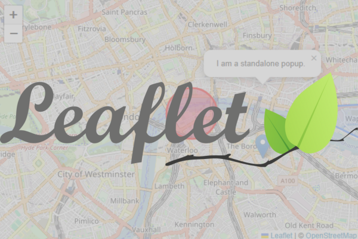
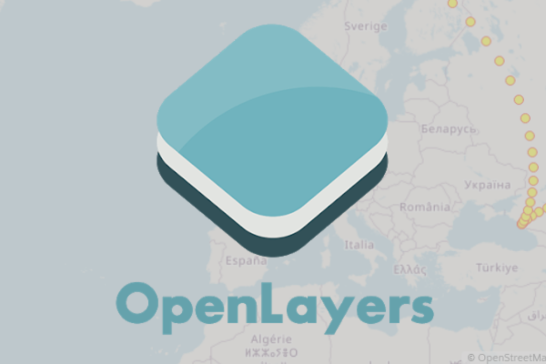
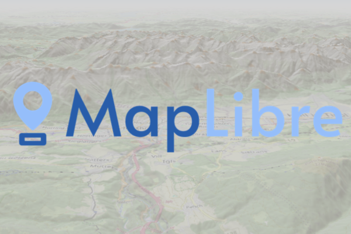
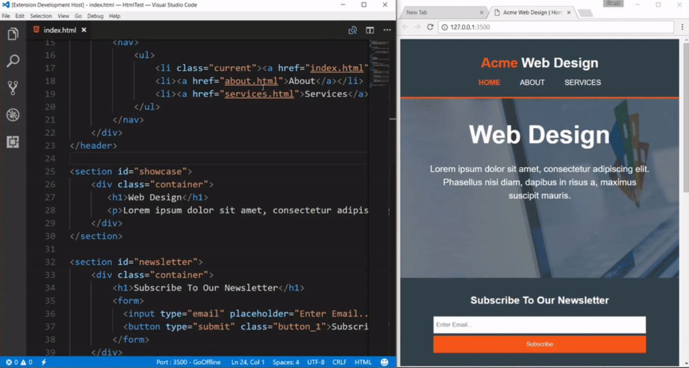
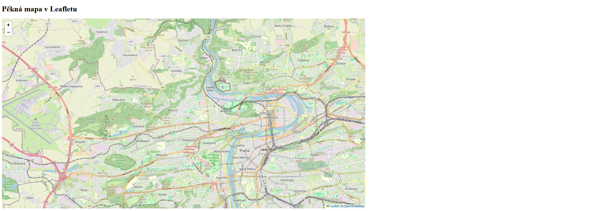
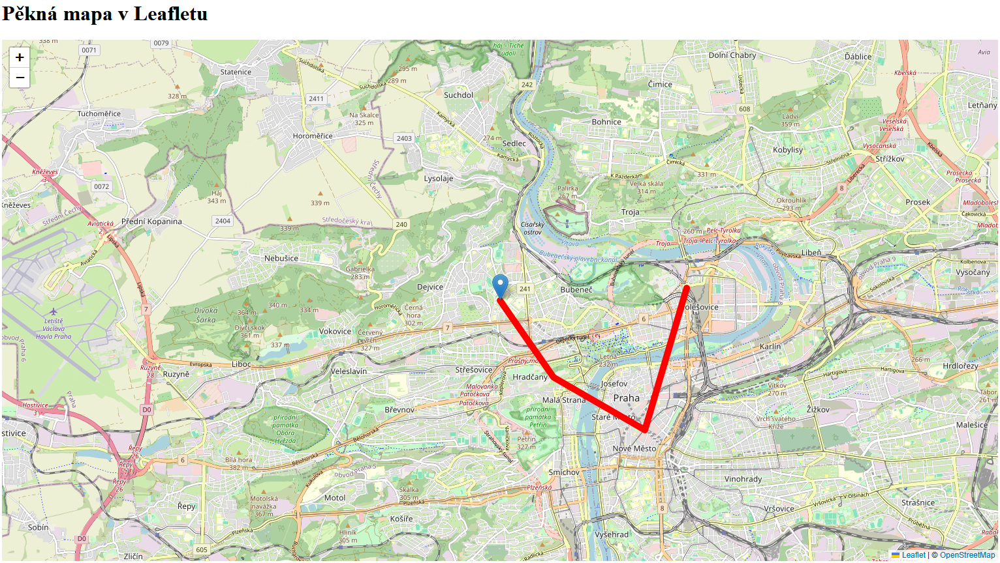
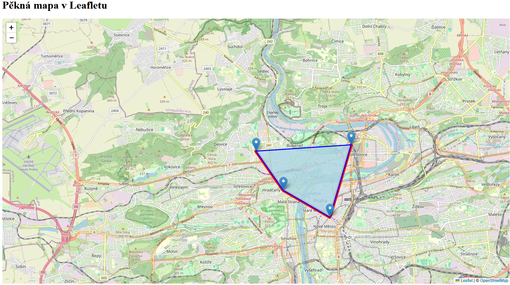

## Výběr nejoblíbenějších JS mapových knihoven

<div class="grid cards" markdown>

-   :simple-leaflet:{ .lg .middle height} __[Leaflet](https://leafletjs.com/)__

    ---

    Lehká a výkonná knihovna pro interaktivní mapy. 
    
    Je __jednoduchá na použití__ a vhodná pro většinu projektů.

    

-   :simple-openlayers:{ .lg .middle } __[Open Layers](https://openlayers.org/)__

    ---

    Výkonná knihovna pro vytváření dynamických aplikací. 
    
    Vhodná pro rozsáhlé a __komplexní GIS aplikace__.

    

-   :simple-maplibre:{ .lg .middle } __[MapLibre GL JS](https://maplibre.org/maplibre-gl-js/docs/)__

    ---

    Vykreslování interaktivních map pomocí __WebGL__.

    Ideální pro aplikace, které potřebují svižné 3D vizualizace a vlastní stylování map.

    

-   :simple-cesium:{ .lg .middle } __[CesiumJS](https://cesium.com/learn/cesiumjs-learn/)__

    ---

    Vhodná pro 3D aplikace či interaktivní analýzu terénu.  

    Perfektní pro aplikace, které vyžadují __realistickou 3D vizualizaci__.

    

</div>

## VS Code

Visual Studio Code (VS Code) je bezplatný a multiplatformní editor zdrojového kódu, který vyvinula společnost Microsoft. Je populární díky flexibilitě a podpoře široké škály programovacích jazyků.

Mezi výhody patří zvýraznění syntaxe, našeptávání při psaní, ladění kódu přímo z editoru a možnost instalace řady rozšíření (např. [Live Server](https://marketplace.visualstudio.com/items?itemName=ritwickdey.LiveServer)).


<figure markdown>
{ width="800" }
    <figcaption>Prostředí VS Code s ukázkou rozšíření Live server, díky kterému je možné sledovat změny kódu v reálném čase</figcaption>
</figure>

[Stažení VS Code :material-microsoft-visual-studio-code:](https://code.visualstudio.com/download){ .md-button .md-button--primary .center}
{: .button_array}

## Mapová aplikace v prostředí Leaflet

### 0) Příprava struktury souborů

Na disku si vytvoříme prázdnou složku, ve které budeme uchovávat veškeré soubory spojené s tímto cvičením (html, js a css soubory + např. obrázky pro ikony). Ideálně volíme umístění na vlastním disku H.

 - nový soubor ```index.html```

    ``` html
    <!DOCTYPE html> 
    <html> 
    <head> 
        <meta charset="UTF-8"> 
        <meta name="viewport" content="width=device-width, initial-scale=1.0">
        <link rel="stylesheet" href="style.css">
        <title>Moje první Leaflet mapa</title> 
    </head>
    <body> 

        <h1>Pěkná mapa v Leafletu</h1> 
        

    </body>
    </html>
    ```

- nový soubor ```script.js``` - zatím ponecháme prázdný

- nový soubor ```style.css``` - zatím ponecháme prázdný

### 1) Zobrazení jednoduchého mapového okna

Do souboru ```index.html``` je potřeba připojit knihovnu Leaflet v hlavičce souboru (*head*). Dále musíme v sekci *body* vložit mapové okno a připojit skript odkazující na ovládání mapy.

=== "index.html"

    ``` html
    ...
    <head> 
        ...

        <!-- Externí připojení CSS symbologie Leaflet -->
        <link rel="stylesheet" href="https://unpkg.com/leaflet@1.9.4/dist/leaflet.css"
        integrity="sha256-p4NxAoJBhIIN+hmNHrzRCf9tD/miZyoHS5obTRR9BMY="
        crossorigin=""/>

        <!-- Externí připojení JS knihovny -> vložit až po připojení CSS souboru -->
        <script src="https://unpkg.com/leaflet@1.9.4/dist/leaflet.js"
        integrity="sha256-20nQCchB9co0qIjJZRGuk2/Z9VM+kNiyxNV1lvTlZBo="
        crossorigin=""></script>

        ...
    </head>

    ...

    <body> 
        ...
        <!-- Vložení divu pro zobrazení mapového okna -->
        <div id="map"></div>

        <!-- Připojení JS scriptu ovládajícího mapové okno -->
        <script src="script.js"></script>

    </body>

    ```

Ve ```script.js``` vytvoříme proměnnou mapy, nastavíme její střed a úroveň přiblížení. Dále určíme podkladovou mapu, maximální úroveň přiblížení a popis datového zdroje.

=== "script.js"

    ``` js
    // Nastavení mapy, jejího středu a úrovně přiblížení
    var map = L.map('map').setView([50.104, 14.388], 13);

    // Určení podkladové mapy, maximální úrovně přiblížení a zdroje dat
    L.tileLayer('https://tile.openstreetmap.org/{z}/{x}/{y}.png', {
        maxZoom: 19,
        attribution: '&copy; <a href="http://www.openstreetmap.org/copyright">OpenStreetMap</a>'
    }).addTo(map);

    ```

Pomocí ```style.css``` upravíme velikost mapového okna dle potřeb.

=== "style.css"

    ``` css
    /* Velikost mapového okna */
    #map {
        height: 800px;
        width: 60%;
    }

    ```

<figure markdown>
{ width="1000" }
    <figcaption>Základní zobrazení mapového okna pomocí knihovny Leaflet</figcaption>
</figure>


??? note "&nbsp;<span style="color:#448aff">Stav kódu po dokončení kroku 1) Zobrazení jednoduchého mapového okna</span>"

    === "index.html"

        ``` html
        <!DOCTYPE html> 
        <html> 
        <head> 
            <meta charset="UTF-8"> 
            <meta name="viewport" content="width=device-width, initial-scale=1.0">
            <link rel="stylesheet" href="style.css">

            <!-- Externí připojení CSS symbologie Leaflet-->
            <link rel="stylesheet" href="https://unpkg.com/leaflet@1.9.4/dist/leaflet.css"
            integrity="sha256-p4NxAoJBhIIN+hmNHrzRCf9tD/miZyoHS5obTRR9BMY="
            crossorigin=""/>
            

            <!-- Externí připojení JS knihovny -> vložit až po připojení CSS souboru -->
            <script src="https://unpkg.com/leaflet@1.9.4/dist/leaflet.js"
            integrity="sha256-20nQCchB9co0qIjJZRGuk2/Z9VM+kNiyxNV1lvTlZBo="
            crossorigin=""></script>

            <title>Moje první Leaflet mapa</title> 
        </head>
        <body> 

            <h1>Pěkná mapa v Leafletu</h1> 

            <div id="map"></div>
            <script src="script.js"></script>

        </body>
        </html>
        ```

    === "script.js"

        ``` js
        // Nastavení mapy, jejího středu a úrovně přiblížení
        var map = L.map('map').setView([50.104, 14.388], 13);

        // Určení podkladové mapy, maximální úrovně přiblížení a zdroje dat
        L.tileLayer('https://tile.openstreetmap.org/{z}/{x}/{y}.png', {
            maxZoom: 19,
            attribution: '&copy; <a href="http://www.openstreetmap.org/copyright">OpenStreetMap</a>'
        }).addTo(map);
        ```

    === "style.css"

        ``` css
        /* Velikost mapového okna */
        #map {
            height: 800px;
            width: 60%;
        }

        ```

### 2) Vykreslení útvarů v mapě

Pomocí kódu je možné do mapy přidat body, linie či polygony různých tvarů. Data můžeme buď zadat manuálně nebo načíst ze souboru, např. z formátu [GeoJSON](https://en.wikipedia.org/wiki/GeoJSON). Tomu se budeme věnovat v příštím cvičení, nyní nám postačí ruční zadání.


Nejprve přidáme obyčejný marker, aneb bod v mapě. Například pro polohu FSv ČVUT v Praze, jejíž souřadnice vyčteme z Google Map. 

=== "script.js"

    ``` js
    // Bod zobrazující FSv ČVUT v Praze
    var marker = L.marker([50.104, 14.388]).addTo(map);

    ```

V kroku 3 budeme marker vylepšovat, ale nejprve zkusíme vykreslit obdobným způsobem linii a polygony.

Vykreslíme několik bodů na základě jejich souřadnic. Následně je spojíme do [polyline](https://leafletjs.com/reference.html#polyline). V dokumentaci najdeme také parametry vizualizace linie.

=== "script.js"

    ``` js
    // Body 
    var points = [
        [50.104, 14.388], // FSv ČVUT v Praze
        [50.091, 14.402], // Pražský hrad
        [50.082, 14.426], // metro Můstek
        [50.106, 14.437]  // vlak Praha Holešovice-zastávka
    ];

    // Linie propojující několik bodů 
    var line = L.polyline(points).addTo(map);

    ```

Následně zkusíme upravit barvu a styl linie spojující body.

=== "script.js"

    ``` js
    // Linie propojující několik bodů 
    var line = L.polyline(points, {color: "red", weight: 10}).addTo(map);

    ```

<figure markdown>
{ width="800" }
    <figcaption>Vykreslení bodu a linie</figcaption>
</figure>

Dále vytvoříme [polygon](https://leafletjs.com/reference.html#polygon) spojující zadané body a opět upravíme jeho styl s pomocí dokumentace.

=== "script.js"

    ``` js
    // Polygon se zadanými vrcholy
    var polygon = L.polygon(points, {color: "blue", weight: 3, fillColor: "lightblue", fillOpacity: "0.8"}).addTo(map);
    ```

Nově vytvořená vrstva (tedy níže v kódu) se v mapě vykreslí nad předchozí vrstvu. V tomto případě je tedy linie zobrazená pod polygonem.

<figure markdown>
{ width="800" }
    <figcaption>Vykreslení bodu a linie</figcaption>
</figure>


??? note "&nbsp;<span style="color:#448aff">Stav kódu po dokončení kroku 2) Vykreslení útvarů v mapě</span>"

    === "index.html - beze změny"

        ``` html
        <!DOCTYPE html> 
        <html> 
        <head> 
            <meta charset="UTF-8"> 
            <meta name="viewport" content="width=device-width, initial-scale=1.0">
            <link rel="stylesheet" href="style.css">

            <!-- Externí připojení CSS symbologie Leaflet-->
            <link rel="stylesheet" href="https://unpkg.com/leaflet@1.9.4/dist/leaflet.css"
            integrity="sha256-p4NxAoJBhIIN+hmNHrzRCf9tD/miZyoHS5obTRR9BMY="
            crossorigin=""/>
            

            <!-- Externí připojení JS knihovny -> vložit až po připojení CSS souboru -->
            <script src="https://unpkg.com/leaflet@1.9.4/dist/leaflet.js"
            integrity="sha256-20nQCchB9co0qIjJZRGuk2/Z9VM+kNiyxNV1lvTlZBo="
            crossorigin=""></script>

            <title>Moje první Leaflet mapa</title> 
        </head>
        <body> 

            <h1>Pěkná mapa v Leafletu</h1> 

            <div id="map"></div>
            <script src="script.js"></script>

        </body>
        </html>
        ```


    === "script.js"

        ``` js
        // Nastavení mapy, jejího středu a úrovně přiblížení
        var map = L.map('map').setView([50.104, 14.388], 13);

        // Určení podkladové mapy, maximální úrovně přiblížení a zdroje dat
        L.tileLayer('https://tile.openstreetmap.org/{z}/{x}/{y}.png', {
            maxZoom: 19,
            attribution: '&copy; <a href="http://www.openstreetmap.org/copyright">OpenStreetMap</a>'
        }).addTo(map);

        // Bod zobrazující FSv ČVUT v Praze
        var marker = L.marker([50.104, 14.388]).addTo(map);

        // Body 
        var points = [
            [50.104, 14.388], // FSv ČVUT v Praze
            [50.091, 14.402], // Pražský hrad
            [50.082, 14.426], // metro Můstek
            [50.106, 14.437]  // vlak Praha Holešovice-zastávka
        ];

        // Linie propojující několik bodů 
        var line = L.polyline(points, {color: "red", weight: 10}).addTo(map);

        // Polygon se zadanými vrcholy
        var polygon = L.polygon(points, {color: "blue", weight: 3, fillColor: "lightblue", fillOpacity: "0.8"}).addTo(map);

        ```

    === "style.css - beze změny"

        ``` css
        /* Velikost mapového okna */
        #map {
            height: 800px;
            width: 60%;
        }
        ```


### 3) Pop-up 

Nejprve zobrazíme markery pro všechny body v poli ```points```. To je možné provést postupně po jednom (jako v prvním kroku) nebo automatizovaně. 

=== "script.js"

    ``` js
    // Přidání markerů pro každý bod
    points.forEach(function(coord) {
        L.marker(coord).addTo(map);
    });
    ```

V kódu výše se pro každý bod z pole ```points``` vytvoří marker v mapě. Proměnná ```coord``` představuje každý jednotlivý prvek (bod = dvojice souřadnic) v poli ```points``` během iterace pomocí metody ```.forEach()```.

Následně je možné smazat či vložit do blokového komentáře předchozí zadání markeru na FSv ČVUT.

<figure markdown>
{ width="800" }
    <figcaption>Vytvoření markeru nad každým z bodů v poli points</figcaption>
</figure>

- pop up po kliknutí na každý pin, editace popupu
- změna ikony pinu na jiný obrázek načtení ze souboru


??? note "&nbsp;<span style="color:#448aff">Stav kódu po dokončení kroku 3) Pop-up </span>"

    === "index.html - beze změny"

        ``` html
        <!DOCTYPE html> 
        <html> 
        <head> 
            <meta charset="UTF-8"> 
            <meta name="viewport" content="width=device-width, initial-scale=1.0">
            <link rel="stylesheet" href="style.css">

            <!-- Externí připojení CSS symbologie Leaflet-->
            <link rel="stylesheet" href="https://unpkg.com/leaflet@1.9.4/dist/leaflet.css"
            integrity="sha256-p4NxAoJBhIIN+hmNHrzRCf9tD/miZyoHS5obTRR9BMY="
            crossorigin=""/>
            

            <!-- Externí připojení JS knihovny -> vložit až po připojení CSS souboru -->
            <script src="https://unpkg.com/leaflet@1.9.4/dist/leaflet.js"
            integrity="sha256-20nQCchB9co0qIjJZRGuk2/Z9VM+kNiyxNV1lvTlZBo="
            crossorigin=""></script>

            <title>Moje první Leaflet mapa</title> 
        </head>
        <body> 

            <h1>Pěkná mapa v Leafletu</h1> 

            <div id="map"></div>
            <script src="script.js"></script>

        </body>
        </html>
        ```


    === "script.js"

        ``` js
        // Nastavení mapy, jejího středu a úrovně přiblížení
        var map = L.map('map').setView([50.104, 14.388], 13);

        // Určení podkladové mapy, maximální úrovně přiblížení a zdroje dat
        L.tileLayer('https://tile.openstreetmap.org/{z}/{x}/{y}.png', {
            maxZoom: 19,
            attribution: '&copy; <a href="http://www.openstreetmap.org/copyright">OpenStreetMap</a>'
        }).addTo(map);

        // Bod zobrazující FSv ČVUT v Praze
        // var marker = L.marker([50.104, 14.388]).addTo(map);

        // Body 
        var points = [
            [50.104, 14.388], // FSv ČVUT v Praze
            [50.091, 14.402], // Pražský hrad
            [50.082, 14.426], // metro Můstek
            [50.106, 14.437]  // vlak Praha Holešovice-zastávka
        ];

        // Linie propojující několik bodů 
        var line = L.polyline(points, {color: "red", weight: 10}).addTo(map);

        // Polygon se zadanými vrcholy
        var polygon = L.polygon(points, {color: "blue", weight: 3, fillColor: "lightblue", fillOpacity: "0.8"}).addTo(map);


        // Přidání markerů pro každý bod
        points.forEach(function(coord) {
            L.marker(coord).addTo(map);
        });
        ```

    === "style.css - beze změny"

        ``` css
        /* Velikost mapového okna */
        #map {
            height: 800px;
            width: 60%;
        }
        ```
### 4) Přidání mapových vrstev

- přidat přepínání mezi podkladovými mapami

- přidat zapnutí/vypnutí zobrazení mapových vrstev

- do příště - příprava statistických dat ČR (ČSÚ) v GIS pro načtení geojson a zobrazení kartogramu


