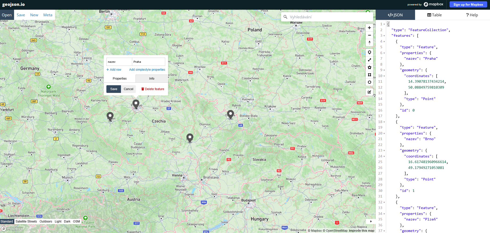
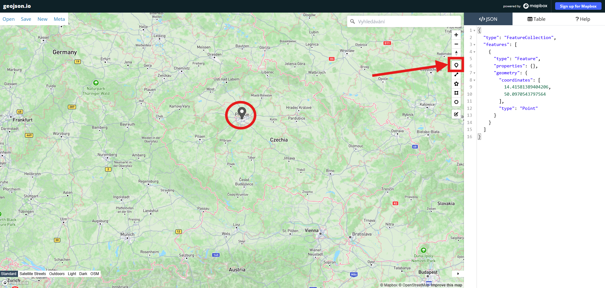
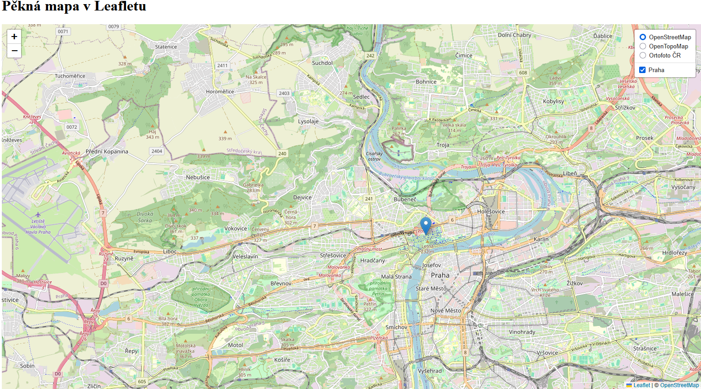
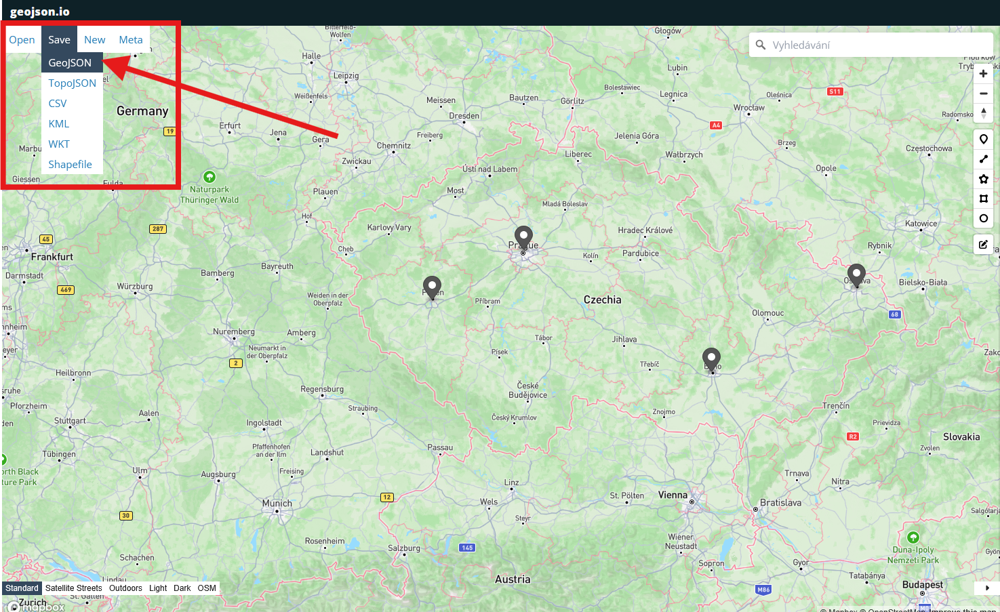

## GeoJSON
[**GeoJSON (Geographic JavaScript Object Notation)**](https://docs.fileformat.com/cs/gis/geojson/) je otevřený formát pro ukládání a výměnu geografických dat. Tento formát je navržený tak, aby reprezentoval geografické prvky s jejich neprostorovými atributy. 

Je založený na standardu **JSON (JavaScript Object Notation)**, což ho činí čitelným pro lidi i stroje a snadno zpracovatelným v různých programovacích jazycích.

### Struktura formátu GeoJSON

- **```type```** – specifikace typu objektu geometrie nebo kolekce souřadnic (```FeatureCollection```)

- **```geometry```** – určení prostoroví reprezentace dat (např. bod, linie, polygon)

- **```properties```** – atributy nebo metadata vztahující se k dané geometrii

- **```coordinates```** – zeměpisné souřadnice bodu či lomových bodů (``` [zeměpisná délka (longitude), šířka (latitude), nadmořská výška]```)

=== "data.geojson"

    ``` json
    {
        "type": "Feature",
        "geometry": {
            "type": "Point",
            "coordinates": [125.6, 10.1]
        },
        "properties": {
            "name": "Dinagat Islands"
        }
    }
    ```

### Typy geometrie GeoJSON

- **```Point```** – bod

- **```LineString```** – linie

- **```Polygon```** – polygon

- **```MultiPoint```** – sada několika bodů

- **```MultiLineString```** – sada několika linií

- **```MultiPolygon```** – sada několika polygonů

- **```Feature```** – geometrické objekty s přidanými parametry

- **```FeatureCollection ```** – sada několika ```Feature```    

Lepší pochopení struktury vytváření geodat ve formátu GeoJSON můžeme získat při využití platformy [**geojson.io**](https://geojson.io/).

<figure markdown>
{ width="1200" }
    <figcaption>Platforma geojson.io</figcaption>
</figure>

## Načtení dat z GeoJSON do mapové aplikace

Toto cvičení navazuje na závěr předchozího cvičení. Začínáme tedy s kódem z minulé hodiny, který je vypsán v nabídce níže.

??? note "&nbsp;<span style="color:#448aff">Stav kódu na začátku cvičení </span>"

    === "index.html - beze změny"

        ``` html
        <!DOCTYPE html> 
        <html> 
        <head> 
            <meta charset="UTF-8"> 
            <meta name="viewport" content="width=device-width, initial-scale=1.0">
            <link rel="stylesheet" href="style.css">

            <!-- Externí připojení CSS symbologie Leaflet-->
            <link rel="stylesheet" href="https://unpkg.com/leaflet@1.9.4/dist/leaflet.css"
            integrity="sha256-p4NxAoJBhIIN+hmNHrzRCf9tD/miZyoHS5obTRR9BMY="
            crossorigin=""/>
            

            <!-- Externí připojení JS knihovny -> vložit až po připojení CSS souboru -->
            <script src="https://unpkg.com/leaflet@1.9.4/dist/leaflet.js"
            integrity="sha256-20nQCchB9co0qIjJZRGuk2/Z9VM+kNiyxNV1lvTlZBo="
            crossorigin=""></script>

            <title>Moje první Leaflet mapa</title> 
        </head>
        <body> 

            <h1>Pěkná mapa v Leafletu</h1> 

            <div id="map"></div>
            <script src="script.js"></script>

        </body>
        </html>
        ```


    === "script.js"

        ``` js
        // Nastavení mapy, jejího středu a úrovně přiblížení
        var map = L.map('map').setView([50.104, 14.388], 13);

        // Určení podkladové mapy, maximální úrovně přiblížení a zdroje dat
        var osm = L.tileLayer('https://tile.openstreetmap.org/{z}/{x}/{y}.png', {
            maxZoom: 19,
            attribution: '&copy; <a href="http://www.openstreetmap.org/copyright">OpenStreetMap</a>'
        }).addTo(map);

        // Definice podkladové OpenTopoMap
        var otm = L.tileLayer('https://{s}.tile.opentopomap.org/{z}/{x}/{y}.png', {
            maxZoom: 17,
            attribution: 'Map data: &copy; <a href="https://www.openstreetmap.org/copyright">OpenStreetMap</a> contributors, <a href="http://viewfinderpanoramas.org">SRTM</a> | Map style: &copy; <a href="https://opentopomap.org">OpenTopoMap</a> (<a href="https://creativecommons.org/licenses/by-sa/3.0/">CC-BY-SA</a>)'
        });

        // Přiání OpenTopoMap do mapy
        //otm.addTo(map);

        // Přidání ortofota jako WMS služby, určení vrstvy, formátu a průhlednosti
        var ortofoto = L.tileLayer.wms("https://ags.cuzk.gov.cz/arcgis1/services/ORTOFOTO/MapServer/WMSServer", {
            layers: "0", 
            format: "image/png",
            transparent: true,
            attribution: "&copy ČÚZK"
        });

        // Body s textovými informacemi
        var points = [
            { coords: [50.104, 14.388], text: "FSv ČVUT v Praze" },
            { coords: [50.091, 14.402], text: "Pražský hrad" },
            { coords: [50.082, 14.426], text: "metro Můstek" },
            { coords: [50.106, 14.437], text: "vlak Praha Holešovice-zastávka" }
        ];

        // Linie propojující několik bodů 
        var line = L.polyline(points.map(p => p.coords), {color: "red", weight: 10}).addTo(map);

        // Polygon se zadanými vrcholy
        var polygon = L.polygon(points.map(p => p.coords), {color: "blue", weight: 3, fillColor: "lightblue", fillOpacity: "0.8"}).addTo(map);

        // Pop-up pro polygon
        polygon.bindPopup("Toto je polygon");

        // Vytvoření vrstvy pro markery
        var markersLayer = L.layerGroup();

        // Přidání markerů s popisky pro každý bod
        points.forEach(function(point) {
            L.marker(point.coords).bindPopup(point.text).addTo(markersLayer);
        });

        // Vložení skupiny bodů do mapy
        markersLayer.addTo(map);

        // Nastavení parametrů vlastního markeru
        var blackMarker = L.icon({
            iconUrl: '/assets/cerny_popup.png', // Umístění obrázku na disku
            iconSize:     [60, 60], // Velikost ikony v px
            iconAnchor:   [0, 80], // Pozice, na které se zobrazí ikona - vůči bodu
            popupAnchor:  [30, -100] // Pozice, ze které se popup otevře - vůči bodu
        });

        // Samostatný bod s novým značením
        var markerDivokaS = L.marker([50.093, 14.324], {icon: blackMarker}).addTo(map); 
        markerDivokaS.bindPopup("Zde je <b style='color: red;'>Divoká Šárka</b>");

        // Proměnná uchovávající podkladové mapy, mezi kterými chceme přepínat
        var baseMaps = {
            "OpenStreetMap": osm, // "popis mapy": nazevPromenne
            "OpenTopoMap": otm,
            "Ortofoto ČR": ortofoto
        };

        // Proměnná uchovávající mapové vrstvy, které chceme zobrazovat a skrývat
        var overlayMaps = {
            "Zajímavá místa": markersLayer,
            "Divoká Šárka": markerDivokaS,
            "Moje linie": line, 
            "Můj polygon": polygon
        };

        // Grafické přepínání podkladových map
        var layerControl = L.control.layers(baseMaps, overlayMaps, {collapsed: false}).addTo(map);
        ```

    === "style.css - beze změny"

        ``` css
        /* Velikost mapového okna */
        #map {
            height: 800px;
            width: 60%;
        }
        ```

### 1) Načtení bodu z GeoJSON do mapové aplikace

Nejprve načteme GeoJSON přímo v kódu jako proměnnou. Na platformě geojson.io vytvoříme jeden bod, například na pozici Prahy. K tomu využijeme první tlačítko z pravé postranní nabídky v mapě. Vygenerovaný kód v pravé části obrazovky si zkopírujeme.

<figure markdown>
{ width="1200" }
    <figcaption>Vytvoření bodu se souřadnicemi Prahy</figcaption>
</figure>

V javascript kódu vytvoříme proměnnou, do které vložíme zkopírovaný kód z GeoJSON.

=== "script.js"

    ``` js
    // Načtení bodu z GeoJSON zápisu
    var prahaBod = [
        // Sem vložíme kód z GeoJSON
    ];
    ```

Po vložení bodu:

=== "script.js"

    ``` js
    // Načtení bodu z GeoJSON zápisu
    var prahaBod = [
        {
            "type": "FeatureCollection",
            "features": [
            {
                "type": "Feature",
                "properties": {},
                "geometry": {
                "coordinates": [
                    14.41581389404206,
                    50.0970543797564
                ],
                "type": "Point"
                }
            }
            ]
        }
    ];
    ```

V další fázi je třeba přidat načtení souboru z GeoJSONu do vrstvy ```prahaBodLayer```.

=== "script.js"

    ``` js
    // Přiřazení GeoJSONu do mapové vrstvy a její přidání do mapy
    var prahaBodLayer = L.geoJSON(prahaBod).addTo(map);
    ```

Před pokračováním na další kroky mapovou aplikaci pročistíme a smažeme či zakomentářujeme všechny ostatní mapové vrstvy ```markersLayer```, ```markerDivokaS```, ```line``` a ```polygon```.

<figure markdown>
{ width="800" }
    <figcaption>Mapová aplikace po pročištění kódu a načtení bodu z GeoJSON</figcaption>
</figure>

??? note "&nbsp;<span style="color:#448aff">Stav kódu po dokončení kroku 1) Načtení bodu z GeoJSON do mapové aplikace</span>"

    === "index.html - beze změny"

        ``` html
        <!DOCTYPE html> 
        <html> 
        <head> 
            <meta charset="UTF-8"> 
            <meta name="viewport" content="width=device-width, initial-scale=1.0">
            <link rel="stylesheet" href="style.css">

            <!-- Externí připojení CSS symbologie Leaflet-->
            <link rel="stylesheet" href="https://unpkg.com/leaflet@1.9.4/dist/leaflet.css"
            integrity="sha256-p4NxAoJBhIIN+hmNHrzRCf9tD/miZyoHS5obTRR9BMY="
            crossorigin=""/>
            

            <!-- Externí připojení JS knihovny -> vložit až po připojení CSS souboru -->
            <script src="https://unpkg.com/leaflet@1.9.4/dist/leaflet.js"
            integrity="sha256-20nQCchB9co0qIjJZRGuk2/Z9VM+kNiyxNV1lvTlZBo="
            crossorigin=""></script>

            <title>Moje první Leaflet mapa</title> 
        </head>
        <body> 

            <h1>Pěkná mapa v Leafletu</h1> 

            <div id="map"></div>
            <script src="script.js"></script>

        </body>
        </html>
        ```


    === "script.js"

        ``` js
        // Nastavení mapy, jejího středu a úrovně přiblížení
        var map = L.map('map').setView([50.104, 14.388], 13);

        // Určení podkladové mapy, maximální úrovně přiblížení a zdroje dat
        var osm = L.tileLayer('https://tile.openstreetmap.org/{z}/{x}/{y}.png', {
            maxZoom: 19,
            attribution: '&copy; <a href="http://www.openstreetmap.org/copyright">OpenStreetMap</a>'
        }).addTo(map);

        // Definice podkladové OpenTopoMap
        var otm = L.tileLayer('https://{s}.tile.opentopomap.org/{z}/{x}/{y}.png', {
            maxZoom: 17,
            attribution: 'Map data: &copy; <a href="https://www.openstreetmap.org/copyright">OpenStreetMap</a> contributors, <a href="http://viewfinderpanoramas.org">SRTM</a> | Map style: &copy; <a href="https://opentopomap.org">OpenTopoMap</a> (<a href="https://creativecommons.org/licenses/by-sa/3.0/">CC-BY-SA</a>)'
        });

        // Přidání ortofota jako WMS služby, určení vrstvy, formátu a průhlednosti
        var ortofoto = L.tileLayer.wms("https://ags.cuzk.gov.cz/arcgis1/services/ORTOFOTO/MapServer/WMSServer", {
            layers: "0", 
            format: "image/png",
            transparent: true,
            attribution: "&copy ČÚZK"
        });

        // Načtení bodu z GeoJSON zápisu
        var prahaBod = [
            {
                "type": "FeatureCollection",
                "features": [
                {
                    "type": "Feature",
                    "properties": {},
                    "geometry": {
                    "coordinates": [
                        14.41581389404206,
                        50.0970543797564
                    ],
                    "type": "Point"
                    }
                }
                ]
            }
        ];

        // Přiřazení GeoJSONu do mapové vrstvy a její přidání do mapy
        var prahaBodLayer = L.geoJSON(prahaBod).addTo(map);

        // Proměnná uchovávající podkladové mapy, mezi kterými chceme přepínat
        var baseMaps = {
            "OpenStreetMap": osm, // "popis mapy": nazevPromenne
            "OpenTopoMap": otm,
            "Ortofoto ČR": ortofoto
        };

        // Proměnná uchovávající mapové vrstvy, které chceme zobrazovat a skrývat
        var overlayMaps = {
            "Praha": prahaBodLayer
        };

        // Grafické přepínání podkladových map
        var layerControl = L.control.layers(baseMaps, overlayMaps, {collapsed: false}).addTo(map);
        ```

    === "style.css - beze změny"

        ``` css
        /* Velikost mapového okna */
        #map {
            height: 800px;
            width: 60%;
        }
        ```


### 2) Načtení externího souboru s daty

Na platformě geojson.io vytvoříme jednoduchou bodovou vrstvu s vybranými městy v Česku. Pro začátek stačí zvolit např. 4 body, přičemž každému bodu určíme hodnotu atributu ```nazev```, do které zapíšeme název daného města. Soubor s daty stáhneme tlačítkem *Save* v levém horním rohu. Soubor přejmenujeme na ```mesta.geojson```.

<figure markdown>
{ width="800" }
    <figcaption>Stažení GeoJSONu s vytvořenými body</figcaption>
</figure>


## Tvorba kartogramu