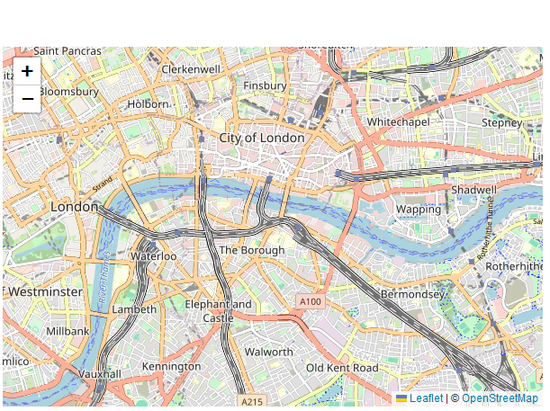

## Příprava stránky změna

Před psaním kódu pro mapu je třeba na stránce provést následující přípravné kroky:

**1) Vložte soubor Leaflet CSS do části head dokumentu:**

```html
<link rel="stylesheet" href="https://unpkg.com/leaflet@1.9.4/dist/leaflet.css"
     integrity="sha256-p4NxAoJBhIIN+hmNHrzRCf9tD/miZyoHS5obTRR9BMY="
     crossorigin=""/>
```

**2) Zahrňte soubor Leaflet JavaScript za soubor Leaflet CSS:**

```html
 <!-- Make sure you put this AFTER Leaflet's CSS -->
 <script src="https://unpkg.com/leaflet@1.9.4/dist/leaflet.js"
     integrity="sha256-20nQCchB9co0qIjJZRGuk2/Z9VM+kNiyxNV1lvTlZBo="
     crossorigin=""></script>
```


**3) Na místo, kde chcete mít mapu, vložte prvek div s určitým id:**

```html
<div id="map"></div>
```

**4) Ujistěte se, že kontejner mapy má definovanou výšku, například nastavením v CSS:**

```css
#map { height: 180px; }
```

V tuto chvíli můžeme přejít na úpravu mapy

## Nastavení mapy

Vytvořme si mapu centra Londýna pomocí pěkné mapy OpenStreetMap dlaždicemi. Od této chvíle budeme pracovat v JS. Nejprve inicializujeme mapu a nastavíme její zobrazení na námi zvolené zeměpisné souřadnice a přiblížení úroveň přiblížení:

```html
var map = L.map('map').setView([51.505, -0.09], 13);
```

Ve výchozím nastavení (protože jsme při vytváření instance mapy nepředávali žádné možnosti) jsou na mapě povoleny všechny interakce myší a dotykem a má ovládací prvky přiblížení a přiřazení.

Všimněte si, že volání setView vrací také objekt mapy - takto se chová většina metod Leafletu, pokud nevrací explicitní hodnotu, což umožňuje pohodlné řetězení metod podobné jQuery.

Dále přidáme vrstvu dlaždic, kterou přidáme do naší mapy, v tomto případě je to vrstva dlaždic OpenStreetMap. Vytvoření vrstvy dlaždic obvykle zahrnuje nastavení šablony URL pro obrázky dlaždic, text atributu a maximální úroveň přiblížení vrstvy. Dlaždice OpenStreetMap jsou vhodné pro programování mapy Leaflet, ale pokud se chystáte používat dlaždice v produkci, přečtěte si Zásady používání dlaždic OpenStreetMap.

```html
L.tileLayer('https://tile.openstreetmap.org/{z}/{x}/{y}.png', {
    maxZoom: 19,
    attribution: '&copy; <a href="http://www.openstreetmap.org/copyright">OpenStreetMap</a>'
}).addTo(map);
```

Ujistěte se, že je veškerý kód volán až po začlenění div a leaflet.js. To je vše! Nyní máte funkční mapu Leaflet.

Stojí za zmínku, že Leaflet je provider-agnostic, což znamená, že nevynucuje konkrétní výběr poskytovatelů pro dlaždice. Leaflet také neobsahuje ani jediný řádek kódu specifický pro poskytovatele, takže v případě potřeby můžete používat jiné poskytovatele.

```html
<script>

	const map = L.map('map').setView([51.505, -0.09], 13);

	const tiles = L.tileLayer('https://tile.openstreetmap.org/{z}/{x}/{y}.png', {
		maxZoom: 19,
		attribution: '&copy; <a href="http://www.openstreetmap.org/copyright">OpenStreetMap</a>'
	}).addTo(map);

</script>
```

<figure markdown>
{ width="600" }
    <figcaption>Výsledná mapa v Leaflet</figcaption>
</figure>