## GeoJSON
[**GeoJSON (Geographic JavaScript Object Notation)**](https://docs.fileformat.com/cs/gis/geojson/) je otevřený formát pro ukládání a výměnu geografických dat. Tento formát je navržený tak, aby reprezentoval geografické prvky s jejich neprostorovými atributy. 

Je založený na standardu **JSON (JavaScript Object Notation)**, což ho činí čitelným pro lidi i stroje a snadno zpracovatelným v různých programovacích jazycích.

### Struktura formátu GeoJSON

- **```type```** – specifikace typu objektu geometrie nebo kolekce souřadnic (```FeatureCollection```)

- **```geometry```** – určení prostoroví reprezentace dat (např. bod, linie, polygon)

- **```properties```** – atributy nebo metadata vztahující se k dané geometrii

- **```coordinates```** – zeměpisné souřadnice bodu či lomových bodů (``` [zeměpisná délka (longitude), šířka (latitude), nadmořská výška]```)

=== "data.geojson"

    ``` json
    {
        "type": "Feature",
        "geometry": {
            "type": "Point",
            "coordinates": [125.6, 10.1]
        },
        "properties": {
            "name": "Dinagat Islands"
        }
    }
    ```

### Typy geometrie GeoJSON

- **```Point```** – bod

- **```LineString```** – linie

- **```Polygon```** – polygon

- **```MultiPoint```** – sada několika bodů

- **```MultiLineString```** – sada několika linií

- **```MultiPolygon```** – sada několika polygonů

- **```Feature```** – geometrické objekty s přidanými parametry

- **```FeatureCollection ```** – sada několika ```Feature```    

Lepší pochopení struktury vytváření geodat ve formátu GeoJSON můžeme získat při využití platformy [**geojson.io**](https://geojson.io/).

<figure markdown>
{ width="1200" }
    <figcaption>Platforma geojson.io</figcaption>
</figure>

!!! info "&nbsp;<span>TopoJSON</span>"
    **TopoJSON** je nadstavba GeoJSON, která se liší tím, že neukládá opakující se informace o topologii sousedních prvků, což vede k menší velikosti souboru a efektivnější práci s geoprostorovými daty.

    Například společná hranice dvou států (Česka a Německa) se uloží pouze jednou. V GeoJSONu by se tato hranice uložila dvakrát (jednou pro polygon Česka, podruhé pro polygon Německa). Je tím pádem vhodný pro **využití u větších datových sad** či při nutnosti **zachování topologie**.

    Datová struktura je naopak v porovnání s GeoJSONem složitější. 

    Více informací: [https://github.com/topojson/topojson](https://github.com/topojson/topojson)

## Načtení dat z GeoJSON do mapové aplikace

Toto cvičení navazuje na závěr předchozího cvičení. Začínáme tedy s kódem z minulé hodiny, který je vypsán v nabídce níže. Kód se však bude výrazně měnit, takže **doporučujeme vytvořit kopii dat z minulé hodiny do nové složky**, ve které budete pracovat. Takto si zachováte postup z obou hodin uložený.

??? note "&nbsp;<span style="color:#448aff">Stav kódu na začátku cvičení </span>"

    === "index.html - beze změny"

        ``` html
        <!DOCTYPE html> 
        <html> 
        <head> 
            <meta charset="UTF-8"> 
            <meta name="viewport" content="width=device-width, initial-scale=1.0">
            <link rel="stylesheet" href="style.css">

            <!-- Externí připojení CSS symbologie Leaflet-->
            <link rel="stylesheet" href="https://unpkg.com/leaflet@1.9.4/dist/leaflet.css"
            integrity="sha256-p4NxAoJBhIIN+hmNHrzRCf9tD/miZyoHS5obTRR9BMY="
            crossorigin=""/>
            

            <!-- Externí připojení JS knihovny -> vložit až po připojení CSS souboru -->
            <script src="https://unpkg.com/leaflet@1.9.4/dist/leaflet.js"
            integrity="sha256-20nQCchB9co0qIjJZRGuk2/Z9VM+kNiyxNV1lvTlZBo="
            crossorigin=""></script>

            <title>Moje první Leaflet mapa</title> 
        </head>
        <body> 

            <h1>Pěkná mapa v Leafletu</h1> 

            <div id="map"></div>
            <script src="script.js"></script>

        </body>
        </html>
        ```


    === "script.js"

        ``` js
        // Nastavení mapy, jejího středu a úrovně přiblížení
        var map = L.map('map').setView([50.104, 14.388], 13);

        // Určení podkladové mapy, maximální úrovně přiblížení a zdroje dat
        var osm = L.tileLayer('https://tile.openstreetmap.org/{z}/{x}/{y}.png', {
            maxZoom: 19,
            attribution: '&copy; <a href="http://www.openstreetmap.org/copyright">OpenStreetMap</a>'
        }).addTo(map);

        // Definice podkladové OpenTopoMap
        var otm = L.tileLayer('https://{s}.tile.opentopomap.org/{z}/{x}/{y}.png', {
            maxZoom: 17,
            attribution: 'Map data: &copy; <a href="https://www.openstreetmap.org/copyright">OpenStreetMap</a> contributors, <a href="http://viewfinderpanoramas.org">SRTM</a> | Map style: &copy; <a href="https://opentopomap.org">OpenTopoMap</a> (<a href="https://creativecommons.org/licenses/by-sa/3.0/">CC-BY-SA</a>)'
        });

        // Přiání OpenTopoMap do mapy
        //otm.addTo(map);

        // Přidání ortofota jako WMS služby, určení vrstvy, formátu a průhlednosti
        var ortofoto = L.tileLayer.wms("https://ags.cuzk.gov.cz/arcgis1/services/ORTOFOTO/MapServer/WMSServer", {
            layers: "0", 
            format: "image/png",
            transparent: true,
            attribution: "&copy ČÚZK"
        });

        // Body s textovými informacemi
        var points = [
            { coords: [50.104, 14.388], text: "FSv ČVUT v Praze" },
            { coords: [50.091, 14.402], text: "Pražský hrad" },
            { coords: [50.082, 14.426], text: "metro Můstek" },
            { coords: [50.106, 14.437], text: "vlak Praha Holešovice-zastávka" }
        ];

        // Linie propojující několik bodů 
        var line = L.polyline(points.map(p => p.coords), {color: "red", weight: 10}).addTo(map);

        // Polygon se zadanými vrcholy
        var polygon = L.polygon(points.map(p => p.coords), {color: "blue", weight: 3, fillColor: "lightblue", fillOpacity: "0.8"}).addTo(map);

        // Pop-up pro polygon
        polygon.bindPopup("Toto je polygon");

        // Vytvoření vrstvy pro markery
        var markersLayer = L.layerGroup();

        // Přidání markerů s popisky pro každý bod
        points.forEach(function(point) {
            L.marker(point.coords).bindPopup(point.text).addTo(markersLayer);
        });

        // Vložení skupiny bodů do mapy
        markersLayer.addTo(map);

        // Nastavení parametrů vlastního markeru
        var blackMarker = L.icon({
            iconUrl: '/assets/cerny_popup.png', // Umístění obrázku na disku
            iconSize:     [60, 60], // Velikost ikony v px
            iconAnchor:   [0, 80], // Pozice, na které se zobrazí ikona - vůči bodu
            popupAnchor:  [30, -100] // Pozice, ze které se popup otevře - vůči bodu
        });

        // Samostatný bod s novým značením
        var markerDivokaS = L.marker([50.093, 14.324], {icon: blackMarker}).addTo(map); 
        markerDivokaS.bindPopup("Zde je <b style='color: red;'>Divoká Šárka</b>");

        // Proměnná uchovávající podkladové mapy, mezi kterými chceme přepínat
        var baseMaps = {
            "OpenStreetMap": osm, // "popis mapy": nazevPromenne
            "OpenTopoMap": otm,
            "Ortofoto ČR": ortofoto
        };

        // Proměnná uchovávající mapové vrstvy, které chceme zobrazovat a skrývat
        var overlayMaps = {
            "Zajímavá místa": markersLayer,
            "Divoká Šárka": markerDivokaS,
            "Moje linie": line, 
            "Můj polygon": polygon
        };

        // Grafické přepínání podkladových map
        var layerControl = L.control.layers(baseMaps, overlayMaps, {collapsed: false}).addTo(map);
        ```

    === "style.css - beze změny"

        ``` css
        /* Velikost mapového okna */
        #map {
            height: 800px;
            width: 60%;
        }
        ```

### 1) Načtení bodu z GeoJSON do mapové aplikace

Nejprve načteme GeoJSON přímo v kódu jako proměnnou. Na platformě geojson.io vytvoříme jeden bod, například na pozici Prahy. K tomu využijeme první tlačítko z pravé postranní nabídky v mapě. Vygenerovaný kód v pravé části obrazovky si zkopírujeme.

<figure markdown>
{ width="1200" }
    <figcaption>Vytvoření bodu se souřadnicemi Prahy</figcaption>
</figure>

V javascript kódu vytvoříme proměnnou, do které vložíme zkopírovaný kód z GeoJSON.

=== "script.js"

    ``` js
    // Načtení bodu z GeoJSON zápisu
    var prahaBod = [
        // Sem vložíme kód z GeoJSON
    ];
    ```

Po vložení bodu:

=== "script.js"

    ``` js
    // Načtení bodu z GeoJSON zápisu
    var prahaBod = [
        {
            "type": "FeatureCollection",
            "features": [
            {
                "type": "Feature",
                "properties": {},
                "geometry": {
                "coordinates": [
                    14.41581389404206,
                    50.0970543797564
                ],
                "type": "Point"
                }
            }
            ]
        }
    ];
    ```

V další fázi je třeba přidat načtení souboru z GeoJSONu do vrstvy ```prahaBodLayer```.

=== "script.js"

    ``` js
    // Přiřazení GeoJSONu do mapové vrstvy a její přidání do mapy
    var prahaBodLayer = L.geoJSON(prahaBod).addTo(map);
    ```

Před pokračováním na další kroky mapovou aplikaci pročistíme a smažeme či zakomentářujeme všechny ostatní mapové vrstvy ```markersLayer```, ```markerDivokaS```, ```line``` a ```polygon```.

<figure markdown>
{ width="800" }
    <figcaption>Mapová aplikace po pročištění kódu a načtení bodu z GeoJSON</figcaption>
</figure>

??? note "&nbsp;<span style="color:#448aff">Stav kódu po dokončení kroku 1) Načtení bodu z GeoJSON do mapové aplikace</span>"

    === "index.html - beze změny"

        ``` html
        <!DOCTYPE html> 
        <html> 
        <head> 
            <meta charset="UTF-8"> 
            <meta name="viewport" content="width=device-width, initial-scale=1.0">
            <link rel="stylesheet" href="style.css">

            <!-- Externí připojení CSS symbologie Leaflet-->
            <link rel="stylesheet" href="https://unpkg.com/leaflet@1.9.4/dist/leaflet.css"
            integrity="sha256-p4NxAoJBhIIN+hmNHrzRCf9tD/miZyoHS5obTRR9BMY="
            crossorigin=""/>
            

            <!-- Externí připojení JS knihovny -> vložit až po připojení CSS souboru -->
            <script src="https://unpkg.com/leaflet@1.9.4/dist/leaflet.js"
            integrity="sha256-20nQCchB9co0qIjJZRGuk2/Z9VM+kNiyxNV1lvTlZBo="
            crossorigin=""></script>

            <title>Moje první Leaflet mapa</title> 
        </head>
        <body> 

            <h1>Pěkná mapa v Leafletu</h1> 

            <div id="map"></div>
            <script src="script.js"></script>

        </body>
        </html>
        ```


    === "script.js"

        ``` js
        // Nastavení mapy, jejího středu a úrovně přiblížení
        var map = L.map('map').setView([50.104, 14.388], 13);

        // Určení podkladové mapy, maximální úrovně přiblížení a zdroje dat
        var osm = L.tileLayer('https://tile.openstreetmap.org/{z}/{x}/{y}.png', {
            maxZoom: 19,
            attribution: '&copy; <a href="http://www.openstreetmap.org/copyright">OpenStreetMap</a>'
        }).addTo(map);

        // Definice podkladové OpenTopoMap
        var otm = L.tileLayer('https://{s}.tile.opentopomap.org/{z}/{x}/{y}.png', {
            maxZoom: 17,
            attribution: 'Map data: &copy; <a href="https://www.openstreetmap.org/copyright">OpenStreetMap</a> contributors, <a href="http://viewfinderpanoramas.org">SRTM</a> | Map style: &copy; <a href="https://opentopomap.org">OpenTopoMap</a> (<a href="https://creativecommons.org/licenses/by-sa/3.0/">CC-BY-SA</a>)'
        });

        // Přidání ortofota jako WMS služby, určení vrstvy, formátu a průhlednosti
        var ortofoto = L.tileLayer.wms("https://ags.cuzk.gov.cz/arcgis1/services/ORTOFOTO/MapServer/WMSServer", {
            layers: "0", 
            format: "image/png",
            transparent: true,
            attribution: "&copy ČÚZK"
        });

        // Načtení bodu z GeoJSON zápisu
        var prahaBod = [
            {
                "type": "FeatureCollection",
                "features": [
                {
                    "type": "Feature",
                    "properties": {},
                    "geometry": {
                    "coordinates": [
                        14.41581389404206,
                        50.0970543797564
                    ],
                    "type": "Point"
                    }
                }
                ]
            }
        ];

        // Přiřazení GeoJSONu do mapové vrstvy a její přidání do mapy
        var prahaBodLayer = L.geoJSON(prahaBod).addTo(map);

        // Proměnná uchovávající podkladové mapy, mezi kterými chceme přepínat
        var baseMaps = {
            "OpenStreetMap": osm, // "popis mapy": nazevPromenne
            "OpenTopoMap": otm,
            "Ortofoto ČR": ortofoto
        };

        // Proměnná uchovávající mapové vrstvy, které chceme zobrazovat a skrývat
        var overlayMaps = {
            "Praha": prahaBodLayer
        };

        // Grafické přepínání podkladových map
        var layerControl = L.control.layers(baseMaps, overlayMaps, {collapsed: false}).addTo(map);
        ```

    === "style.css - beze změny"

        ``` css
        /* Velikost mapového okna */
        #map {
            height: 800px;
            width: 60%;
        }
        ```


### 2) Načtení externího souboru s daty

Na platformě geojson.io vytvoříme jednoduchou bodovou vrstvu s vybranými městy v Česku. Pro začátek stačí zvolit např. 4 body, přičemž každému bodu určíme hodnotu atributu ```nazev```, do které zapíšeme název daného města. Soubor s daty stáhneme tlačítkem *Save* v levém horním rohu. Soubor přejmenujeme na ```mesta.geojson```.

<figure markdown>
{ width="800" }
    <figcaption>Stažení GeoJSONu s vytvořenými body</figcaption>
</figure>


Takto stažený soubor je možné nahrát přímo do Leaflet, nicméně jednodušší možností je vytvoření nového js scriptu, např. ```mesta_GeoJSON.js```, ve kterém vytvoříme proměnnou ```mesta``` a přiřadíme jí data ze staženého GeoJSONu. Nový soubor uložíme do stejné pracovní složky jako ostatní skripty.

Struktura připraveného souboru bude vypadat následovně:

=== "mesta_GeoJSON.js"

    ``` js
    var mesta = {
        "type": "FeatureCollection",
        "features": [
        {
            ... // Zde jsou ostatní načtená data z GeoJSONu
        }
        ]
    };
    ```

Abychom mohli města ze souboru ```mesta_GeoJSON.js``` načíst, je potřeba skript připojit v ```index.html``` – obdobně jako ostatní použité js soubory. 

Do hlavičky v html tedy přidáme:

=== "index.html"

    ``` html
    <!-- Načtení souboru s městy GeoJSON-->
    <script src="mesta_GeoJSON.js"></script>
    ```


Nyní můžeme pokračovat načtením bodů z GeoJSONu do mapy. To provededeme podobně jako při načtení samostatného bodu Prahy v předchozím kroku. Zároveň přidáme novou vrstu měst do správce vrstev.

=== "script.js"

    ``` js
    // Načtení GeoJSONu z proměnné "mesta" uložené v souboru "mesta_GeoJSON.js"
    var mestaLayer = L.geoJSON(mesta).addTo(map);

    // Proměnná uchovávající mapové vrstvy, které chceme zobrazovat a skrývat
    var overlayMaps = {
        "Praha": prahaBodLayer,
        "Města": mestaLayer
    };
    ```

<figure markdown>
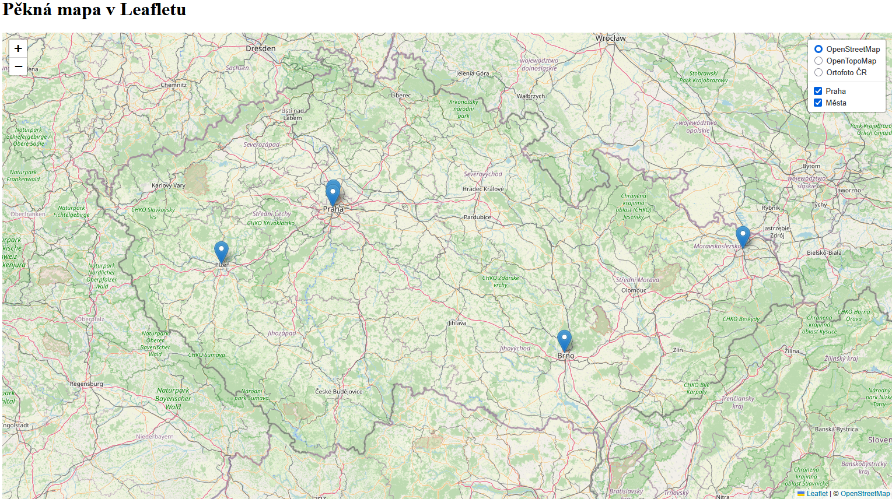{ width="800" }
    <figcaption>Mapová aplikace po načtení měst z GeoJSONu</figcaption>
</figure>


Závěrem tohoto kroku si upravíme rozsah úvodního okna pro celé Česko a upravíme zobrazení měst tak, abychom byli schopni zobrazit pop-up s jejich názvy.

=== "script.js"

    ``` js
    // Nastavení mapy, jejího středu a úrovně přiblížení
    var map = L.map('map').setView([49.860, 15.315], 8); // Výběr bodu zhruba uprostřed republiky
    ```

Popup vytvoříme obdobně jako v minulé hodině, jen je k atributu potřeba přistupovat přes ```feature.properties.nazev```. 

Níže je vypsaný kód pro obyčejný pop-up vypisující pouze atribut (v komentáři) a upravený pop-up, který využívá html zápis. Pokud se odkazujeme přímo na hodnoty atributu, pak je nutné ve výpisu popupu využít zpětné uvozovky (backquote) ``` ` ``` (Alt + ý). 

=== "script.js"

    ``` js
    // Načtení GeoJSONu z proměnné "mesta" uložené v souboru "mesta_GeoJSON.js"
    var mestaLayer = L.geoJSON(mesta, {
    onEachFeature: function (feature, layer) {
        if (feature.properties && feature.properties.nazev) {
            // layer.bindPopup(feature.properties.nazev); // Obyčejný popup
            layer.bindPopup(`Jméno města je <b>${feature.properties.nazev}</b>`); // Vylepšený popup
        }
    }
    }).addTo(map);
    ```

<figure markdown>
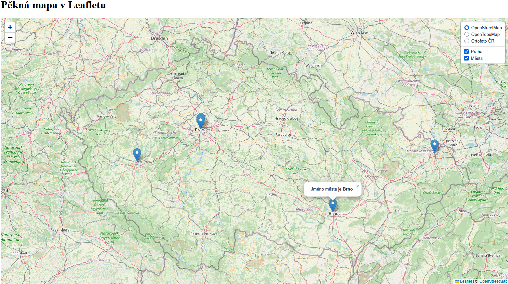{ width="800" }
    <figcaption>Přidání pop-upu pro výpis hodnoty atributu "název"</figcaption>
</figure>

??? note "&nbsp;<span style="color:#448aff">Stav kódu po dokončení kroku 2) Načtení externího souboru s daty</span>"

    === "index.html"

        ``` html
        <!DOCTYPE html> 
        <html> 
        <head> 
            <meta charset="UTF-8"> 
            <meta name="viewport" content="width=device-width, initial-scale=1.0">
            <link rel="stylesheet" href="style.css">

            <!-- Načtení souboru s městy GeoJSON-->
            <script src="mesta_GeoJSON.js"></script>

            <!-- Externí připojení CSS symbologie Leaflet-->
            <link rel="stylesheet" href="https://unpkg.com/leaflet@1.9.4/dist/leaflet.css"
            integrity="sha256-p4NxAoJBhIIN+hmNHrzRCf9tD/miZyoHS5obTRR9BMY="
            crossorigin=""/>
            

            <!-- Externí připojení JS knihovny -> vložit až po připojení CSS souboru -->
            <script src="https://unpkg.com/leaflet@1.9.4/dist/leaflet.js"
            integrity="sha256-20nQCchB9co0qIjJZRGuk2/Z9VM+kNiyxNV1lvTlZBo="
            crossorigin=""></script>

            <title>Moje první Leaflet mapa</title> 
        </head>
        <body> 

            <h1>Pěkná mapa v Leafletu</h1> 

            <div id="map"></div>
            <script src="script.js"></script>

        </body>
        </html>
        ```


    === "script.js"

        ``` js
        // Nastavení mapy, jejího středu a úrovně přiblížení
        var map = L.map('map').setView([49.860, 15.315], 8); // Výběr bodu zhruba uprostřed republiky

        // Určení podkladové mapy, maximální úrovně přiblížení a zdroje dat
        var osm = L.tileLayer('https://tile.openstreetmap.org/{z}/{x}/{y}.png', {
            maxZoom: 19,
            attribution: '&copy; <a href="http://www.openstreetmap.org/copyright">OpenStreetMap</a>'
        }).addTo(map);

        // Definice podkladové OpenTopoMap
        var otm = L.tileLayer('https://{s}.tile.opentopomap.org/{z}/{x}/{y}.png', {
            maxZoom: 17,
            attribution: 'Map data: &copy; <a href="https://www.openstreetmap.org/copyright">OpenStreetMap</a> contributors, <a href="http://viewfinderpanoramas.org">SRTM</a> | Map style: &copy; <a href="https://opentopomap.org">OpenTopoMap</a> (<a href="https://creativecommons.org/licenses/by-sa/3.0/">CC-BY-SA</a>)'
        });

        // Přidání ortofota jako WMS služby, určení vrstvy, formátu a průhlednosti
        var ortofoto = L.tileLayer.wms("https://ags.cuzk.gov.cz/arcgis1/services/ORTOFOTO/MapServer/WMSServer", {
            layers: "0", 
            format: "image/png",
            transparent: true,
            attribution: "&copy ČÚZK"
        });

        // Načtení bodu z GeoJSON zápisu
        var prahaBod = [
            {
                "type": "FeatureCollection",
                "features": [
                {
                    "type": "Feature",
                    "properties": {},
                    "geometry": {
                    "coordinates": [
                        14.41581389404206,
                        50.0970543797564
                    ],
                    "type": "Point"
                    }
                }
                ]
            }
        ];

        // Přiřazení GeoJSONu do mapové vrstvy a její přidání do mapy
        var prahaBodLayer = L.geoJSON(prahaBod).addTo(map);

        // Načtení GeoJSONu z proměnné "mesta" uložené v souboru "mesta_GeoJSON.js"
        var mestaLayer = L.geoJSON(mesta, {
        onEachFeature: function (feature, layer) {
            if (feature.properties && feature.properties.nazev) {
                // layer.bindPopup(feature.properties.nazev); // Obyčejný popup
                layer.bindPopup(`Jméno města je <b>${feature.properties.nazev}</b>`); // Vylepšený popup
            }
        }
        }).addTo(map);

        // Proměnná uchovávající podkladové mapy, mezi kterými chceme přepínat
        var baseMaps = {
            "OpenStreetMap": osm, // "popis mapy": nazevPromenne
            "OpenTopoMap": otm,
            "Ortofoto ČR": ortofoto
        };

        // Proměnná uchovávající mapové vrstvy, které chceme zobrazovat a skrývat
        var overlayMaps = {
            "Praha": prahaBodLayer,
            "Města": mestaLayer
        };

        // Grafické přepínání podkladových map
        var layerControl = L.control.layers(baseMaps, overlayMaps, {collapsed: false}).addTo(map);
        ```

    === "style.css - beze změny"

        ``` css
        /* Velikost mapového okna */
        #map {
            height: 800px;
            width: 60%;
        }
        ```

## Tvorba kartogramu

Více informací o tvorbě kartogramu v Leaflet je na [stránkách dokumentace](https://leafletjs.com/examples/choropleth/).

### 1) Připojení dat ORP

!!! info "&nbsp;<span>Příprava GeoJSON v GIS a jeho kontrola</span>"
    Pro vytvoření kartogramu využijeme data obcí s rozšířenou působností (ORP) z datasetu [ArcČR 4.3](https://www.arcdata.cz/cs-cz/produkty/data/arccr). Zde nalezneme řadu zajímavých statistických dat, která v následujících několika cvičeních vizualizujeme metodami tematické kartografie či infografikou.

    1) Nejprve bude nutné protřídit atributy ve vrstvě ORP dle obrázku níže.

    <figure markdown>
    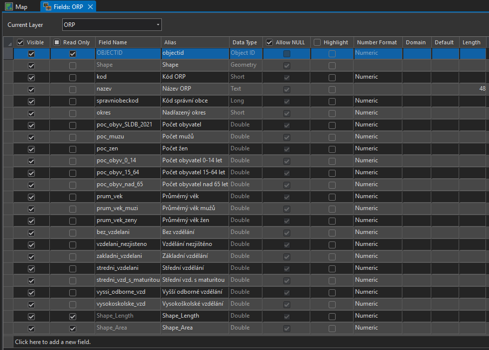{ width="600" }
        <figcaption>Vybrané atributy z vrstvy ORP</figcaption>
    </figure>

    2) Dále polygony generalizujeme pro webové prostředí geoprocesingovou funkcí [Smooth Shared Edges](https://pro.arcgis.com/en/pro-app/latest/tool-reference/cartography/smooth-shared-edges.htm). Využijeme algoritmus ```PAEK``` a ```Smoothing Tolerance``` nastavíme na ```1500 m```.

    3) Závěrem provedeme export do GeoJSONu pomocí funkce [Features to JSON](https://pro.arcgis.com/en/pro-app/latest/tool-reference/conversion/features-to-json.htm). Zaškrtneme ```Output to GeoJSON``` a ```Project to WGS_1984```.

    Vyexportovaný GeoJSON můžeme **validovat** (zkontrolovat) pomocí některého z webových nástrojů:

    - [GeoJSONLint](https://geojsonlint.com/): náhled na data

    <figure markdown>
    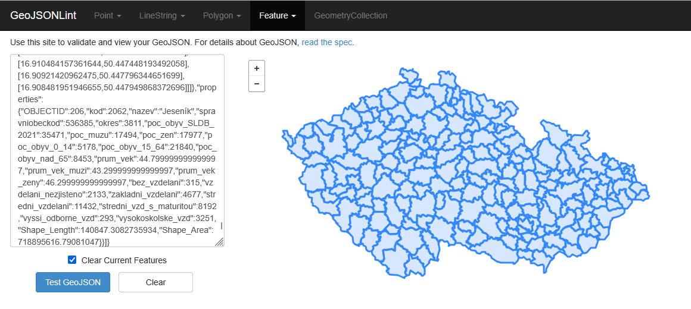{ width="600" }
        <figcaption>Kontrola a náhled GeoJSONu pomocí GeoJSONLint</figcaption>
    </figure>
    
    - [GeoJSON validator](https://www.itb.ec.europa.eu/json/geojson/upload): validace přímo ze souboru - výpis případných chyb
    <figure markdown>
    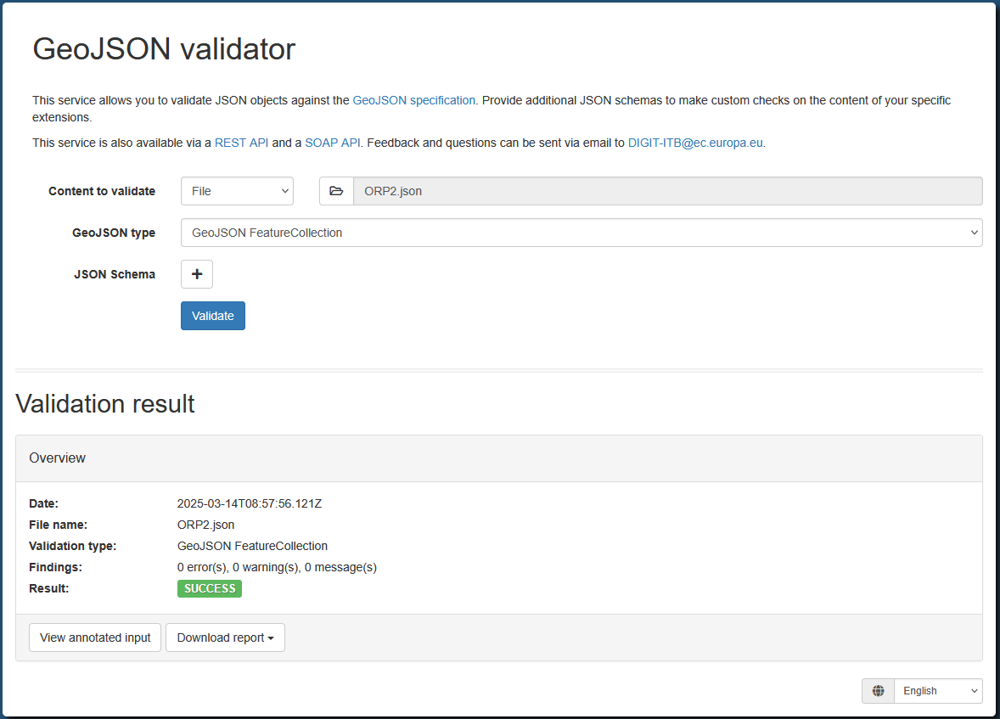{ width="600" }
        <figcaption>Kontrola GeoJSON pomocí GeoJSON validator</figcaption>
    </figure>
        
    <div align="center">

    [:material-layers-plus: GeoJSON s daty ORP](../assets/cviceni4/ORP_ywek.json){ .md-button .md-button--primary }

    </div>


Nyní se dostaneme k načtení polygonů ORP s atributy. Je potřeba vytvořit nový js soubor, např. ```ORP_GeoJSON.js```, ve kterém bude vložený GeoJSON s ORP, který jsme si dopředu připravili v GIS. Postup připojení bude velmi podobný jako v případě bodů měst. V podstatě vytvoříme novou proměnnou ```ORP```, do které přiřadíme GeoJSON.

Struktura nového souboru bude následující:

=== "ORP_GeoJSON.js"

    ``` js
    var ORP = {"type":"FeatureCollection","features":
    [
        ... // Zde jsou ostatní načtená data z GeoJSONu 
    ]
    };
    ```

Připojení v hlavičce ```index.html```:

=== "index.html"

    ``` html
    <!-- Načtení souboru s ORP GeoJSON-->
    <script src="ORP_GeoJSON.js"></script>
    ```

Provedeme jednoduché načtení polygonů ORP do aplikace. **Načítání dat ORP** musíme vypsat **téměř až na konci** skriptu. Tedy veškeré výpočetní či jiné funkce k němu vztažené vložíme v kódu před jeho načtení.

=== "script.js"

    ``` js
    // Načtení GeoJSONu s polygony ORP do mapy
    var ORPLayer = L.geoJSON(ORP).addTo(map);
    ```

<figure markdown>
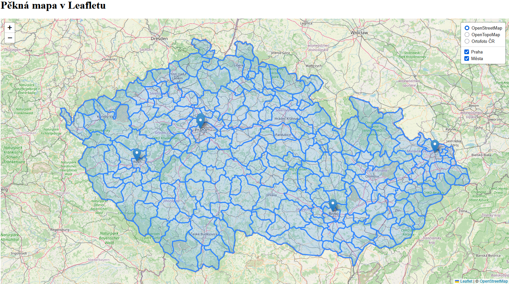{ width="800" }
    <figcaption>Zobrazení polygonů ORP v mapové aplikaci</figcaption>
</figure>

??? note "&nbsp;<span style="color:#448aff">Stav kódu po dokončení kroku 1) Připojení dat ORP</span>"

    === "index.html"

        ``` html
        <!DOCTYPE html> 
        <html> 
        <head> 
            <meta charset="UTF-8"> 
            <meta name="viewport" content="width=device-width, initial-scale=1.0">
            <link rel="stylesheet" href="style.css">

            <!-- Načtení souboru s městy GeoJSON-->
            <script src="mesta_GeoJSON.js"></script>

            <!-- Načtení souboru s ORP GeoJSON-->
            <script src="ORP_GeoJSON.js"></script>

            <!-- Externí připojení CSS symbologie Leaflet-->
            <link rel="stylesheet" href="https://unpkg.com/leaflet@1.9.4/dist/leaflet.css"
            integrity="sha256-p4NxAoJBhIIN+hmNHrzRCf9tD/miZyoHS5obTRR9BMY="
            crossorigin=""/>
            

            <!-- Externí připojení JS knihovny -> vložit až po připojení CSS souboru -->
            <script src="https://unpkg.com/leaflet@1.9.4/dist/leaflet.js"
            integrity="sha256-20nQCchB9co0qIjJZRGuk2/Z9VM+kNiyxNV1lvTlZBo="
            crossorigin=""></script>

            <title>Moje první Leaflet mapa</title> 
        </head>
        <body> 

            <h1>Pěkná mapa v Leafletu</h1> 

            <div id="map"></div>
            <script src="script.js"></script>

        </body>
        </html>
        ```


    === "script.js"

        ``` js
        // Nastavení mapy, jejího středu a úrovně přiblížení
        var map = L.map('map').setView([49.860, 15.315], 8); // Výběr bodu zhruba uprostřed republiky

        // Určení podkladové mapy, maximální úrovně přiblížení a zdroje dat
        var osm = L.tileLayer('https://tile.openstreetmap.org/{z}/{x}/{y}.png', {
            maxZoom: 19,
            attribution: '&copy; <a href="http://www.openstreetmap.org/copyright">OpenStreetMap</a>'
        }).addTo(map);

        // Definice podkladové OpenTopoMap
        var otm = L.tileLayer('https://{s}.tile.opentopomap.org/{z}/{x}/{y}.png', {
            maxZoom: 17,
            attribution: 'Map data: &copy; <a href="https://www.openstreetmap.org/copyright">OpenStreetMap</a> contributors, <a href="http://viewfinderpanoramas.org">SRTM</a> | Map style: &copy; <a href="https://opentopomap.org">OpenTopoMap</a> (<a href="https://creativecommons.org/licenses/by-sa/3.0/">CC-BY-SA</a>)'
        });

        // Přidání ortofota jako WMS služby, určení vrstvy, formátu a průhlednosti
        var ortofoto = L.tileLayer.wms("https://ags.cuzk.gov.cz/arcgis1/services/ORTOFOTO/MapServer/WMSServer", {
            layers: "0", 
            format: "image/png",
            transparent: true,
            attribution: "&copy ČÚZK"
        });

        // Načtení bodu z GeoJSON zápisu
        var prahaBod = [
            {
                "type": "FeatureCollection",
                "features": [
                {
                    "type": "Feature",
                    "properties": {},
                    "geometry": {
                    "coordinates": [
                        14.41581389404206,
                        50.0970543797564
                    ],
                    "type": "Point"
                    }
                }
                ]
            }
        ];

        // Přiřazení GeoJSONu do mapové vrstvy a její přidání do mapy
        var prahaBodLayer = L.geoJSON(prahaBod).addTo(map);

        // Načtení GeoJSONu z proměnné "mesta" uložené v souboru "mesta_GeoJSON.js"
        var mestaLayer = L.geoJSON(mesta, {
        onEachFeature: function (feature, layer) {
            if (feature.properties && feature.properties.nazev) {
                // layer.bindPopup(feature.properties.nazev); // Obyčejný popup
                layer.bindPopup(`Jméno města je <b>${feature.properties.nazev}</b>`); // Vylepšený popup
            }
        }
        }).addTo(map);

        // Načtení GeoJSONu s polygony ORP do mapy
        var ORPLayer = L.geoJSON(ORP).addTo(map);

        // Proměnná uchovávající podkladové mapy, mezi kterými chceme přepínat
        var baseMaps = {
            "OpenStreetMap": osm, // "popis mapy": nazevPromenne
            "OpenTopoMap": otm,
            "Ortofoto ČR": ortofoto
        };

        // Proměnná uchovávající mapové vrstvy, které chceme zobrazovat a skrývat
        var overlayMaps = {
            "Praha": prahaBodLayer,
            "Města": mestaLayer
        };

        // Grafické přepínání podkladových map
        var layerControl = L.control.layers(baseMaps, overlayMaps, {collapsed: false}).addTo(map);
        ```

    === "style.css - beze změny"

        ``` css
        /* Velikost mapového okna */
        #map {
            height: 800px;
            width: 60%;
        }
        ```

### 2) Základní statický kartogram

Pro vytvoření kartogramu je potřeba nejprve upravit načítání bodů z GeoJSONu.

=== "script.js"

    ``` js
    // Načtení GeoJSONu s polygony ORP do mapy
    var ORPLayer = L.geoJSON(ORP,{
        style: kartogram, 
    }).addTo(map);
    ```

Po přiřazení stylu ```kartogram``` do vrstvy ```ORPLayer``` bude potřeba vytvořit barvnou stupnici pro kartogram. Pro představu o rozsahu dat můžeme využít náhled v GISu. 


!!! info "&nbsp;<span>Výpočet hodnoty zobrazovaného atributu přímo v JavaScriptu</span>"

    Pokud máme z GISu připravený atribut pro vizualizaci, můžeme pokračovat s přípravou barevné stupnice níže. Nicméně, v této ukázce si ještě musíme dopočítat hustotu obyvatelstva v každém ORP.

    === "script.js"

    ``` js
    // Výpočet nového atributu pro každý prvek ORP 
    // (hustota obyvatelstva = počet obyvatel / plocha), převod z m2 na km2 -> vynásobení 1 000 000
    ORP.features.forEach(function(feature){
        if(feature.properties.Shape_Area && feature.properties.poc_obyv_SLDB_2021){
            feature.properties.hustota = (feature.properties.poc_obyv_SLDB_2021/feature.properties.Shape_Area)*1000000
        }else{
            feature.properties.hustota = 0
        }
    })
    ```


V tomto příkladu budeme pracovat s hustotou obyvatelstva v jednotlivých ORP, ale je možné použít jiný vhodný relativní atribut. Barevnou stupnici můžeme vytvořit pomocí nástroje [ColorBrewer](https://colorbrewer2.org/).

=== "script.js"

    ``` js
    // Vytvoření barevné stupnice
    function getColor(d) {
    return d > 1000 ? '#800026' :
            d > 500  ? '#BD0026' :
            d > 200  ? '#E31A1C' :
            d > 100  ? '#FC4E2A' :
            d > 50   ? '#FD8D3C' :
            d > 20   ? '#FEB24C' :
                        '#FFEDA0'; // Výchozí barva
    }
    ```

Pro vytvoření statického kartogramu je nutné ještě definovat jeho styl, ve kterém určíme atribut, který chceme vizualizovat. Dále můžeme upravit styl vrstvy (průhlednost, ohraničení apod.).

=== "script.js"

    ``` js
    // Styl kartogramu
    function kartogram(feature) {
    return {
        fillColor: getColor(feature.properties.hustota), // Styl na základě atributu "hustota"
        weight: 1,
        opacity: 1,
        color: 'white',
        fillOpacity: 0.7
    };
    }
    ```

Závěrem pouze odstraníme vykreslování bodových vrstev při načtení mapy – ponecháme je pouze v seznamu vrstev (smazáním příslušných ```.addTo(map)```). Do seznamu přidáme nově vytvořenou vrstvu kartogramu ```ORPLayer```.

=== "script.js"

    ``` js
    // Proměnná uchovávající mapové vrstvy, které chceme zobrazovat a skrývat
    var overlayMaps = {
        "Praha": prahaBodLayer,
        "Města": mestaLayer,
        "Hustota obyvatelstva": ORPLayer
    };
    ```

<figure markdown>
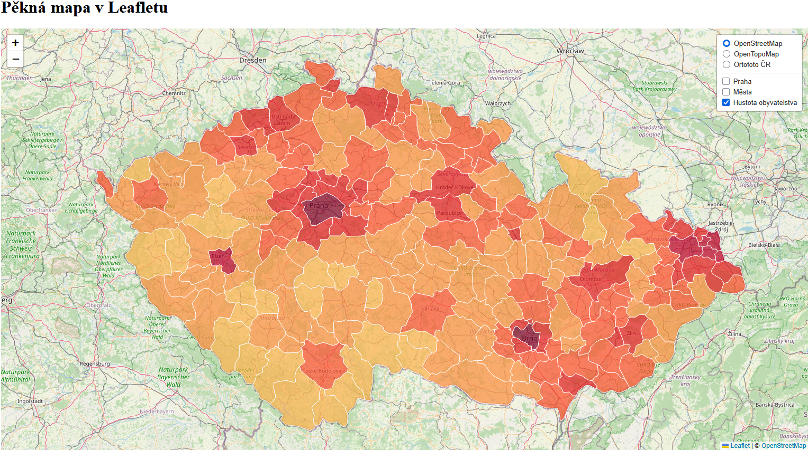{ width="800" }
    <figcaption>Vytvoření statického (neinteraktivního) kartogramu</figcaption>
</figure>

??? note "&nbsp;<span style="color:#448aff">Stav kódu po dokončení kroku 2) Základní statický kartogram</span>"

    === "index.html - beze změny"

        ``` html
        <!DOCTYPE html> 
        <html> 
        <head> 
            <meta charset="UTF-8"> 
            <meta name="viewport" content="width=device-width, initial-scale=1.0">
            <link rel="stylesheet" href="style.css">

            <!-- Načtení souboru s městy GeoJSON-->
            <script src="mesta_GeoJSON.js"></script>

            <!-- Načtení souboru s ORP GeoJSON-->
            <script src="ORP_GeoJSON.js"></script>

            <!-- Externí připojení CSS symbologie Leaflet-->
            <link rel="stylesheet" href="https://unpkg.com/leaflet@1.9.4/dist/leaflet.css"
            integrity="sha256-p4NxAoJBhIIN+hmNHrzRCf9tD/miZyoHS5obTRR9BMY="
            crossorigin=""/>
            

            <!-- Externí připojení JS knihovny -> vložit až po připojení CSS souboru -->
            <script src="https://unpkg.com/leaflet@1.9.4/dist/leaflet.js"
            integrity="sha256-20nQCchB9co0qIjJZRGuk2/Z9VM+kNiyxNV1lvTlZBo="
            crossorigin=""></script>

            <title>Moje první Leaflet mapa</title> 
        </head>
        <body> 

            <h1>Pěkná mapa v Leafletu</h1> 

            <div id="map"></div>
            <script src="script.js"></script>

        </body>
        </html>
        ```


    === "script.js"

        ``` js
        // Nastavení mapy, jejího středu a úrovně přiblížení
        var map = L.map('map').setView([49.860, 15.315], 8); // Výběr bodu zhruba uprostřed republiky

        // Určení podkladové mapy, maximální úrovně přiblížení a zdroje dat
        var osm = L.tileLayer('https://tile.openstreetmap.org/{z}/{x}/{y}.png', {
            maxZoom: 19,
            attribution: '&copy; <a href="http://www.openstreetmap.org/copyright">OpenStreetMap</a>'
        }).addTo(map);

        // Definice podkladové OpenTopoMap
        var otm = L.tileLayer('https://{s}.tile.opentopomap.org/{z}/{x}/{y}.png', {
            maxZoom: 17,
            attribution: 'Map data: &copy; <a href="https://www.openstreetmap.org/copyright">OpenStreetMap</a> contributors, <a href="http://viewfinderpanoramas.org">SRTM</a> | Map style: &copy; <a href="https://opentopomap.org">OpenTopoMap</a> (<a href="https://creativecommons.org/licenses/by-sa/3.0/">CC-BY-SA</a>)'
        });

        // Přidání ortofota jako WMS služby, určení vrstvy, formátu a průhlednosti
        var ortofoto = L.tileLayer.wms("https://ags.cuzk.gov.cz/arcgis1/services/ORTOFOTO/MapServer/WMSServer", {
            layers: "0", 
            format: "image/png",
            transparent: true,
            attribution: "&copy ČÚZK"
        });

        // Načtení bodu z GeoJSON zápisu
        var prahaBod = [
            {
                "type": "FeatureCollection",
                "features": [
                {
                    "type": "Feature",
                    "properties": {},
                    "geometry": {
                    "coordinates": [
                        14.41581389404206,
                        50.0970543797564
                    ],
                    "type": "Point"
                    }
                }
                ]
            }
        ];

        // Přiřazení GeoJSONu do mapové vrstvy a její přidání do mapy
        var prahaBodLayer = L.geoJSON(prahaBod);

        // Načtení GeoJSONu z proměnné "mesta" uložené v souboru "mesta_GeoJSON.js"
        var mestaLayer = L.geoJSON(mesta, {
        onEachFeature: function (feature, layer) {
            if (feature.properties && feature.properties.nazev) {
                // layer.bindPopup(feature.properties.nazev); // Obyčejný popup
                layer.bindPopup(`Jméno města je <b>${feature.properties.nazev}</b>`); // Vylepšený popup
            }
        }
        });

        // Výpočet nového atributu pro každý prvek ORP 
        // (hustota obyvatelstva = počet obyvatel / plocha), převod z m2 na km2 -> vynásobení 1 000 000
        ORP.features.forEach(function(feature){
            if(feature.properties.Shape_Area && feature.properties.poc_obyv_SLDB_2021){
                feature.properties.hustota = (feature.properties.poc_obyv_SLDB_2021/feature.properties.Shape_Area)*1000000
            }else{
                feature.properties.hustota = 0
            }
        })

        // Vytvoření barevné stupnice
        function getColor(d) {
        return d > 1000 ? '#800026' :
                d > 500  ? '#BD0026' :
                d > 200  ? '#E31A1C' :
                d > 100  ? '#FC4E2A' :
                d > 50   ? '#FD8D3C' :
                d > 20   ? '#FEB24C' :
                            '#FFEDA0'; // Výchozí barva
        }

        // Styl kartogramu
        function kartogram(feature) {
        return {
            fillColor: getColor(feature.properties.hustota), // Styl na základě atributu "hustota"
            weight: 1,
            opacity: 1,
            color: 'white',
            fillOpacity: 0.7
        };
        }

        // Načtení GeoJSONu s polygony ORP do mapy
        var ORPLayer = L.geoJSON(ORP,{
            style: kartogram 
        }).addTo(map);

        // Proměnná uchovávající podkladové mapy, mezi kterými chceme přepínat
        var baseMaps = {
            "OpenStreetMap": osm, // "popis mapy": nazevPromenne
            "OpenTopoMap": otm,
            "Ortofoto ČR": ortofoto
        };

        // Proměnná uchovávající mapové vrstvy, které chceme zobrazovat a skrývat
        var overlayMaps = {
            "Praha": prahaBodLayer,
            "Města": mestaLayer,
            "Hustota obyvatelstva": ORPLayer
        };

        // Grafické přepínání podkladových map
        var layerControl = L.control.layers(baseMaps, overlayMaps, {collapsed: false}).addTo(map);
        ```

    === "style.css - beze změny"

        ``` css
        /* Velikost mapového okna */
        #map {
            height: 800px;
            width: 60%;
        }
        ```

### 3) Interaktivní kartogram

Nyní statický kartogram upravíme tak, aby byl interaktivní, a tedy vhodný pro webovou mapovou aplikaci.

V první řadě nastavíme zvýraznění a výběr polygonu po najetí kurzoru myši.

=== "script.js"

    ``` js
    // Výběr prvku po najetí kurzorem myši
    function highlightFeature(e) {
        var layer = e.target;

        // Úprava stylu vybraného prvku = jeho zvýraznění
        layer.setStyle({
            weight: 5,
            color: '#666',
            dashArray: '',
            fillOpacity: 0.7
        });

        layer.bringToFront();
    }
    ```

Dále přidáme přiblížení mapy na vybraný polygon po kliknutí levého tlačítka myši.

=== "script.js"

    ``` js
    // Přiblížení na vybraný polygon po kliknutí myší
    function zoomToFeature(e) {
        map.fitBounds(e.target.getBounds());
    }
    ```

Abychom byli schopni přistupovat k jednotlivým prvkům kartogramu, je potřeba vytvořit funkci ```onEachFeature```, ve které definujeme procesy výběru polygonu a přiblížení na něj. 

=== "script.js"

    ``` js
    // Přístup k jednotlivým polygonů ve vrstvě
    function onEachFeature(feature, layer) {
        layer.on({
            mouseover: highlightFeature,
            click: zoomToFeature
        });
    }
    ```

Pro vytvoření funkčního kódu musíme přiřadit funkci ```onEachFeature``` do definice vrstvy:

=== "script.js"

    ``` js
    // Načtení GeoJSONu s polygony ORP do mapy
    var ORPLayer = L.geoJSON(ORP,{
        style: kartogram, 
        onEachFeature: onEachFeature
    }).addTo(map);
    ```


Při otestování aplikace v současném stavu zjistíme, že se vybrané polygony nevypínají, tzn. zůstávají stále zvýrazněné.

<figure markdown>
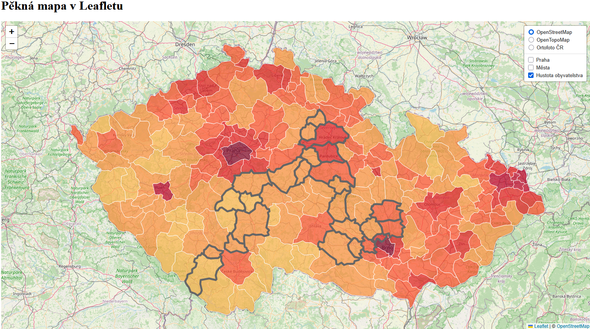{ width="800" }
    <figcaption>ORP zůstávají vybrané i po přejetí myši na jiný polygon</figcaption>
</figure>

V kódu je potřeba přidat ošetření tohoto stavu tak, aby se styl daného polygonu resetoval do základního nastavení.

=== "script.js"

    ``` js
    // Resetování stylu kartogramu po zrušení jeho výběru myší
    function resetHighlight(e) {
        ORPLayer.resetStyle(e.target);
    }
    ```

Pro správné fungování je nutné nově vytvořenou funkci ```resetHighlight``` přidat do funkce ```onEachFeature```.

=== "script.js"

    ``` js
    // Přístup k jednotlivým polygonů ve vrstvě
    function onEachFeature(feature, layer) {
    layer.on({
        mouseover: highlightFeature,
        mouseout: resetHighlight,
        click: zoomToFeature
    });
    }
    ```

Aplikace následně funguje správně, tedy po najejí myši se vybere vždy jeden polygon. Ten se po změně výběru opět skryje a zvýrazní se další vybraný polygon.

<figure markdown>
{ width="800" }
    <figcaption>Interaktivní výběr prvku v mapě</figcaption>
</figure>

??? note "&nbsp;<span style="color:#448aff">Stav kódu po dokončení kroku 3) Interaktivní kartogram</span>"

    === "index.html - beze změny"

        ``` html
        <!DOCTYPE html> 
        <html> 
        <head> 
            <meta charset="UTF-8"> 
            <meta name="viewport" content="width=device-width, initial-scale=1.0">
            <link rel="stylesheet" href="style.css">

            <!-- Načtení souboru s městy GeoJSON-->
            <script src="mesta_GeoJSON.js"></script>

            <!-- Načtení souboru s ORP GeoJSON-->
            <script src="ORP_GeoJSON.js"></script>

            <!-- Externí připojení CSS symbologie Leaflet-->
            <link rel="stylesheet" href="https://unpkg.com/leaflet@1.9.4/dist/leaflet.css"
            integrity="sha256-p4NxAoJBhIIN+hmNHrzRCf9tD/miZyoHS5obTRR9BMY="
            crossorigin=""/>
            

            <!-- Externí připojení JS knihovny -> vložit až po připojení CSS souboru -->
            <script src="https://unpkg.com/leaflet@1.9.4/dist/leaflet.js"
            integrity="sha256-20nQCchB9co0qIjJZRGuk2/Z9VM+kNiyxNV1lvTlZBo="
            crossorigin=""></script>

            <title>Moje první Leaflet mapa</title> 
        </head>
        <body> 

            <h1>Pěkná mapa v Leafletu</h1> 

            <div id="map"></div>
            <script src="script.js"></script>

        </body>
        </html>
        ```


    === "script.js"

        ``` js
        // Nastavení mapy, jejího středu a úrovně přiblížení
        var map = L.map('map').setView([49.860, 15.315], 8); // Výběr bodu zhruba uprostřed republiky

        // Určení podkladové mapy, maximální úrovně přiblížení a zdroje dat
        var osm = L.tileLayer('https://tile.openstreetmap.org/{z}/{x}/{y}.png', {
            maxZoom: 19,
            attribution: '&copy; <a href="http://www.openstreetmap.org/copyright">OpenStreetMap</a>'
        }).addTo(map);

        // Definice podkladové OpenTopoMap
        var otm = L.tileLayer('https://{s}.tile.opentopomap.org/{z}/{x}/{y}.png', {
            maxZoom: 17,
            attribution: 'Map data: &copy; <a href="https://www.openstreetmap.org/copyright">OpenStreetMap</a> contributors, <a href="http://viewfinderpanoramas.org">SRTM</a> | Map style: &copy; <a href="https://opentopomap.org">OpenTopoMap</a> (<a href="https://creativecommons.org/licenses/by-sa/3.0/">CC-BY-SA</a>)'
        });

        // Přidání ortofota jako WMS služby, určení vrstvy, formátu a průhlednosti
        var ortofoto = L.tileLayer.wms("https://ags.cuzk.gov.cz/arcgis1/services/ORTOFOTO/MapServer/WMSServer", {
            layers: "0", 
            format: "image/png",
            transparent: true,
            attribution: "&copy ČÚZK"
        });

        // Načtení bodu z GeoJSON zápisu
        var prahaBod = [
            {
                "type": "FeatureCollection",
                "features": [
                {
                    "type": "Feature",
                    "properties": {},
                    "geometry": {
                    "coordinates": [
                        14.41581389404206,
                        50.0970543797564
                    ],
                    "type": "Point"
                    }
                }
                ]
            }
        ];

        // Přiřazení GeoJSONu do mapové vrstvy a její přidání do mapy
        var prahaBodLayer = L.geoJSON(prahaBod);

        // Načtení GeoJSONu z proměnné "mesta" uložené v souboru "mesta_GeoJSON.js"
        var mestaLayer = L.geoJSON(mesta, {
        onEachFeature: function (feature, layer) {
            if (feature.properties && feature.properties.nazev) {
                // layer.bindPopup(feature.properties.nazev); // Obyčejný popup
                layer.bindPopup(`Jméno města je <b>${feature.properties.nazev}</b>`); // Vylepšený popup
            }
        }
        });

        // Výpočet nového atributu pro každý prvek ORP 
        // (hustota obyvatelstva = počet obyvatel / plocha), převod z m2 na km2 -> vynásobení 1 000 000
        ORP.features.forEach(function(feature){
            if(feature.properties.Shape_Area && feature.properties.poc_obyv_SLDB_2021){
                feature.properties.hustota = (feature.properties.poc_obyv_SLDB_2021/feature.properties.Shape_Area)*1000000
            }else{
                feature.properties.hustota = 0
            }
        })

        // Vytvoření barevné stupnice
        function getColor(d) {
        return d > 1000 ? '#800026' :
                d > 500  ? '#BD0026' :
                d > 200  ? '#E31A1C' :
                d > 100  ? '#FC4E2A' :
                d > 50   ? '#FD8D3C' :
                d > 20   ? '#FEB24C' :
                            '#FFEDA0'; // Výchozí barva
        }

        // Styl kartogramu
        function kartogram(feature) {
        return {
            fillColor: getColor(feature.properties.hustota), // Styl na základě atributu "hustota"
            weight: 1,
            opacity: 1,
            color: 'white',
            fillOpacity: 0.7
        };
        }

        // Výběr prvku po najetí kurzorem myši
        function highlightFeature(e) {
            var layer = e.target;

            // Úprava stylu vybraného prvku = jeho zvýraznění
            layer.setStyle({
                weight: 5,
                color: '#666',
                dashArray: '',
                fillOpacity: 0.7
            });

            layer.bringToFront();
        }

        // Přiblížení na vybraný polygon po kliknutí myší
        function zoomToFeature(e) {
            map.fitBounds(e.target.getBounds());
        }

        // Resetování stylu kartogramu po zrušení jeho výběru myší
        function resetHighlight(e) {
            ORPLayer.resetStyle(e.target);
        }

        // Přístup k jednotlivým polygonů ve vrstvě
        function onEachFeature(feature, layer) {
            layer.on({
                mouseover: highlightFeature,
                mouseout: resetHighlight,
                click: zoomToFeature
            });
        }

        // Načtení GeoJSONu s polygony ORP do mapy
        var ORPLayer = L.geoJSON(ORP,{
            style: kartogram, 
            onEachFeature: onEachFeature
        }).addTo(map);

        // Proměnná uchovávající podkladové mapy, mezi kterými chceme přepínat
        var baseMaps = {
            "OpenStreetMap": osm, // "popis mapy": nazevPromenne
            "OpenTopoMap": otm,
            "Ortofoto ČR": ortofoto
        };

        // Proměnná uchovávající mapové vrstvy, které chceme zobrazovat a skrývat
        var overlayMaps = {
            "Praha": prahaBodLayer,
            "Města": mestaLayer,
            "Hustota obyvatelstva": ORPLayer
        };

        // Grafické přepínání podkladových map
        var layerControl = L.control.layers(baseMaps, overlayMaps, {collapsed: false}).addTo(map);
        ```

    === "style.css - beze změny"

        ``` css
        /* Velikost mapového okna */
        #map {
            height: 800px;
            width: 60%;
        }
        ```

### 4) Přidání pop-upu a legendy

Nejprve vypíšeme informace o vybraném prvku z mapy do samostatného divu, který vytvoříme přímo pomocí js.

V informačním pop-upu se vypíše text, který bude využívat dva atributy polygonů z GeoJSONu - ```NAZEV``` a ```hustota``` (zaokrouhlíme na 2 des. místa).

=== "script.js"

    ``` js
    // Vytvoření pop-upu s informacemi o vybraném prvku v mapě
    var info = L.control();

    info.onAdd = function (map) {
        this._div = L.DomUtil.create('div', 'info'); // Vytvoří div s třídou "info"
        this.update();
        return this._div;
    };

    // Funkce pro aktualizaci po-upu na základě předaných vlastností prvku
    info.update = function (props) {
        this._div.innerHTML = '<h4>Hustota obyvatel</h4>' +  (props ?
            '<b>' + props.nazev + '</b><br />' + props.hustota.toFixed(2) + ' obyv. / km<sup>2</sup>'
            : 'Vyber ORP'); // Výpis, pokud není vybraný prvek
    };

    // Vložení info pop-upu do mapy
    info.addTo(map); 
    ```

Pro aktualizaci info pop-upu na základě výběru prvku ještě musíme upravit funkce ```highlightFeature``` a ```resetHighlight```.

=== "script.js"

    ``` js
    // Výběr prvku po najetí kurzorem myši
    function highlightFeature(e) {
        var layer = e.target;

        // Úprava stylu vybraného prvku = jeho zvýraznění
        layer.setStyle({
            weight: 5,
            color: '#666',
            dashArray: '',
            fillOpacity: 0.7
        });

        layer.bringToFront();
        info.update(layer.feature.properties); // Aktualizace info pop-upu při výběru prvku
    }

    // Resetování stylu kartogramu po zrušení jeho výběru myší
    function resetHighlight(e) {
        ORPLayer.resetStyle(e.target);
        info.update(); // Aktualizace info pop-upu při výběru prvku
    }
    ```

Výsledná aplikace by měla vypadat zhruba takto. V pravém horním rohu se vypisují vybrané atributy zvoleného polygonu, nicméně je potřeba vytvořit styl daného divu.

<figure markdown>
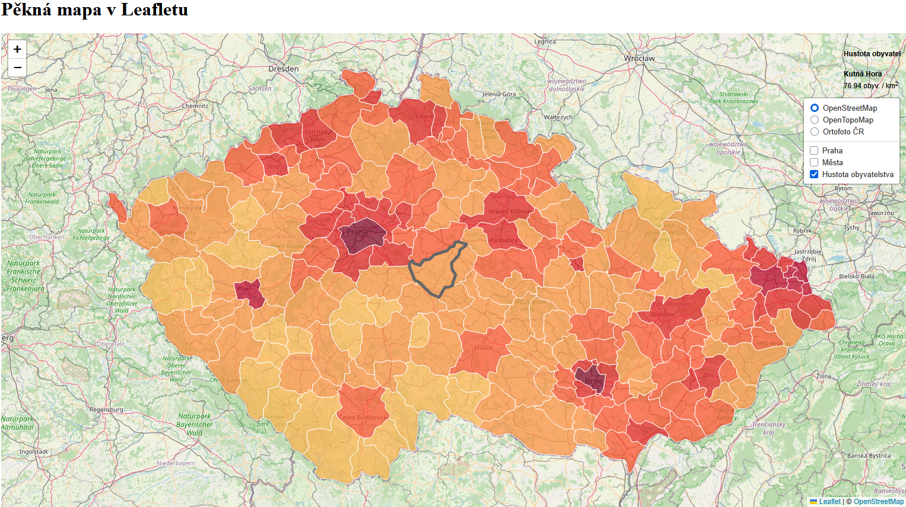{ width="800" }
    <figcaption>Výpis atributů vybraného prvku</figcaption>
</figure>

Úprava stylu divu s pop-upem v souboru ```style.css```:

=== "style.css"

    ``` js
    /* Div třídy info */
    .info {
        padding: 6px 8px;
        font: 14px/16px Arial, Helvetica, sans-serif;
        background: white;
        background: rgba(255,255,255,0.8);
        box-shadow: 0 0 15px rgba(0,0,0,0.2);
        border-radius: 5px;
    }

    /* Nadpis v divu info */
    .info h4 {
        margin: 0 0 5px;
        color: #777;
    }
    ```

<figure markdown>
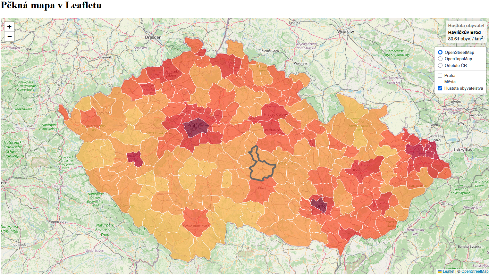{ width="800" }
    <figcaption>Upravený styl pop-upu pro výpis informací o prvku</figcaption>
</figure>

V posledním kroku přidáme legendu a upravíme její styl.

=== "script.js"

    ``` js
    // Vytvoření legendy a nastavení její pozice
    var legend = L.control({position: 'bottomright'});

    legend.onAdd = function (map) {

        var div = L.DomUtil.create('div', 'info legend'),
            grades = [0, 20, 50, 100, 200, 500, 1000], // Hranice intervalů - stejné jako v nastavení stylu kartogramu
            labels = [];

        div.innerHTML += '<h4>Hustota obyvatel</h4>' + 'obyv. / km<sup>2</sup><br />'; // Nadpis legendy

        // Procházení intervalů hustoty - pro každý interval se vygeneruje štítek s barevným čtvercem.
        for (var i = 0; i < grades.length; i++) {
            div.innerHTML +=
                '<i style="background:' + getColor(grades[i] + 1) + '"></i> ' +
                grades[i] + (grades[i + 1] ? '&ndash;' + grades[i + 1] + '<br>' : '+');
        }

        return div;
    };

    // Přidání legendy do mapy
    legend.addTo(map);
    ```

Pro správné zobrazení všech součástí legendy musíme upravit ```style.css```.

=== "style.css"

    ``` js
    /* Úprava stylu legendy*/
    .legend {
        line-height: 18px;
        color: #555;
    }

    /* Zobrazení čtverců s barvou stylu každého atributu */
    .legend i {
        width: 18px;
        height: 18px;
        float: left;
        margin-right: 8px;
        opacity: 0.7;
    }
    ```

<figure markdown>
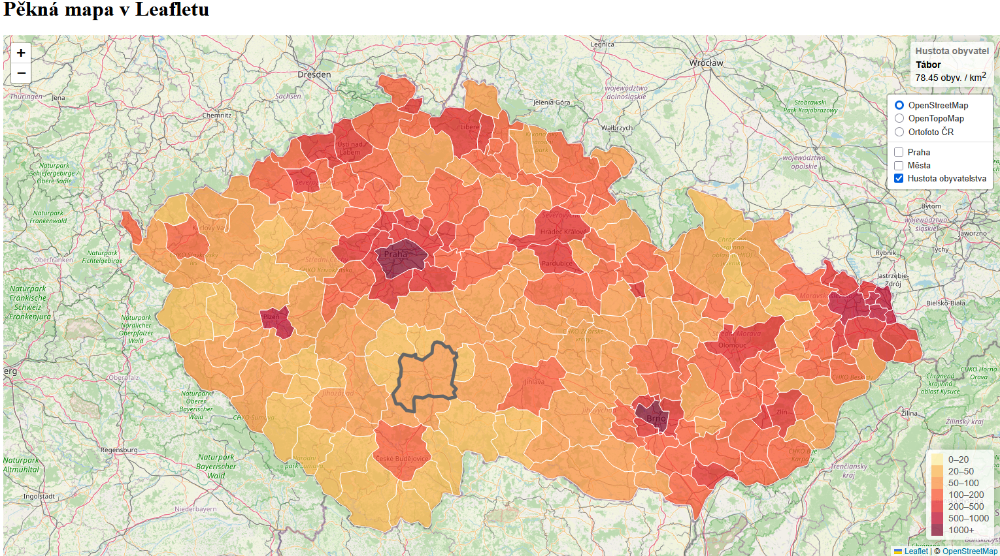{ width="1000" }
    <figcaption>Finální mapa se zobrazenou legendou</figcaption>
</figure>

??? note "&nbsp;<span style="color:#448aff">Stav kódu po dokončení kroku 4) Přidání pop-upu a legendy</span>"

    === "index.html - beze změny"

        ``` html
        <!DOCTYPE html> 
        <html> 
        <head> 
            <meta charset="UTF-8"> 
            <meta name="viewport" content="width=device-width, initial-scale=1.0">
            <link rel="stylesheet" href="style.css">

            <!-- Načtení souboru s městy GeoJSON-->
            <script src="mesta_GeoJSON.js"></script>

            <!-- Načtení souboru s ORP GeoJSON-->
            <script src="ORP_GeoJSON.js"></script>

            <!-- Externí připojení CSS symbologie Leaflet-->
            <link rel="stylesheet" href="https://unpkg.com/leaflet@1.9.4/dist/leaflet.css"
            integrity="sha256-p4NxAoJBhIIN+hmNHrzRCf9tD/miZyoHS5obTRR9BMY="
            crossorigin=""/>
            

            <!-- Externí připojení JS knihovny -> vložit až po připojení CSS souboru -->
            <script src="https://unpkg.com/leaflet@1.9.4/dist/leaflet.js"
            integrity="sha256-20nQCchB9co0qIjJZRGuk2/Z9VM+kNiyxNV1lvTlZBo="
            crossorigin=""></script>

            <title>Moje první Leaflet mapa</title> 
        </head>
        <body> 

            <h1>Pěkná mapa v Leafletu</h1> 

            <div id="map"></div>
            <script src="script.js"></script>

        </body>
        </html>
        ```


    === "script.js"

        ``` js
        // Nastavení mapy, jejího středu a úrovně přiblížení
        var map = L.map('map').setView([49.860, 15.315], 8); // Výběr bodu zhruba uprostřed republiky

        // Určení podkladové mapy, maximální úrovně přiblížení a zdroje dat
        var osm = L.tileLayer('https://tile.openstreetmap.org/{z}/{x}/{y}.png', {
            maxZoom: 19,
            attribution: '&copy; <a href="http://www.openstreetmap.org/copyright">OpenStreetMap</a>'
        }).addTo(map);

        // Definice podkladové OpenTopoMap
        var otm = L.tileLayer('https://{s}.tile.opentopomap.org/{z}/{x}/{y}.png', {
            maxZoom: 17,
            attribution: 'Map data: &copy; <a href="https://www.openstreetmap.org/copyright">OpenStreetMap</a> contributors, <a href="http://viewfinderpanoramas.org">SRTM</a> | Map style: &copy; <a href="https://opentopomap.org">OpenTopoMap</a> (<a href="https://creativecommons.org/licenses/by-sa/3.0/">CC-BY-SA</a>)'
        });

        // Přidání ortofota jako WMS služby, určení vrstvy, formátu a průhlednosti
        var ortofoto = L.tileLayer.wms("https://ags.cuzk.gov.cz/arcgis1/services/ORTOFOTO/MapServer/WMSServer", {
            layers: "0", 
            format: "image/png",
            transparent: true,
            attribution: "&copy ČÚZK"
        });

        // Načtení bodu z GeoJSON zápisu
        var prahaBod = [
            {
                "type": "FeatureCollection",
                "features": [
                {
                    "type": "Feature",
                    "properties": {},
                    "geometry": {
                    "coordinates": [
                        14.41581389404206,
                        50.0970543797564
                    ],
                    "type": "Point"
                    }
                }
                ]
            }
        ];

        // Přiřazení GeoJSONu do mapové vrstvy a její přidání do mapy
        var prahaBodLayer = L.geoJSON(prahaBod);

        // Načtení GeoJSONu z proměnné "mesta" uložené v souboru "mesta_GeoJSON.js"
        var mestaLayer = L.geoJSON(mesta, {
        onEachFeature: function (feature, layer) {
            if (feature.properties && feature.properties.nazev) {
                // layer.bindPopup(feature.properties.nazev); // Obyčejný popup
                layer.bindPopup(`Jméno města je <b>${feature.properties.nazev}</b>`); // Vylepšený popup
            }
        }
        });

        // Výpočet nového atributu pro každý prvek ORP 
        // (hustota obyvatelstva = počet obyvatel / plocha), převod z m2 na km2 -> vynásobení 1 000 000
        ORP.features.forEach(function(feature){
            if(feature.properties.Shape_Area && feature.properties.poc_obyv_SLDB_2021){
                feature.properties.hustota = (feature.properties.poc_obyv_SLDB_2021/feature.properties.Shape_Area)*1000000
            }else{
                feature.properties.hustota = 0
            }
        })

        // Vytvoření barevné stupnice
        function getColor(d) {
        return d > 1000 ? '#800026' :
                d > 500  ? '#BD0026' :
                d > 200  ? '#E31A1C' :
                d > 100  ? '#FC4E2A' :
                d > 50   ? '#FD8D3C' :
                d > 20   ? '#FEB24C' :
                            '#FFEDA0'; // Výchozí barva
        }

        // Styl kartogramu
        function kartogram(feature) {
        return {
            fillColor: getColor(feature.properties.hustota), // Styl na základě atributu "hustota"
            weight: 1,
            opacity: 1,
            color: 'white',
            fillOpacity: 0.7
        };
        }

        // Výběr prvku po najetí kurzorem myši
        function highlightFeature(e) {
            var layer = e.target;

            // Úprava stylu vybraného prvku = jeho zvýraznění
            layer.setStyle({
                weight: 5,
                color: '#666',
                dashArray: '',
                fillOpacity: 0.7
            });

            layer.bringToFront();
            info.update(layer.feature.properties); // Aktualizace info pop-upu při výběru prvku
        }

        // Přiblížení na vybraný polygon po kliknutí myší
        function zoomToFeature(e) {
            map.fitBounds(e.target.getBounds());
        }

        // Resetování stylu kartogramu po zrušení jeho výběru myší
        function resetHighlight(e) {
            ORPLayer.resetStyle(e.target);
            info.update(); // Aktualizace info pop-upu při výběru prvku
        }

        // Přístup k jednotlivým polygonů ve vrstvě
        function onEachFeature(feature, layer) {
            layer.on({
                mouseover: highlightFeature,
                mouseout: resetHighlight,
                click: zoomToFeature
            });
        }

        // Vytvoření pop-upu s informacemi o vybraném prvku v mapě
        var info = L.control();

        info.onAdd = function (map) {
            this._div = L.DomUtil.create('div', 'info'); // Vytvoří div s třídou "info"
            this.update();
            return this._div;
        };

        // Funkce pro aktualizaci po-upu na základě předaných vlastností prvku
        info.update = function (props) {
            this._div.innerHTML = '<h4>Hustota obyvatel</h4>' +  (props ?
                '<b>' + props.nazev + '</b><br />' + props.hustota.toFixed(2) + ' obyv. / km<sup>2</sup>'
                : 'Vyber ORP'); // Výpis, pokud není vybraný prvek
        };

        // Vložení info pop-upu do mapy
        info.addTo(map); 

        // Vytvoření legendy a nastavení její pozice
        var legend = L.control({position: 'bottomright'});

        legend.onAdd = function (map) {

            var div = L.DomUtil.create('div', 'info legend'),
                grades = [0, 20, 50, 100, 200, 500, 1000], // Hranice intervalů - stejné jako v nastavení stylu kartogramu
                labels = [];

            div.innerHTML += '<h4>Hustota obyvatel</h4>' + 'obyv. / km<sup>2</sup><br />'; // Nadpis legendy

            // Procházení intervalů hustoty - pro každý interval se vygeneruje štítek s barevným čtvercem.
            for (var i = 0; i < grades.length; i++) {
                div.innerHTML +=
                    '<i style="background:' + getColor(grades[i] + 1) + '"></i> ' +
                    grades[i] + (grades[i + 1] ? '&ndash;' + grades[i + 1] + '<br>' : '+');
            }

            return div;
        };

        // Přidání legendy do mapy
        legend.addTo(map);

        // Načtení GeoJSONu s polygony ORP do mapy
        var ORPLayer = L.geoJSON(ORP,{
            style: kartogram, 
            onEachFeature: onEachFeature
        }).addTo(map);

        // Proměnná uchovávající podkladové mapy, mezi kterými chceme přepínat
        var baseMaps = {
            "OpenStreetMap": osm, // "popis mapy": nazevPromenne
            "OpenTopoMap": otm,
            "Ortofoto ČR": ortofoto
        };

        // Proměnná uchovávající mapové vrstvy, které chceme zobrazovat a skrývat
        var overlayMaps = {
            "Praha": prahaBodLayer,
            "Města": mestaLayer,
            "Hustota obyvatelstva": ORPLayer
        };

        // Grafické přepínání podkladových map
        var layerControl = L.control.layers(baseMaps, overlayMaps, {collapsed: false}).addTo(map);
        ```

    === "style.css"

        ``` css
        /* Velikost mapového okna */
        #map {
            height: 800px;
            width: 60%;
        }

        /* Div třídy info */
        .info {
            padding: 6px 8px;
            font: 14px/16px Arial, Helvetica, sans-serif;
            background: white;
            background: rgba(255,255,255,0.8);
            box-shadow: 0 0 15px rgba(0,0,0,0.2);
            border-radius: 5px;
        }

        /* Nadpis v divu info */
        .info h4 {
            margin: 0 0 5px;
            color: #777;
        }

        /* Úprava stylu legendy*/
        .legend {
            line-height: 18px;
            color: #555;
        }

        /* Zobrazení čtverců s barvou stylu každého atributu */
        .legend i {
            width: 18px;
            height: 18px;
            float: left;
            margin-right: 8px;
            opacity: 0.7;
        }
        ```