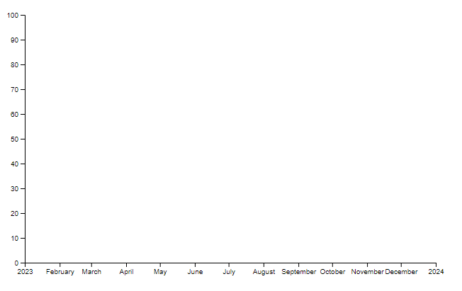
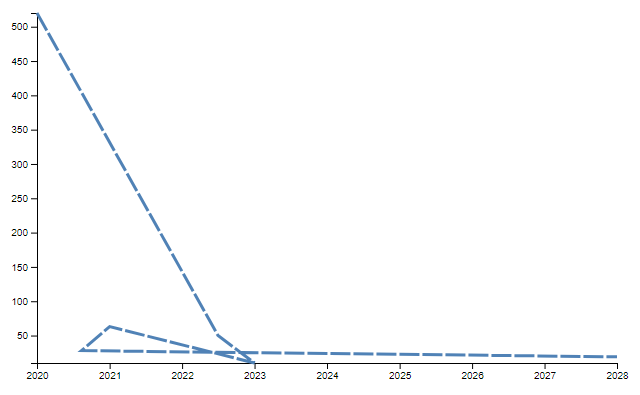
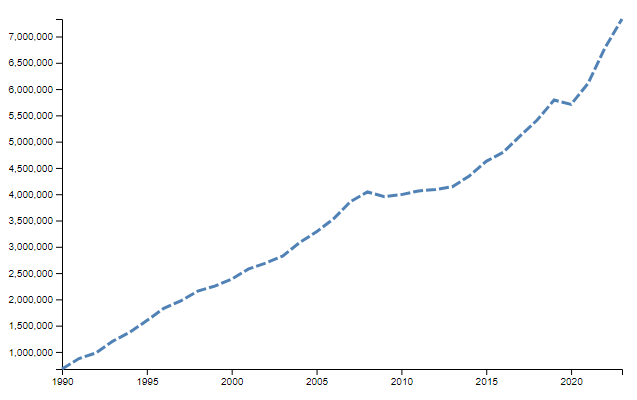
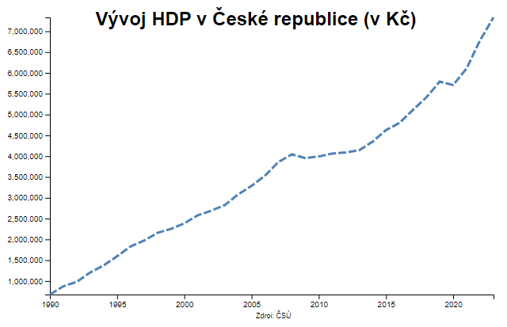
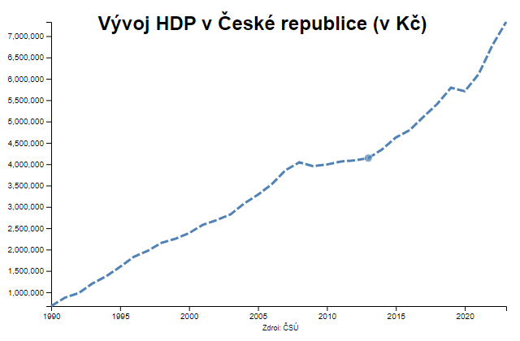
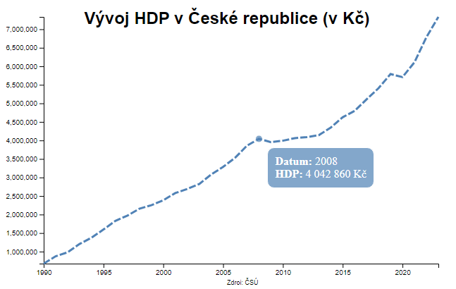

Při práci ve VS Code je nutné [nainstalovat](https://youtu.be/9kEOkw_LvGU?si=8V1ewwZ5qhl71g73) extension Live Sever

## Jednotlivé kroky jsou rozděleny do samostatných commitů pro případné hledání chyb:
### [1) Instalace knihovny a příprava template grafu](https://github.com/frantisekmuzik/YWEK_D3/commit/206a0fbe5cc46cc20e45bfdfb604a4f7081bbd95)
- knihovna: [https://d3js.org/](https://d3js.org/)
- instalace knihovny: [https://d3js.org/getting-started#d3-in-vanilla-html](https://d3js.org/getting-started#d3-in-vanilla-html)
- ukázkový graf (zobrazí pouze osy): [https://d3js.org/getting-started](https://d3js.org/getting-started)

<figure markdown>
{ width="600" }
    <figcaption>Ukázkový graf</figcaption>
</figure>

### [2) Rozdělení JS a HTML souborů](https://github.com/frantisekmuzik/YWEK_D3/commit/ea29841e67628ce8a55b75541bc4c68c738c787e)
- vytvoření JS souboru, do kterého se přesune kód z HTML

### [3) Přidání přímo zadaných dat](https://github.com/frantisekmuzik/YWEK_D3/commit/f694b7d625e5622db3f8f09380e8fda81edf3cec)
- vytvoření matice dat (datum, hodnota)
- základní úprava os
- vykreslování hodnot grafu
- změna atributů grafu (barva apod.)

<figure markdown>
{ width="600" }
    <figcaption>Vložení vlastních dat do grafu</figcaption>
</figure>

### [4) Import dat z csv](https://github.com/frantisekmuzik/YWEK_D3/commit/c04123e071413b69d25dce000aecf2435f40d9f6)
- stažení dat v XSLX z ČSÚ (ideální data -> rok, hodnota): https://vdb.czso.cz/vdbvo2/faces/cs/index.jsf?page=statistiky
- úprava v Excelu (ponechat pouze dva sloupce - datum, hodnota) a vyexportovat včetně záhlaví jako CSV s kódováním UTF-8
- import dat v kódu
- změna datového formátu vložených atributů

<figure markdown>
{ width="600" }
    <figcaption>Import dat ze souboru</figcaption>
</figure>

### [5) Vylepšení grafu](https://github.com/frantisekmuzik/YWEK_D3/commit/adbd009054ab82ebfc8026288efbc85471730544)
- přidání titulku a zdroje dat
- případná úprava os a jejich popisu

<figure markdown>
{ width="600" }
    <figcaption>Přidání popisu grafu</figcaption>
</figure>

### [6) Interaktivita](https://github.com/frantisekmuzik/YWEK_D3/commit/c622dda4a6df87b6bffd8ee205cc8481d927d2ef)
- vytvoření interaktivity grafu
- základní úprava html - vytvoření nadpisu karty, head, body
- vytvoření stylu v html pro listening rectangle
- vytvoření indikátoru zobrazené hodnoty na linii grafu
- skrytí indikátoru zobrazené hodnoty po opuštění grafu ukazatelem myši

<figure markdown>
{ width="600" }
    <figcaption>Přidání interaktivity grafu</figcaption>
</figure>

### [7) Pop-up](https://github.com/frantisekmuzik/YWEK_D3/commit/62ea2606ca60acac93c3183f0e1f405d54fa1b89)
- vytvoření stylu v html pro pop-up
- vytvoření divu pro pop-up
- přidání pop-upu s výpisem vybraných hodnot 
- skrytí pop-upu, pokud nejsou zjišťované hodnoty

<figure markdown>
{ width="600" }
    <figcaption>Pop-up s informacemi o zobrazovaném bodě</figcaption>
</figure>

!!! info "&nbsp;Užitečné odkazy"
    - styly v D3: [http://www.d3noob.org/2014/02/styles-in-d3js.html](http://www.d3noob.org/2014/02/styles-in-d3js.html)
    - tvary v D3: [https://d3-graph-gallery.com/graph/shape.html](https://d3-graph-gallery.com/graph/shape.html)
    - atributy v D3: [http://www.d3noob.org/2014/02/attributes-in-d3js.html](http://www.d3noob.org/2014/02/attributes-in-d3js.html)
    - převod času: [https://developer.mozilla.org/en-US/docs/Web/JavaScript/Reference/Global_Objects/Date](https://developer.mozilla.org/en-US/docs/Web/JavaScript/Reference/Global_Objects/Date)

