## D3.js (Data-Driven Documents)

D3.js (Data-Driven Documents) je open-source JavaScriptová knihovna pro manipulaci s dokumenty na základě dat. Umožňuje vytvářet dynamické, interaktivní a škálovatelné vizualizace dat v prohlížeči. Používá k tomu technologie jako SVG, HTML5, CSS a Canvas.

**Hlavní výhoda** spočívá v **plné kontrole nad vizualizací** – na rozdíl od jiných knihoven, které mají hotové/předpřipravené grafy, D3.js umožňuje vytvořit vizualizaci přesně podle vlastních potřeb.

<figure markdown>
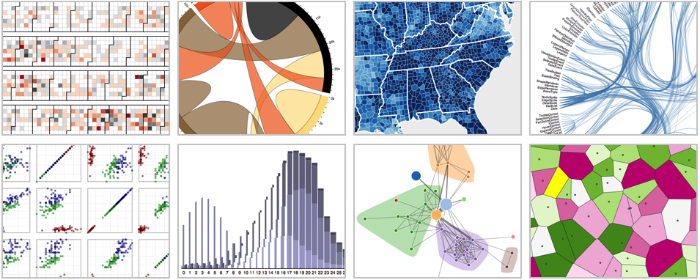{ width=100% }
    <figcaption>Ukázky vizualizací vytvořených pomocí D3.js</figcaption>
</figure>


[Knihovna D3.js](https://d3js.org/){ .md-button .md-button--primary .center}
{: .button_array}

[:simple-youtube: D3.js in 100 Seconds](https://youtu.be/bp2GF8XcJdY?si=CnCvsg5uMNHM9FXA){ .md-button .center}
{: .button_array}


<h3 style="text-align:center;">Základní vlastnosti D3.js</h3>
<div class="grid cards grid_icon_info smaller_padding" markdown> 

-   :octicons-code-16:{ .xl }

    __Výběr a manipulace s DOM__
    <br>
    <br>
    Snadný výběr a úprava HTML a SVG prvky pomocí **selektorů** podobných jQuery. 
    <br>
    <br>
    Díky tomu můžeme provádět **dynamické úpravy** grafů, změnu stylu či interaktivitu vizualizací.

    
-   :material-chart-pie:{ .xl }    

    __Vazba dat na vizuální prvky__
    <br>
    <br>
    D3.js umožňuje __připojit data k HTML/SVG prvkům__ a vytvářet vizualizace na základě těchto dat.

-   :material-chart-line:{ .xl }

    __Škálování a osy__ 
    <br>
    <br>
    Široké možnosti škálování dat na __různé__ vizuální __výstupy__.

-   :material-button-pointer:{ .xl }

    __Animace a interaktivita__
    <br>
    <br>
    Umožnění plynulých přechodů a __interaktivity__.
</div>

!!! info "&nbsp;<span >DOM (Document Object Model)</span>"
    DOM (Document Object Model) je **strukturovaná reprezentace webové stránky**, kterou prohlížeč vytváří při načtení HTML dokumentu. 
    
    Umožňuje **JavaScriptu manipulovat s obsahem a strukturou stránky** – například měnit text, styly nebo dynamicky přidávat prvky.

    **= stromová reprezentace HTML v prohlížeči**

    Příklad jednoduchého HTML:

    ``` html
    <!DOCTYPE html>
    <html>
    <head>
        <title>Moje stránka</title>
    </head>
    <body>
        <h1 id="nadpis">Ahoj, svět!</h1>
        <p class="text">Toto je odstavec.</p>
    </body>
    </html>
    ```


    Prohlížeč převede HTML do struktury DOM takto:

    ``` less
    Document
    ├── html
    │   ├── head
    │   │   ├── title ("Moje stránka")
    │   ├── body
    │       ├── h1#nadpis ("Ahoj, svět!")
    │       ├── p.text ("Toto je odstavec.")
    ```

    Pomocí JavaScriptu pak můžeme s DOM pracovat například následovně:
    ``` js
    // Výběr prvku
    const nadpis = document.getElementById("nadpis"); // Výběr podle ID
    const odstavec = document.querySelector(".text"); // Výběr podle CSS selektoru

    // Změna obsahu
    nadpis.textContent = "Nový nadpis"; // Změna textu uvnitř <h1>

    // Změna stylu 
    odstavec.style.color = "red"; // Změna barvy textu odstavce na červenou

    // Přidání nového prvku
    const novyOdstavec = document.createElement("p"); // Vytvoření <p>
    novyOdstavec.textContent = "Nový dynamický odstavec!";
    document.body.appendChild(novyOdstavec); // Přidání do stránky
    ```

    Příklad dynamického **přidání prvku pomocí D3.js v DOM**:
    ```js
    d3.select("body").append("p").text("Toto je nový odstavec");
    ```

## Základní manipulace s DOM pomocí D3.js

### 1) Připojení knihovny D3.js

Založíme si nový projekt. Začneme s novým prázdným ```index.html``` kódem, do kterého [připojíme](https://d3js.org/getting-started#d3-in-vanilla-html) knihovnu D3.js. Využijeme připojení pomocí UMD+CDN.

V kódu vytvoříme nadpis pro testování manipulace s DOM a pod něj v ```body``` připojíme nově vytvořený (zatím) prázdný ```script.js```.

=== "index.html"
``` html
<!DOCTYPE html> 
<html> 
<head> 
    <meta charset="UTF-8"> 
    <meta name="viewport" content="width=device-width, initial-scale=1.0">
    <title>YWEK Vizualizace D3.js</title> 

    <!-- Připojení D3.js -->
    <script src="https://cdn.jsdelivr.net/npm/d3@7"></script>


</head>
<body> 

    <h1>Nadpis</h1>

    <!-- Připojení skriptu -->
    <script src="script.js"></script>
</body>
</html>
```

### 2) Výběr a manipulace s textem skrze JavaScript

Pomocí D3.js můžeme **vybírat DOM elementy** s použitím jejich **CSS selectoru** nebo přímo jejich **názvu**.

Existují dvě výběrové funkce (metody):

- **```d3.select()```** - Vybere **první** DOM element, který splňuje požadavky výběru. Tyto požadavky můžeme nastavit v argumentu funkce.
- **```d3.selectAll()```** - Vybere **všechny** DOM elementy, které splňují požadavky výběru.

V první ukázce vybereme předem vytvořený nadpis stránky určený tagem ```<h1>```. Tomuto textu upravíme barvu.

=== "script.js"
``` js
// Výběr nadpisu h1 a změna jeho barvy
d3.select("h1").style("color", "red");
```

<figure markdown>
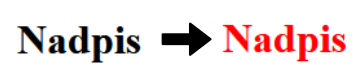{ width="200" }
    <figcaption>Změna barvy nadpisu</figcaption>
</figure>

!!! info "&nbsp;<span>Výběr elementů</span>"
    Pokud bychom měli na webové stránce více jak jeden nadpis, funkcí ```d3.select()``` se změní pouze první z nich.

    <figure markdown>
    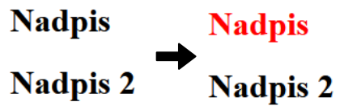{ width="200" }
    </figure>

    Pokud bychom chtěli změnit barvu všech nadpisů, museli bychom použít funkci ```d3.selectAll()```.

    <figure markdown>
    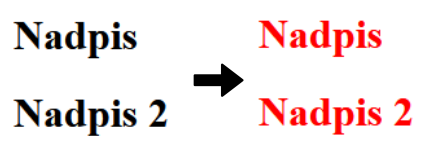{ width="200" }
    </figure>


Následně můžeme textu přidat atributy či nastavit další úpravy jeho stylu.

=== "script.js"
``` js
// Výběr nadpisu h1
d3.select("h1")
    .style("color", "red") // Změna barvy
    .style("font-size", "50px") // Změna velikosti
    .attr("class", "hlavniNadpis"); // Určení třídy vybraného elementu
```

<figure markdown>
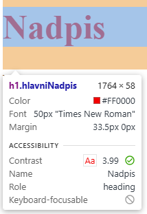{ width="200" }
    <figcaption>Ukázka změny atributů pomocí vývojářského režimu (tlačítko F12)</figcaption>
</figure>

Ve výsledku je možné text pomocí JavaScriptu kompletně přepsat, takže z "Nadpis" vytvoříme "Toto je nový nadpis".
=== "script.js"
``` js
// Výběr nadpisu h1
d3.select("h1")
    ...
    .text("Toto je nový nadpis"); // Nový text
```
<figure markdown>
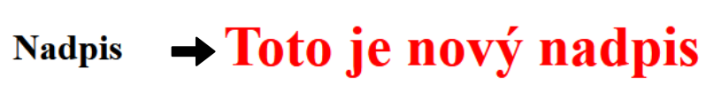{ width="400" }
    <figcaption>Přehled změn v nadpisu</figcaption>
</figure>

### 3) Vytvoření nových prvků

Pomocí D3.js nemusíme manipulovat pouze s již vytvořenými elementy, ale můžeme vytvořit nové přímo v JavaScriptu.

Nejprve do ```body``` připojíme nový odstavec (```<p>```).

=== "script.js"
``` js
// Vytvoření nového odstavce v body
d3.select("body").append("p").text("Zde je nový odstavec.");
```

<figure markdown>
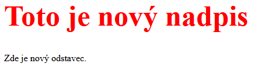{ width="400" }
    <figcaption>Vytvoření nového odstavce</figcaption>
</figure>

Takto lze vytvořit více různých odstavců, například:

=== "script.js"
``` js
// Vytvoření nových odstavců v body
d3.select("body").append("p").text("Zde je nový odstavec.");
d3.select("body").append("p").text("Zde je další nový odstavec.");
d3.select("body").append("p").text("Ahoj! Já jsem také nový odstavec.");
```
<figure markdown>
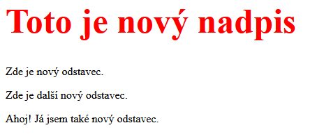{ width="400" }
    <figcaption>Vytvoření několika nových odstavců</figcaption>
</figure>

Funkcí ```d3.selectAll()``` můžeme změnit barvu všem odstavcům najednou.

=== "script.js"
``` js
// Změna barvy všech odstavců
d3.selectAll("p").style("color", "green");
```
<figure markdown>
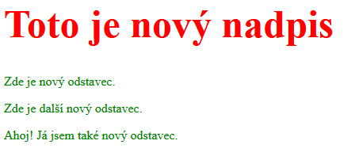{ width="400" }
    <figcaption>Změna barvy všech odstavců</figcaption>
</figure>

??? note "&nbsp;<span style="color:#448aff">Stav kódu po dokončení základní manipulace s DOM pomocí D3.js</span>"

    === "index.html"

        ``` html
        <!DOCTYPE html> 
        <html> 
        <head> 
            <meta charset="UTF-8"> 
            <meta name="viewport" content="width=device-width, initial-scale=1.0">
            <title>YWEK Vizualizace D3.js</title> 

            <!-- Připojení D3.js -->
            <script src="https://cdn.jsdelivr.net/npm/d3@7"></script>


        </head>
        <body> 

            <h1>Nadpis</h1>

            <!-- Připojení skriptu -->
            <script src="script.js"></script>
        </body>
        </html>
        ```


    === "script.js"

        ``` js
        // Výběr nadpisu h1
        d3.select("h1")
            .style("color", "red") // Změna barvy
            .style("font-size", "50px") // Změna velikosti
            .attr("class", "hlavniNadpis") // Určení třídy vybraného elementu
            .text("Toto je nový nadpis"); // Nový text

        // Vytvoření nových odstavců v body
        d3.select("body").append("p").text("Zde je nový odstavec.");
        d3.select("body").append("p").text("Zde je další nový odstavec.");
        d3.select("body").append("p").text("Ahoj! Já jsem také nový odstavec.");

        // Změna barvy všech odstavců
        d3.selectAll("p").style("color", "green");
        ```


## Liniový graf

V další úloze vytvoříme interaktivní liniový graf, který bude načítat data z CSV souboru.

### 1) Vykreslení os grafu

Soubor ```index.html``` drobně upravíme. Vytvoříme ```div``` s názvem ```containerLineChart```, do kterého se bude liniový graf vykreslovat. 

Následně vytvoříme nový skript ```script-line-chart.js```, který také připojíme do kódu.

=== "index.html"
``` html
<!DOCTYPE html> 
<html> 
<head> 
    <meta charset="UTF-8"> 
    <meta name="viewport" content="width=device-width, initial-scale=1.0">
    <title>Graf pomocí D3.js</title> 

    <!-- Připojení D3.js -->
    <script src="https://cdn.jsdelivr.net/npm/d3@7"></script>

</head>
<body> 

    <h1>Liniový graf</h1>

    <!-- div, ve kterém se bude liniový graf vykreslovat -->
    <div id="containerLineChart"></div>

    <!-- Připojení skriptu pro vykreslení liniového grafu -->
    <script type="module" src="script-line-chart.js"></script>
</body>
</html>
```


Z [dokumentace](https://d3js.org/getting-started) si připojíme základní vykreslení os pro liniový graf. Kód vložíme do souboru ```script-line-chart.js```. 

Zkopírovaný kód je třeba lehce upravit - je nutné určit správné ID divu, do kterého budeme graf vykreslovat, tzn. ```container``` :material-arrow-right: ```containerLineChart```.


=== "script-line-chart.js"
``` js
// Určení velikosti grafu a jeho okrajů
const width = 640;
const height = 400;
const marginTop = 20;
const marginRight = 20;
const marginBottom = 30;
const marginLeft = 40;

// Definice osy x
const x = d3.scaleUtc()
    .domain([new Date("2023-01-01"), new Date("2024-01-01")]) // Hodnoty na ose x
    .range([marginLeft, width - marginRight]); // Šířka osy při vykreslení grafu

// Definice osy y
const y = d3.scaleLinear()
    .domain([0, 100]) // Hodnoty na ose y
    .range([height - marginBottom, marginTop]); // Výška osy při vykreslení grafu

// Vytvoření SVG, do kterého se graf vykreslí
const svg = d3.create("svg")
    .attr("width", width)
    .attr("height", height);

// Přidání osy x do grafu (= vykreslení do SVG)
svg.append("g")
    .attr("transform", `translate(0,${height - marginBottom})`)
    .call(d3.axisBottom(x));

// Přidání osy y do grafu (= vykreslení do SVG)
svg.append("g")
    .attr("transform", `translate(${marginLeft},0)`)
    .call(d3.axisLeft(y));

// Připojení prvu SVG (= vykreslení ve webové stránce)
containerLineChart.append(svg.node());
```

<figure markdown>
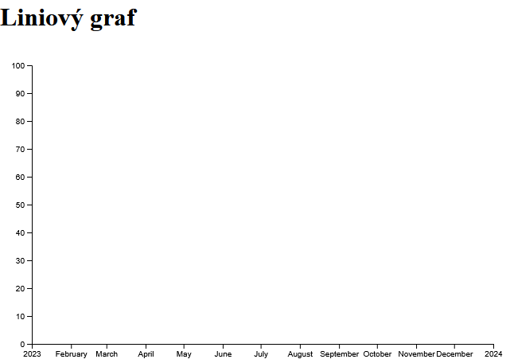{ width="600" }
    <figcaption>Vytvoření prázdného grafu</figcaption>
</figure>

??? note "&nbsp;<span style="color:#448aff">Stav kódu po dokončení kroku 1) Vykreslení os grafu</span>"

    === "index.html"

        ``` html
        <!DOCTYPE html> 
        <html> 
        <head> 
            <meta charset="UTF-8"> 
            <meta name="viewport" content="width=device-width, initial-scale=1.0">
            <title>Graf pomocí D3.js</title> 

            <!-- Připojení D3.js -->
            <script src="https://cdn.jsdelivr.net/npm/d3@7"></script>

            
        </head>
        <body> 

            <h1>Liniový graf</h1>

            <!-- div, ve kterém se bude liniový graf vykreslovat -->
            <div id="containerLineChart"></div>

            <!-- Připojení skriptu pro vykreslení liniového grafu -->
            <script type="module" src="script-line-chart.js"></script>
        </body>
        </html>
        ```


    === "script-line-chart.js"

        ``` js
        // Určení velikosti grafu a jeho okrajů
        const width = 640;
        const height = 400;
        const marginTop = 20;
        const marginRight = 20;
        const marginBottom = 30;
        const marginLeft = 40;

        // Definice osy x
        const x = d3.scaleUtc()
            .domain([new Date("2023-01-01"), new Date("2024-01-01")]) // Hodnoty na ose x
            .range([marginLeft, width - marginRight]); // Šířka osy při vykreslení grafu

        // Definice osy y
        const y = d3.scaleLinear()
            .domain([0, 100]) // Hodnoty na ose y
            .range([height - marginBottom, marginTop]); // Výška osy při vykreslení grafu

        // Vytvoření SVG, do kterého se graf vykreslí
        const svg = d3.create("svg")
            .attr("width", width)
            .attr("height", height);

        // Přidání osy x do grafu (= vykreslení do SVG)
        svg.append("g")
            .attr("transform", `translate(0,${height - marginBottom})`)
            .call(d3.axisBottom(x));

        // Přidání osy y do grafu (= vykreslení do SVG)
        svg.append("g")
            .attr("transform", `translate(${marginLeft},0)`)
            .call(d3.axisLeft(y));

        // Připojení prvu SVG (= vykreslení ve webové stránce)
        containerLineChart.append(svg.node());
        ```

### 2) Zadání dat přímo v kódu

Před načtením dat z CSV si zkusíme **načíst smyšlená data** přímo z proměnné v kódu. 

Vytvoříme **pole objektů**, ve kterém bude rok (osa x) a hodnota (osa y). Roky nebudeme řadit chronologicky za sebou, abychom je pak mohli automatizovaně setřídit. 

Dále ve skriptu (zatím) pouze manuálně upravíme **rozsah osy x**. 

=== "script-line-chart.js"
``` js
// Přidání vymyšlených testovacích dat ve formátu rok, hodnoty
const data = [
    {rok: 2020, hodnota: 520},
    {rok: 2000, hodnota: 50},
    {rok: 2010, hodnota: 10},
    {rok: 2015, hodnota: 63},
    {rok: 2005, hodnota: 28},
    {rok: 2025, hodnota: 19}
];

// Definice osy x
const x = d3.scaleUtc()
    .domain([2000, 2025]) // Hodnoty na ose x
    .range([marginLeft, width - marginRight]); // Šířka osy při vykreslení grafu
```

Dále vytvoříme **linii**, kterou zadáme určením x, y hodnot lomových bodů.

Následně definované linie **vykreslíme** do již vytvořeného **SVG** grafu přidáním elementu ```<path>```.

=== "script-line-chart.js"
``` js
// Vytvoření linie, která bude vykreslena
const line= d3.line()
    .x( d => x(d.rok)) // Rok -> na ose X
    .y( d => y(d.hodnota)); // Hodnota -> na ose Y

// Vykreslení linie do SVG    
svg.append("path") 
    .datum(data) // Načtení celého pole data k vykreslení
    .attr("fill","none") // Barva výplně vykresleného obrazce
    .attr("stroke","steelblue") // Barva vykreslené linie
    .attr("stroke-width", 3) // Tloušťka linie
    .style("stroke-dasharray", ("10,3")) // Čárkovaná linie, vzor čárkování určen číselně (čára, mezera)
    .attr("d", line);
```

<figure markdown>
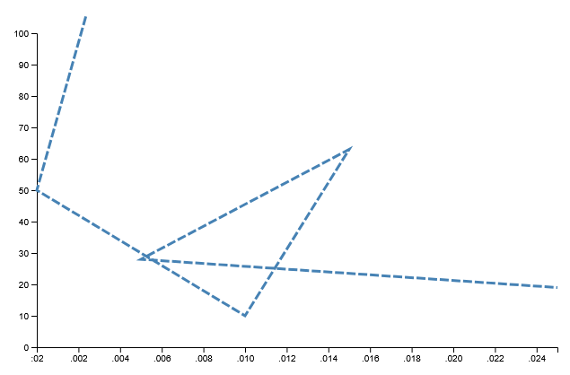{ width="600" }
    <figcaption>Vykreslení vymyšlených dat</figcaption>
</figure>

Všimneme si, že data se vykreslila dle zadaného pořadí. Je tedy nutné je **seřadit** podle roků. 

Buď můžeme dat přeskládat ručně nebo využít funkci ```sort()```.

=== "script-line-chart.js"
``` js
// Seřazení dat vzestupně
data.sort((a, b) => a.rok - b.rok);
```

Data jsou seřazena, ale musíme změnit **rozsah osy y** – automatizovaně. Rovnou podobně nastavíme i rozsah osy x.

=== "script-line-chart.js"
``` js
// Definice osy x
const x = d3.scaleUtc()
    .domain(d3.extent(data, i => i.rok)) // Rozsah osy x - nastavení automaticky dle dat
    .range([marginLeft, width - marginRight]); // Šířka osy při vykreslení grafu

// Definice osy y
const y = d3.scaleLinear()
    .domain(d3.extent(data, d => d.hodnota)) // Rozsah osy y - nastavení automaticky dle dat
    .range([height - marginBottom, marginTop]); // Výška osy při vykreslení grafu
```

Nyní jsou data setříděná a je nastavený správný rozsah os. Dále je však potřeba ještě **upravit datový typ objektů ```rok```** vykreslených na ose x. Ta je připojena funkcí ```d3.scaleUtc()```, tudíž očekává hodnoty ve formě datumu (rok, měsíc, den). Současné hodnoty v poli ```data``` jsou číselné.

Buď manuálně data upravíme nebo je **převedeme automaticky** pomocí funkce ```map()```. Tato funkce transformuje každý prvek pole a vytvoří nové pole se stejnou strukturou.

=== "script-line-chart.js"
``` js
// Přidání vymyšlených testovacích dat ve formátu rok, hodnoty
const data = [
    {rok: 2020, hodnota: 520},
    {rok: 2000, hodnota: 50},
    {rok: 2010, hodnota: 10},
    {rok: 2015, hodnota: 63},
    {rok: 2005, hodnota: 28},
    {rok: 2025, hodnota: 19}
].map(d => ({ 
    rok: new Date(d.rok, 0, 1), // Nastaví 1. leden daného roku
    hodnota: d.hodnota 
}));;
```

Hodnoty se tedy změní z např. ```{rok: 2025, hodnota: 520}``` na ```{rok: new Date(2025, 0, 1), hodnota: 520}```.

<figure markdown>
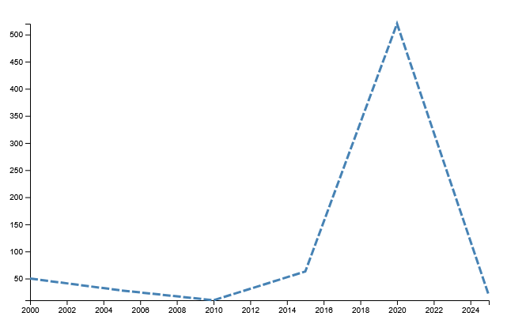{ width="600" }
    <figcaption>Setříděný liniový graf se správným zápisem roků</figcaption>
</figure>

??? note "&nbsp;<span style="color:#448aff">Stav kódu po dokončení kroku 2) Zadání dat přímo v kódu</span>"

    === "index.html – beze změny"

        ``` html
        <!DOCTYPE html> 
        <html> 
        <head> 
            <meta charset="UTF-8"> 
            <meta name="viewport" content="width=device-width, initial-scale=1.0">
            <title>Graf pomocí D3.js</title> 

            <!-- Připojení D3.js -->
            <script src="https://cdn.jsdelivr.net/npm/d3@7"></script>

            
        </head>
        <body> 

            <h1>Liniový graf</h1>

            <!-- div, ve kterém se bude liniový graf vykreslovat -->
            <div id="containerLineChart"></div>

            <!-- Připojení skriptu pro vykreslení liniového grafu -->
            <script type="module" src="script-line-chart.js"></script>
        </body>
        </html>
        ```


    === "script-line-chart.js"

        ``` js
        // Určení velikosti grafu a jeho okrajů
        const width = 640;
        const height = 400;
        const marginTop = 20;
        const marginRight = 20;
        const marginBottom = 30;
        const marginLeft = 40;

        // Přidání vymyšlených testovacích dat ve formátu rok, hodnoty
        const data = [
            {rok: 2020, hodnota: 520},
            {rok: 2000, hodnota: 50},
            {rok: 2010, hodnota: 10},
            {rok: 2015, hodnota: 63},
            {rok: 2005, hodnota: 28},
            {rok: 2025, hodnota: 19}
        ].map(d => ({ 
            rok: new Date(d.rok, 0, 1), // Nastaví 1. leden daného roku
            hodnota: d.hodnota 
        }));;

        // Seřazení dat vzestupně
        data.sort((a, b) => a.rok - b.rok);

        // Definice osy x
        const x = d3.scaleUtc()
            .domain(d3.extent(data, d => d.rok)) // Rozsah osy x - nastavení automaticky dle dat
            .range([marginLeft, width - marginRight]); // Šířka osy při vykreslení grafu

        // Definice osy y
        const y = d3.scaleLinear()
            .domain(d3.extent(data, d => d.hodnota)) // Rozsah osy y - nastavení automaticky dle dat
            .range([height - marginBottom, marginTop]); // Výška osy při vykreslení grafu

        // Vytvoření SVG, do kterého se graf vykreslí
        const svg = d3.create("svg")
            .attr("width", width)
            .attr("height", height);

        // Přidání osy x do grafu (= vykreslení do SVG)
        svg.append("g")
            .attr("transform", `translate(0,${height - marginBottom})`)
            .call(d3.axisBottom(x));

        // Přidání osy y do grafu (= vykreslení do SVG)
        svg.append("g")
            .attr("transform", `translate(${marginLeft},0)`)
            .call(d3.axisLeft(y));

        // Vytvoření linie, která bude vykreslena
        const line= d3.line()
            .x( d => x(d.rok)) // Rok -> na ose X
            .y( d => y(d.hodnota)); // Hodnota -> na ose Y

        // Vykreslení linie do SVG    
        svg.append("path") 
            .datum(data) // Načtení celého pole data k vykreslení
            .attr("fill","none") // Barva výplně vykresleného obrazce
            .attr("stroke","steelblue") // Barva vykreslené linie
            .attr("stroke-width", 3) // Tloušťka linie
            .style("stroke-dasharray", ("10,3")) // Čárkovaná linie, vzor čárkování určen číselně (čára, mezera)
            .attr("d", line);

        // Připojení prvu SVG (= vykreslení ve webové stránce)
        containerLineChart.append(svg.node());
        ```


### 3) Import dat z CSV

Nyní si do grafu vykreslíme **reálná data ve formátu CSV**, kterí stahneme z portálu [Českého statistického úřadu](https://vdb.czso.cz/vdbvo2/faces/cs/index.jsf?page=statistiky). 

Hledáme data, která jsou ideální pro vykreslení liniovým grafem, například [průměrnou hrubou měsíční mzdu](https://vdb.czso.cz/vdbvo2/faces/cs/index.jsf?page=vystup-objekt&z=T&f=TABULKA&skupId=855&katalog=30852&pvo=MZD01-A&pvo=MZD01-A&evo=v208_!_MZD-LEG4_1).


[:material-layers-plus: Připravené CSV](../assets/cviceni5/prumerna_mesicni_mzda_cr.csv){ .md-button .md-button--primary .center}
{: .button_array}


Upravný CSV soubor vložíme do adresáře k ostatním kódům.

Začneme smazáním vymyšlených dat v kódu a nahrazením proměnné ```data``` **načtením roků a hodnot z CSV**. 

Na konec kódu pak musíme přidat **uzavření závorek** funkce ```then()```. 

**Asynchronní funkce** jako then() nebo async() či await() říkají, že kód čeká na dokončení nějaké operace (např. načítání dat) a pokračuje, až je tato operace dokončena.

V našem případě funkce ```d3.csv().then(function(data) {...})``` čeká na načtení dat CSV, než spustí tělo funkce uvnitř ```then()```. Tento kód nebude proveden okamžitě, ale až po dokončení asynchronního požadavku – tedy načtení všech dat.

=== "script-line-chart.js"
``` js
// Načtení dat z csv
const data = d3.csv("prumerna_mesicni_mzda_cr.csv").then( function(data) {
    data.forEach(d => { 
        d.rok = new Date(d.rok, 0, 1); // Převedení roku z textu do formátu pro datum
        d.hodnota = d.prumerna_mesicni_mzda; 
    });

... // Zbytek kódu je stejný

// Připojení prvu SVG (= vykreslení ve webové stránce)
containerLineChart.append(svg.node());
 });
```

<figure markdown>
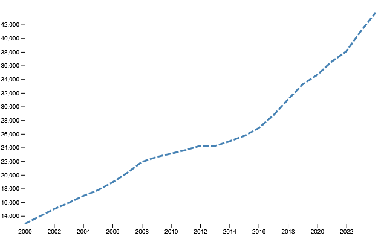{ width="600" }
    <figcaption>Liniový graf vytvořený na základě hodnot z CSV souboru</figcaption>
</figure>

??? note "&nbsp;<span style="color:#448aff">Stav kódu po dokončení kroku 3) Import dat z CSV</span>"

    === "index.html – beze změny"

        ``` html
        <!DOCTYPE html> 
        <html> 
        <head> 
            <meta charset="UTF-8"> 
            <meta name="viewport" content="width=device-width, initial-scale=1.0">
            <title>Graf pomocí D3.js</title> 

            <!-- Připojení D3.js -->
            <script src="https://cdn.jsdelivr.net/npm/d3@7"></script>

            
        </head>
        <body> 

            <h1>Liniový graf</h1>

            <!-- div, ve kterém se bude liniový graf vykreslovat -->
            <div id="containerLineChart"></div>

            <!-- Připojení skriptu pro vykreslení liniového grafu -->
            <script type="module" src="script-line-chart.js"></script>
        </body>
        </html>
        ```


    === "script-line-chart.js"

        ``` js
        // Určení velikosti grafu a jeho okrajů
        const width = 640;
        const height = 400;
        const marginTop = 20;
        const marginRight = 20;
        const marginBottom = 30;
        const marginLeft = 40;

        // Načtení dat z csv
        const data = d3.csv("prumerna_mesicni_mzda_cr.csv").then( function(data) {
            data.forEach(d => { 
                d.rok = new Date(d.rok, 0, 1); // Převedení roku z textu do formátu pro datum
                d.hodnota = d.prumerna_mesicni_mzda; 
            });

        // Seřazení dat vzestupně
        data.sort((a, b) => a.rok - b.rok);

        // Definice osy x
        const x = d3.scaleUtc()
            .domain(d3.extent(data, d => d.rok)) // Rozsah osy x - nastavení automaticky dle dat
            .range([marginLeft, width - marginRight]); // Šířka osy při vykreslení grafu

        // Definice osy y
        const y = d3.scaleLinear()
            .domain(d3.extent(data, d => d.hodnota)) // Rozsah osy y - nastavení automaticky dle dat
            .range([height - marginBottom, marginTop]); // Výška osy při vykreslení grafu

        // Vytvoření SVG, do kterého se graf vykreslí
        const svg = d3.create("svg")
            .attr("width", width)
            .attr("height", height);

        // Přidání osy x do grafu (= vykreslení do SVG)
        svg.append("g")
            .attr("transform", `translate(0,${height - marginBottom})`)
            .call(d3.axisBottom(x));

        // Přidání osy y do grafu (= vykreslení do SVG)
        svg.append("g")
            .attr("transform", `translate(${marginLeft},0)`)
            .call(d3.axisLeft(y));

        // Vytvoření linie, která bude vykreslena
        const line= d3.line()
            .x( d => x(d.rok)) // Rok -> na ose X
            .y( d => y(d.hodnota)); // Hodnota -> na ose Y

        // Vykreslení linie do SVG    
        svg.append("path") 
            .datum(data) // Načtení celého pole data k vykreslení
            .attr("fill","none") // Barva výplně vykresleného obrazce
            .attr("stroke","steelblue") // Barva vykreslené linie
            .attr("stroke-width", 3) // Tloušťka linie
            .style("stroke-dasharray", ("10,3")) // Čárkovaná linie, vzor čárkování určen číselně (čára, mezera)
            .attr("d", line);

        // Připojení prvu SVG (= vykreslení ve webové stránce)
        containerLineChart.append(svg.node());
        });
        ```

### 4) Popis grafu a interaktivita

V dalším kroku přidáme **název grafu a zdroj dat**.

Pokud se texty nevykreslují celé nebo zasahují do grafu, je potřeba upravit jejich pozici (x-ová a y-ová) nebo velikosti okrajů (např. ```marginTop```).

=== "script-line-chart.js"
``` js
// Přidání názvu grafu
svg.append("text")
    .attr("class", "title")
    .attr("x", width / 2) // x-ová pozice 
    .attr("y", 30) // y-ová pozice
    .style("font-size", "24px") // Velikost fontu
    .style("font-weight", "bold") // Typ fontu
    .style("font-family", "sans-serif") // Typ fontu
    .attr("text-anchor", "middle") // Vztažný bod
    .text("Vývoj průměrné hrubé měsíční mzdy v Česku (v Kč)"); // Text nadpisu

// Přidání zdroje dat
svg.append("text")
    .attr("class", "source-credit")
    .attr("x", width/2)
    .attr("y", height)
    .style("font-size", "9px")
    .style("font-family", "sans-serif")
    .text("Zdroj: ČSÚ");  
```

<figure markdown>
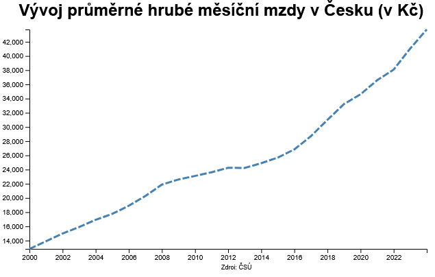{ width="600" }
    <figcaption>Liniový graf s názvem a zdrojem dat</figcaption>
</figure>

Následně upravíme kód tak, aby se **interaktivně zvýraznil** vybraný bod na grafu po najetí kurzoru myši na linii. Tato úprava je již poměrně náročná, tudíž si celý kód vložíme v bloku jako celek.

=== "script-line-chart.js"
``` js
// Vykreslení indikátoru zobrazujícího vybranu hodnotu grafu    
const circle = svg.append("circle")
    .attr("fill", "steelblue") // Výplň
    .style("stroke", "white") // Ohraničení
    .attr("opacity", .70); // Průhlednost 

// Vytvoření listening rectangle, který bude číst data z celého grafu; propojení se stylem v html    
const listeningRect = svg.append("rect")
    .attr("width", width)
    .attr("height", height);

// Zvolení správných hodnot z grafu na základě pozice myši    
listeningRect.on("mousemove", function (event) {
    const [xCoord] = d3.pointer(event, this);
    const bisectDatum = d3.bisector(d => d.rok).left; // Nalezení nejbližšího bodu z grafu k pozici myši
    const x0 = x.invert(xCoord);
    const i = bisectDatum(data, x0, 1);
    const d0 = data[i - 1];
    const d1 = data[i];
    const d = x0 - d0.rok > d1.rok- x0 ? d1 : d0;
    const xPos = x(d.rok); // Do xPos se přiřadí vybraný datum (z načtených dat) na ose x
    const yPos = y(d.hodnota); // Do yPos se přiřadí vybraná hodnota (z načtených dat) na ose y

    // Aktualizování pozice kružnice na základě pozice myši
    circle.attr("cx", xPos)
        .attr("cy", yPos);
 
    // Nastavení poloměru kružnice
    circle.transition()
        .duration(50) // Rychlost změny poloměru kružnice na zobrazovaný poloměr
        .attr("r", 5); // Zobrazovaný poloměr
});

// Skrytí kružnice při opuštění grafu myší
listeningRect.on("mouseleave", function () {
    circle.transition()
      .duration(50)
      .attr("r", 0);
});
```

Pro fungování interaktivity je potřebné vytvořit ```style.css``` a přidat jej do ```index.html```.

=== "style.css"
``` css
rect{
    pointer-events: all;
    fill-opacity: 0;
    stroke-opacity: 0;
    z-index: 1;
}
```

=== "index.html"
``` html
<link rel="stylesheet" href="style.css">
```

<figure markdown>
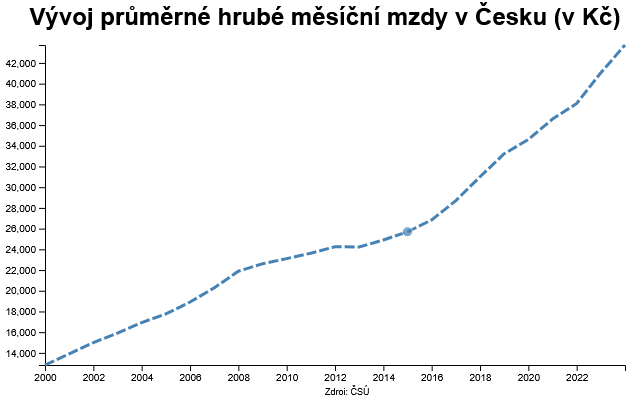{ width="600" }
    <figcaption>Liniový interaktivní graf</figcaption>
</figure>

??? note "&nbsp;<span style="color:#448aff">Stav kódu po dokončení kroku 4) Popis grafu a interaktivita</span>"

    === "index.html"

        ``` html
        <!DOCTYPE html> 
        <html> 
        <head> 
            <meta charset="UTF-8"> 
            <meta name="viewport" content="width=device-width, initial-scale=1.0">
            <title>Graf pomocí D3.js</title> 

            <!-- Připojení D3.js -->
            <script src="https://cdn.jsdelivr.net/npm/d3@7"></script>

            <link rel="stylesheet" href="style.css">
        </head>
        <body> 

            <h1>Liniový graf</h1>

            <!-- div, ve kterém se bude liniový graf vykreslovat -->
            <div id="containerLineChart"></div>

            <!-- Připojení skriptu pro vykreslení liniového grafu -->
            <script type="module" src="script-line-chart.js"></script>
        </body>
        </html>
        ```


    === "script-line-chart.js"

        ``` js
        // Určení velikosti grafu a jeho okrajů
        const width = 640;
        const height = 400;
        const marginTop = 50;
        const marginRight = 20;
        const marginBottom = 30;
        const marginLeft = 40;

        // Načtení dat z csv
        const data = d3.csv("prumerna_mesicni_mzda_cr.csv").then( function(data) {
            data.forEach(d => { 
                d.rok = new Date(d.rok, 0, 1); // Převedení roku z textu do formátu pro datum
                d.hodnota = d.prumerna_mesicni_mzda; 
            });

        // Seřazení dat vzestupně
        data.sort((a, b) => a.rok - b.rok);

        // Definice osy x
        const x = d3.scaleUtc()
            .domain(d3.extent(data, d => d.rok)) // Rozsah osy x - nastavení automaticky dle dat
            .range([marginLeft, width - marginRight]); // Šířka osy při vykreslení grafu

        // Definice osy y
        const y = d3.scaleLinear()
            .domain(d3.extent(data, d => d.hodnota)) // Rozsah osy y - nastavení automaticky dle dat
            .range([height - marginBottom, marginTop]); // Výška osy při vykreslení grafu

        // Vytvoření SVG, do kterého se graf vykreslí
        const svg = d3.create("svg")
            .attr("width", width)
            .attr("height", height);

        // Přidání osy x do grafu (= vykreslení do SVG)
        svg.append("g")
            .attr("transform", `translate(0,${height - marginBottom})`)
            .call(d3.axisBottom(x));

        // Přidání osy y do grafu (= vykreslení do SVG)
        svg.append("g")
            .attr("transform", `translate(${marginLeft},0)`)
            .call(d3.axisLeft(y));

        // Vytvoření linie, která bude vykreslena
        const line= d3.line()
            .x( d => x(d.rok)) // Rok -> na ose X
            .y( d => y(d.hodnota)); // Hodnota -> na ose Y

        // Vykreslení linie do SVG    
        svg.append("path") 
            .datum(data) // Načtení celého pole data k vykreslení
            .attr("fill","none") // Barva výplně vykresleného obrazce
            .attr("stroke","steelblue") // Barva vykreslené linie
            .attr("stroke-width", 3) // Tloušťka linie
            .style("stroke-dasharray", ("10,3")) // Čárkovaná linie, vzor čárkování určen číselně (čára, mezera)
            .attr("d", line);

        // Přidání názvu grafu
        svg.append("text")
            .attr("class", "title")
            .attr("x", width / 2) // x-ová pozice 
            .attr("y", 30) // y-ová pozice
            .style("font-size", "24px") // Velikost fontu
            .style("font-weight", "bold") // Typ fontu
            .style("font-family", "sans-serif") // Typ fontu
            .attr("text-anchor", "middle") // Vztažný bod
            .text("Vývoj průměrné hrubé měsíční mzdy v Česku (v Kč)"); // Text nadpisu

        // Přidání zdroje dat
        svg.append("text")
            .attr("class", "source-credit")
            .attr("x", width/2)
            .attr("y", height)
            .style("font-size", "9px")
            .style("font-family", "sans-serif")
            .text("Zdroj: ČSÚ");

        // Vykreslení indikátoru zobrazujícího vybranu hodnotu grafu    
        const circle = svg.append("circle")
            .attr("fill", "steelblue") // Výplň
            .style("stroke", "white") // Ohraničení
            .attr("opacity", .70); // Průhlednost 

        // Vytvoření listening rectangle, který bude číst data z celého grafu; propojení se stylem v html    
        const listeningRect = svg.append("rect")
            .attr("width", width)
            .attr("height", height);

        // Zvolení správných hodnot z grafu na základě pozice myši    
        listeningRect.on("mousemove", function (event) {
            const [xCoord] = d3.pointer(event, this);
            const bisectDatum = d3.bisector(d => d.rok).left; // Nalezení nejbližšího bodu z grafu k pozici myši
            const x0 = x.invert(xCoord);
            const i = bisectDatum(data, x0, 1);
            const d0 = data[i - 1];
            const d1 = data[i];
            const d = x0 - d0.rok > d1.rok- x0 ? d1 : d0;
            const xPos = x(d.rok); // Do xPos se přiřadí vybraný datum (z načtených dat) na ose x
            const yPos = y(d.hodnota); // Do yPos se přiřadí vybraná hodnota (z načtených dat) na ose y

            // Aktualizování pozice kružnice na základě pozice myši
            circle.attr("cx", xPos)
                .attr("cy", yPos);

            // Nastavení poloměru kružnice
            circle.transition()
                .duration(50) // Rychlost změny poloměru kružnice na zobrazovaný poloměr
                .attr("r", 5); // Zobrazovaný poloměr
        });

        // Skrytí kružnice při opuštění grafu myší
        listeningRect.on("mouseleave", function () {
            circle.transition()
            .duration(50)
            .attr("r", 0);
        });    

        // Připojení prvu SVG (= vykreslení ve webové stránce)
        containerLineChart.append(svg.node());
        });
        ```

    === "style.css"

        ``` css
        rect{
            pointer-events: all;
            fill-opacity: 0;
            stroke-opacity: 0;
            z-index: 1;
        }
        ```

### 5) Vytvoření pop-upu pro výpis vybrané hodnoty grafu

Cílem finálního kroku bude vytvoření pop-upu, ve kterém se budou interaktivně vypisovat hodnoty z grafu.

Nejprve **nastvíme styl** budoucího pop-upu ve ```style.css```.

=== "style.css"
``` css
.popup {
    position: absolute;
    padding: 10px;
    background-color: steelblue;
    color: white;
    border: 1px solid white;
    border-radius: 10px;
    display: none;
    opacity: .70;
}
```

Následně **vytvoříme** pomocí JavaScriptu **div**, do kterého pop-up vykreslíme.

=== "script-line-chart.js"
``` js
// Vytvoření popupu
const popup = d3.select("body")
    .append("div")
    .attr("class", "popup");
```

Závěrem nastavíme vykreslení pop-upu uvnitř funkce ```mousemove```, určíme jeho odsazení od kurzoru myši a vypisovaný text.

Následně skryjeme pop-up při opuštění grafu myší uvnitř funkce ```mouseleave```.

=== "script-line-chart.js"
``` js
// Zvolení správných hodnot z grafu na základě pozice myši    
listeningRect.on("mousemove", function (event) {
    ...

    // Aktualizace popupu 
    popup.style("display", "block")
        .style("left", `${event.pageX + 15}px`)
        .style("top", `${event.pageY - 40}px`)
        .html(`<strong>Rok:</strong> ${d.rok.getFullYear()}<br><strong>Průměrná mzda:</strong> ${d.hodnota.toLocaleString()} Kč`);
});

// Skrytí kružnice a pop-upu při opuštění grafu myší
listeningRect.on("mouseleave", function () {
    ...

    popup.style("display", "none");
});    
```

<figure markdown>
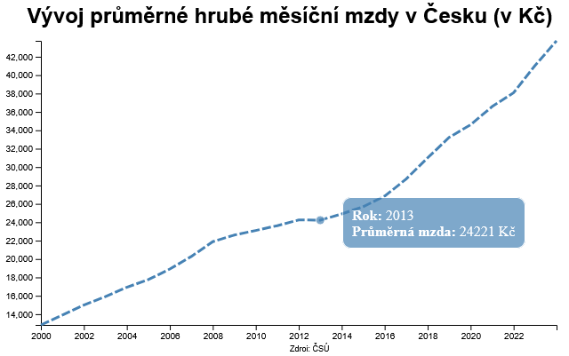{ width="600" }
    <figcaption>Liniový interaktivní graf s pop-upem</figcaption>
</figure>

??? note "&nbsp;<span style="color:#448aff">Stav kódu po dokončení kroku 5) Vytvoření pop-upu pro výpis vybrané hodnoty grafu</span>"

    === "index.html – beze změny"

        ``` html
        <!DOCTYPE html> 
        <html> 
        <head> 
            <meta charset="UTF-8"> 
            <meta name="viewport" content="width=device-width, initial-scale=1.0">
            <title>Graf pomocí D3.js</title> 

            <!-- Připojení D3.js -->
            <script src="https://cdn.jsdelivr.net/npm/d3@7"></script>

            <link rel="stylesheet" href="style.css">
        </head>
        <body> 

            <h1>Liniový graf</h1>

            <!-- div, ve kterém se bude liniový graf vykreslovat -->
            <div id="containerLineChart"></div>

            <!-- Připojení skriptu pro vykreslení liniového grafu -->
            <script type="module" src="script-line-chart.js"></script>
        </body>
        </html>
        ```


    === "script-line-chart.js"

        ``` js
        // Určení velikosti grafu a jeho okrajů
        const width = 640;
        const height = 400;
        const marginTop = 50;
        const marginRight = 20;
        const marginBottom = 30;
        const marginLeft = 40;

        // Načtení dat z csv
        const data = d3.csv("prumerna_mesicni_mzda_cr.csv").then( function(data) {
            data.forEach(d => { 
                d.rok = new Date(d.rok, 0, 1); // Převedení roku z textu do formátu pro datum
                d.hodnota = d.prumerna_mesicni_mzda; 
            });

        // Seřazení dat vzestupně
        data.sort((a, b) => a.rok - b.rok);

        // Definice osy x
        const x = d3.scaleUtc()
            .domain(d3.extent(data, d => d.rok)) // Rozsah osy x - nastavení automaticky dle dat
            .range([marginLeft, width - marginRight]); // Šířka osy při vykreslení grafu

        // Definice osy y
        const y = d3.scaleLinear()
            .domain(d3.extent(data, d => d.hodnota)) // Rozsah osy y - nastavení automaticky dle dat
            .range([height - marginBottom, marginTop]); // Výška osy při vykreslení grafu

        // Vytvoření SVG, do kterého se graf vykreslí
        const svg = d3.create("svg")
            .attr("width", width)
            .attr("height", height);

        // Přidání osy x do grafu (= vykreslení do SVG)
        svg.append("g")
            .attr("transform", `translate(0,${height - marginBottom})`)
            .call(d3.axisBottom(x));

        // Přidání osy y do grafu (= vykreslení do SVG)
        svg.append("g")
            .attr("transform", `translate(${marginLeft},0)`)
            .call(d3.axisLeft(y));

        // Vytvoření popupu
        const popup = d3.select("body")
            .append("div")
            .attr("class", "popup");

        // Vytvoření linie, která bude vykreslena
        const line= d3.line()
            .x( d => x(d.rok)) // Rok -> na ose X
            .y( d => y(d.hodnota)); // Hodnota -> na ose Y

        // Vykreslení linie do SVG    
        svg.append("path") 
            .datum(data) // Načtení celého pole data k vykreslení
            .attr("fill","none") // Barva výplně vykresleného obrazce
            .attr("stroke","steelblue") // Barva vykreslené linie
            .attr("stroke-width", 3) // Tloušťka linie
            .style("stroke-dasharray", ("10,3")) // Čárkovaná linie, vzor čárkování určen číselně (čára, mezera)
            .attr("d", line);

        // Přidání názvu grafu
        svg.append("text")
            .attr("class", "title")
            .attr("x", width / 2) // x-ová pozice 
            .attr("y", 30) // y-ová pozice
            .style("font-size", "24px") // Velikost fontu
            .style("font-weight", "bold") // Typ fontu
            .style("font-family", "sans-serif") // Typ fontu
            .attr("text-anchor", "middle") // Vztažný bod
            .text("Vývoj průměrné hrubé měsíční mzdy v Česku (v Kč)"); // Text nadpisu

        // Přidání zdroje dat
        svg.append("text")
            .attr("class", "source-credit")
            .attr("x", width/2)
            .attr("y", height)
            .style("font-size", "9px")
            .style("font-family", "sans-serif")
            .text("Zdroj: ČSÚ");

        // Vykreslení indikátoru zobrazujícího vybranu hodnotu grafu    
        const circle = svg.append("circle")
            .attr("fill", "steelblue") // Výplň
            .style("stroke", "white") // Ohraničení
            .attr("opacity", .70); // Průhlednost 

        // Vytvoření listening rectangle, který bude číst data z celého grafu; propojení se stylem v html    
        const listeningRect = svg.append("rect")
            .attr("width", width)
            .attr("height", height);

        // Zvolení správných hodnot z grafu na základě pozice myši    
        listeningRect.on("mousemove", function (event) {
            const [xCoord] = d3.pointer(event, this);
            const bisectDatum = d3.bisector(d => d.rok).left; // Nalezení nejbližšího bodu z grafu k pozici myši
            const x0 = x.invert(xCoord);
            const i = bisectDatum(data, x0, 1);
            const d0 = data[i - 1];
            const d1 = data[i];
            const d = x0 - d0.rok > d1.rok- x0 ? d1 : d0;
            const xPos = x(d.rok); // Do xPos se přiřadí vybraný datum (z načtených dat) na ose x
            const yPos = y(d.hodnota); // Do yPos se přiřadí vybraná hodnota (z načtených dat) na ose y

            // Aktualizování pozice kružnice na základě pozice myši
            circle.attr("cx", xPos)
                .attr("cy", yPos);

            // Nastavení poloměru kružnice
            circle.transition()
                .duration(50) // Rychlost změny poloměru kružnice na zobrazovaný poloměr
                .attr("r", 5); // Zobrazovaný poloměr

            // Aktualizace popupu 
            popup.style("display", "block")
                .style("left", `${event.pageX + 15}px`)
                .style("top", `${event.pageY - 40}px`)
                .html(`<strong>Rok:</strong> ${d.rok.getFullYear()}<br><strong>Průměrná mzda:</strong> ${d.hodnota.toLocaleString()} Kč`);
        });

        // Skrytí kružnice při opuštění grafu myší
        listeningRect.on("mouseleave", function () {
            circle.transition()
            .duration(50)
            .attr("r", 0);

            popup.style("display", "none");
        });    

        // Připojení prvu SVG (= vykreslení ve webové stránce)
        containerLineChart.append(svg.node());
        });
        ```

    === "style.css"

        ``` css
        rect{
            pointer-events: all;
            fill-opacity: 0;
            stroke-opacity: 0;
            z-index: 1;
        }

        .popup {
            position: absolute;
            padding: 10px;
            background-color: steelblue;
            color: white;
            border: 1px solid white;
            border-radius: 10px;
            display: none;
            opacity: .70;
        }
        ```


!!! info "&nbsp;<span>Užitečné odkazy</span>"
    - styly v D3: [http://www.d3noob.org/2014/02/styles-in-d3js.html](http://www.d3noob.org/2014/02/styles-in-d3js.html)
    - atributy v D3: [http://www.d3noob.org/2014/02/attributes-in-d3js.html](http://www.d3noob.org/2014/02/attributes-in-d3js.html)
    - převod času: [https://developer.mozilla.org/en-US/docs/Web/JavaScript/Reference/Global_Objects/Date](https://developer.mozilla.org/en-US/docs/Web/JavaScript/Reference/Global_Objects/Date)
    - sloupcový graf: [https://www.tutorialsteacher.com/d3js/create-bar-chart-using-d3js](https://www.tutorialsteacher.com/d3js/create-bar-chart-using-d3js)

