Náplní tohoto cvičení bude tvorba kartodiagramu, který vytvoříme díky propojení knihoven [Leaflet](https://leafletjs.com/) a [D3.js](https://d3js.org/) nad daty ORP, která byla použita ve cvičení 4.

!!! info "&nbsp;<span>Příprava dat a rozložení stránky</span>"

    ## Příprava dat

    Pro vytvoření kartodiagramu musíme v GISu převést polygonovou vrstvu ORP na body pomocí funkce [Feature to Point](https://pro.arcgis.com/en/pro-app/latest/tool-reference/data-management/feature-to-point.htm).

    Do vrstvy byly zároveň přidány informace o výstavbě bytů, které také využijeme pro vizualizaci.

    [:material-layers-plus: GeoJSON s body ORP](../assets/cviceni6/ORP_body_ywek.geojson){ .md-button .md-button--primary .center}
    {: .button_array}

    [:material-layers-plus: GeoJSON s polygony ORP](../assets/cviceni6/ORP_ywek.geojson){ .md-button .md-button--primary .center}
    {: .button_array}

    Mapu ze cvičení 4 upravíme tak, aby v ní byl zobrazený pouze kartogram a bodová vrstva ORP.

    <figure markdown>
    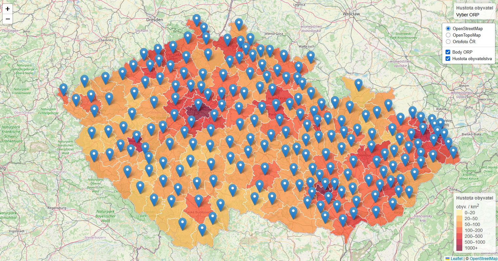{ width=800 }
    </figure>

    ## Rozložení stránky

    Před jakoukoliv další úpravou mapy či grafu nejprve na stránku k mapě připojíme vykreslení os grafu z [dokumentace](https://d3js.org/getting-started) (ten budeme upravovat později).

    Stránku rozdělíme pomocí flexbox v poměru 60% (mapa) / 40% (graf). Graf následně vycentrujeme uvnitř divu pomocí CSS vlastností ```justify-content``` a ```align-items```

    <figure markdown>
    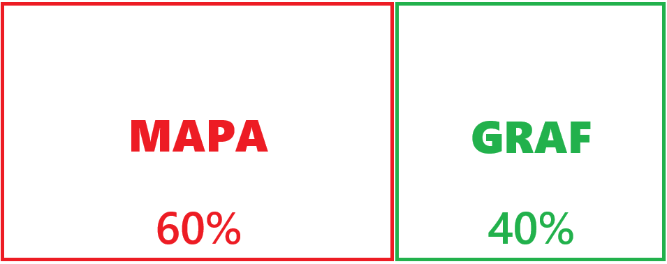{ width=600 }
    </figure>

    Připravená stránka by měla vypadat takto:

    <figure markdown>
    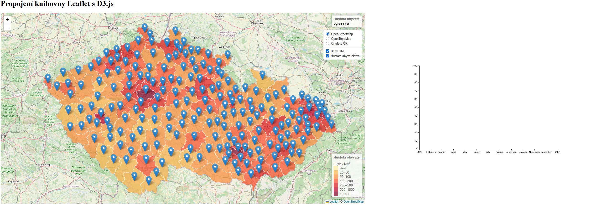{ width=100% }
    </figure>

    Na **disku S** je ke zkopírování složka se soubory, ze kterých budeme v tomto cvičení vycházet: **```S:\K155\Public\155YWEK\YWEK_cviceni6_Leaflet_D3js```**


??? note "&nbsp;<span style="color:#448aff">Připravený kód (bez souborů načítaných dat ORP)</span>"

    === "index.html"

        ``` html
        <!DOCTYPE html> 
        <html> 
        <head> 
            <meta charset="UTF-8"> 
            <meta name="viewport" content="width=device-width, initial-scale=1.0">
            <link rel="stylesheet" href="style.css">

            <!-- Načtení souboru s body ORP GeoJSON-->
            <script src="ORP_body_GeoJSON.js"></script>

            <!-- Načtení souboru s ORP GeoJSON-->
            <script src="ORP_GeoJSON.js"></script>

            <!-- Externí připojení CSS symbologie Leaflet-->
            <link rel="stylesheet" href="https://unpkg.com/leaflet@1.9.4/dist/leaflet.css"
            integrity="sha256-p4NxAoJBhIIN+hmNHrzRCf9tD/miZyoHS5obTRR9BMY="
            crossorigin=""/>

            <!-- Externí připojení JS knihovny -> vložit až po připojení CSS souboru -->
            <script src="https://unpkg.com/leaflet@1.9.4/dist/leaflet.js"
            integrity="sha256-20nQCchB9co0qIjJZRGuk2/Z9VM+kNiyxNV1lvTlZBo="
            crossorigin=""></script>

            <!-- Připojení D3.js -->
            <script src="https://cdn.jsdelivr.net/npm/d3@7"></script>

            <title>Moje druhá Leaflet mapa</title> 
        </head>
        <body> 

            <h1>Propojení knihovny Leaflet s D3.js</h1> 

            <!-- Rozdělení stránky na mapu a graf, poměr je nastavený pomocí CSS -->
            <div id="container">
                <div id="map"></div>
                <div id="containerChart"></div>
            </div>
            
            <!-- Načtení skriptů ovládající mapu -->
            <script src="script.js"></script>

            <!-- Načtení skriptů ovládající graf -->
            <script type="module" src="script-chart.js"></script>

        </body>
        </html>
        ```


    === "script.js"

        ``` js
        // Nastavení mapy, jejího středu a úrovně přiblížení
        var map = L.map('map').setView([49.860, 15.315], 8); // Výběr bodu zhruba uprostřed republiky

        // Určení podkladové mapy, maximální úrovně přiblížení a zdroje dat
        var osm = L.tileLayer('https://tile.openstreetmap.org/{z}/{x}/{y}.png', {
            maxZoom: 19,
            attribution: '&copy; <a href="http://www.openstreetmap.org/copyright">OpenStreetMap</a>'
        }).addTo(map);

        // Definice podkladové OpenTopoMap
        var otm = L.tileLayer('https://{s}.tile.opentopomap.org/{z}/{x}/{y}.png', {
            maxZoom: 17,
            attribution: 'Map data: &copy; <a href="https://www.openstreetmap.org/copyright">OpenStreetMap</a> contributors, <a href="http://viewfinderpanoramas.org">SRTM</a> | Map style: &copy; <a href="https://opentopomap.org">OpenTopoMap</a> (<a href="https://creativecommons.org/licenses/by-sa/3.0/">CC-BY-SA</a>)'
        });

        // Přidání ortofota jako WMS služby, určení vrstvy, formátu a průhlednosti
        var ortofoto = L.tileLayer.wms("https://ags.cuzk.gov.cz/arcgis1/services/ORTOFOTO/MapServer/WMSServer", {
            layers: "0", 
            format: "image/png",
            transparent: true,
            attribution: "&copy ČÚZK"
        });

        // Výpočet nového atributu pro každý prvek ORP 
        // (hustota obyvatelstva = počet obyvatel / plocha), převod z m2 na km2 -> vynásobení 1 000 000
        ORP.features.forEach(function(feature){
            if(feature.properties.Shape_Area && feature.properties.poc_obyv_SLDB_2021){
                feature.properties.hustota = (feature.properties.poc_obyv_SLDB_2021/feature.properties.Shape_Area)*1000000
            }else{
                feature.properties.hustota = 0
            }
        })

        // Vytvoření barevné stupnice
        function getColor(d) {
        return d > 1000 ? '#800026' :
                d > 500  ? '#BD0026' :
                d > 200  ? '#E31A1C' :
                d > 100  ? '#FC4E2A' :
                d > 50   ? '#FD8D3C' :
                d > 20   ? '#FEB24C' :
                            '#FFEDA0'; // Výchozí barva
        }

        // Styl kartogramu
        function kartogram(feature) {
        return {
            fillColor: getColor(feature.properties.hustota), // Styl na základě atributu "hustota"
            weight: 1,
            opacity: 1,
            color: 'white',
            fillOpacity: 0.7
        };
        }

        // Výběr prvku po najetí kurzorem myši
        function highlightFeature(e) {
            var layer = e.target;

            // Úprava stylu vybraného prvku = jeho zvýraznění
            layer.setStyle({
                weight: 5,
                color: '#666',
                dashArray: '',
                fillOpacity: 0.7
            });

            layer.bringToFront();
            info.update(layer.feature.properties); // Aktualizace info pop-upu při výběru prvku
        }

        // Přiblížení na vybraný polygon po kliknutí myší
        function zoomToFeature(e) {
            map.fitBounds(e.target.getBounds());
        }

        // Resetování stylu kartogramu po zrušení jeho výběru myší
        function resetHighlight(e) {
            ORPLayer.resetStyle(e.target);
            info.update(); // Aktualizace info pop-upu při výběru prvku
        }

        // Přístup k jednotlivým polygonů ve vrstvě
        function onEachFeature(feature, layer) {
            layer.on({
                mouseover: highlightFeature,
                mouseout: resetHighlight,
                click: zoomToFeature
            });
        }

        // Vytvoření pop-upu s informacemi o vybraném prvku v mapě
        var info = L.control();

        info.onAdd = function (map) {
            this._div = L.DomUtil.create('div', 'info'); // Vytvoří div s třídou "info"
            this.update();
            return this._div;
        };

        // Funkce pro aktualizaci po-upu na základě předaných vlastností prvku
        info.update = function (props) {
            this._div.innerHTML = '<h4>Hustota obyvatel</h4>' +  (props ?
                '<b>' + props.nazev + '</b><br />' + props.hustota.toFixed(2) + ' obyv. / km<sup>2</sup>'
                : 'Vyber ORP'); // Výpis, pokud není vybraný prvek
        };

        // Vložení info pop-upu do mapy
        info.addTo(map); 

        // Vytvoření legendy a nastavení její pozice
        var legend = L.control({position: 'bottomright'});

        legend.onAdd = function (map) {

            var div = L.DomUtil.create('div', 'info legend'),
                grades = [0, 20, 50, 100, 200, 500, 1000], // Hranice intervalů - stejné jako v nastavení stylu kartogramu
                labels = [];

            div.innerHTML += '<h4>Hustota obyvatel</h4>' + 'obyv. / km<sup>2</sup><br />'; // Nadpis legendy

            // Procházení intervalů hustoty - pro každý interval se vygeneruje štítek s barevným čtvercem.
            for (var i = 0; i < grades.length; i++) {
                div.innerHTML +=
                    '<i style="background:' + getColor(grades[i] + 1) + '"></i> ' +
                    grades[i] + (grades[i + 1] ? '&ndash;' + grades[i + 1] + '<br>' : '+');
            }

            return div;
        };

        // Přidání legendy do mapy
        legend.addTo(map);

        // Načtení GeoJSONu s polygony ORP do mapy
        var ORPLayer = L.geoJSON(ORP,{
            style: kartogram, 
            onEachFeature: onEachFeature
        }).addTo(map);

        // Načtení GeoJSONu s body ORP do mapy
        var ORPPoints = L.geoJSON(ORP_body).addTo(map);

        // Proměnná uchovávající podkladové mapy, mezi kterými chceme přepínat
        var baseMaps = {
            "OpenStreetMap": osm, // "popis mapy": nazevPromenne
            "OpenTopoMap": otm,
            "Ortofoto ČR": ortofoto
        };

        // Proměnná uchovávající mapové vrstvy, které chceme zobrazovat a skrývat
        var overlayMaps = {
            "Body ORP": ORPPoints,
            "Hustota obyvatelstva": ORPLayer
        };

        // Grafické přepínání podkladových map
        var layerControl = L.control.layers(baseMaps, overlayMaps, {collapsed: false}).addTo(map);
        ```

    === "script-chart.js"

        ``` js
        // Určení velikosti grafu a jeho okrajů
        const width = 640;
        const height = 400;
        const marginTop = 20;
        const marginRight = 20;
        const marginBottom = 30;
        const marginLeft = 40;

        // Definice osy x
        const x = d3.scaleUtc()
            .domain([new Date("2023-01-01"), new Date("2024-01-01")]) // Hodnoty na ose x
            .range([marginLeft, width - marginRight]); // Šířka osy při vykreslení grafu

        // Definice osy y
        const y = d3.scaleLinear()
            .domain([0, 100]) // Hodnoty na ose y
            .range([height - marginBottom, marginTop]); // Výška osy při vykreslení grafu

        // Vytvoření SVG, do kterého se graf vykreslí
        const svg = d3.create("svg")
            .attr("width", width)
            .attr("height", height);

        // Přidání osy x do grafu (= vykreslení do SVG)
        svg.append("g")
            .attr("transform", `translate(0,${height - marginBottom})`)
            .call(d3.axisBottom(x));

        // Přidání osy y do grafu (= vykreslení do SVG)
        svg.append("g")
            .attr("transform", `translate(${marginLeft},0)`)
            .call(d3.axisLeft(y));

        // Připojení prvu SVG (= vykreslení ve webové stránce)
        containerChart.append(svg.node());
        ```


    === "style.css"

        ``` css
        /* Rozdělení stránky */
        #container {
            display: flex;
            width: 100%;
        }


        /* Velikost mapového okna */
        #map {
            height: 800px;
            width: 60%;
        }

        /* Velikost divu pro graf a jeho vycentrování */
        #containerChart {
            width: 40%;
            justify-content: center;
            align-items: center;
            display: flex;
        }

        /* Div třídy info */
        .info {
            padding: 6px 8px;
            font: 14px/16px Arial, Helvetica, sans-serif;
            background: white;
            background: rgba(255,255,255,0.8);
            box-shadow: 0 0 15px rgba(0,0,0,0.2);
            border-radius: 5px;
        }

        /* Nadpis v divu info */
        .info h4 {
            margin: 0 0 5px;
            color: #777;
        }

        /* Úprava stylu legendy*/
        .legend {
            line-height: 18px;
            color: #555;
        }

        /* Zobrazení čtverců s barvou stylu každého atributu */
        .legend i {
            width: 18px;
            height: 18px;
            float: left;
            margin-right: 8px;
            opacity: 0.7;
        }
        ```


## Tvorba kartodiagramu

### 1) Změna symbologie bodové vrstvy

Nejprve změníme **symboly bodů ORP**, čímž si připravíme podklad pro diagramy.

Pomocí funkce ```pointToLayer``` převedeme body na kruhové symboly, prozatím se základním vizualizačním stylem. Více se dočteme [v dokumentaci](https://leafletjs.com/reference.html#geojson-pointtolayer). 

=== "script.js"
``` js
// Načtení GeoJSONu s body ORP do mapy
var ORPPoints = L.geoJSON(ORP_body,{
    pointToLayer: function (feature, latlng) { 
         return L.circleMarker(latlng); // Vykreslení kruhových symbolů na souřadnicích bodů
    }
}).addTo(map);
```

<figure markdown>
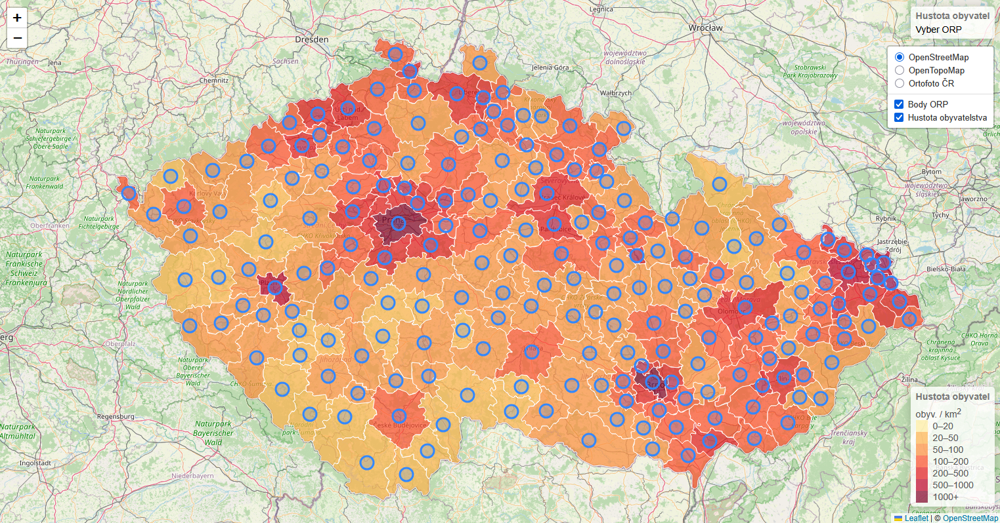{ width="800" }
    <figcaption>Vykreslení kružnic na souřadnicích bodů</figcaption>
</figure>

Při procházení jednotlivých ORP zjistíme, že po vybrání ORP se **neaktualizují body**, které se postupně dostávají **vizuálně pod úroveň polygonů**.

Řešení problému spočívá v úpravě funkce ```highlightFeature```, kterou používáme pro výběr prvku myší. Na konec funkce přidáme vykreslení bodů ORP opět do popředí nad ostatní vrstvy.

=== "script.js"
``` js
// Výběr prvku po najetí kurzorem myši
function highlightFeature(e) {
    ... // Zbytek funkce
    ORPPoints.bringToFront(); // Vykreslení bodů ORP do popředí po výběru prvku
}
```

<figure markdown>
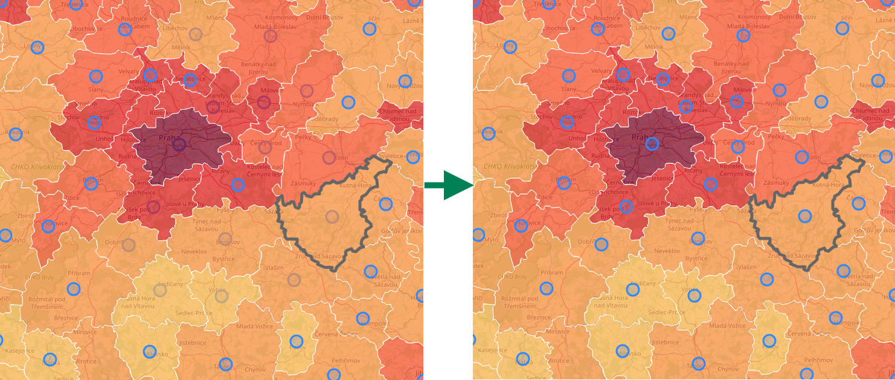{ width="800" }
    <figcaption>Vykreslení bodů do popředí po výběru polygonů</figcaption>
</figure>

Závěrem tohoto kroku vytvoříme vlastní kruhový symbol (marker), pomocí jehož body vizualizujeme.

V sekci načítání bodové vrstvy přidáme nové vlastnosti proměnné ```circleMarker``` značící kruhový symbol.

=== "script.js"
``` js
// Načtení GeoJSONu s body ORP do mapy
var ORPPoints = L.geoJSON(ORP_body,{
    pointToLayer: function (feature, latlng) {
         return L.circleMarker(latlng, {
            radius: 6,  // Velikost symbolu v px
            fillColor: "#ff7800", // Barva výplně
            color: "#000", // Barva ohraničení
            weight: 1.5, // Šířka ohraničení v px
            fillOpacity: 0.8, // Průhlednost výplně
            opacity: 1, // Průhlednost ohraničení
         }); // Vykreslení kruhových symbolů na souřadnicích bodů
    }
}).addTo(map);
```

<figure markdown>
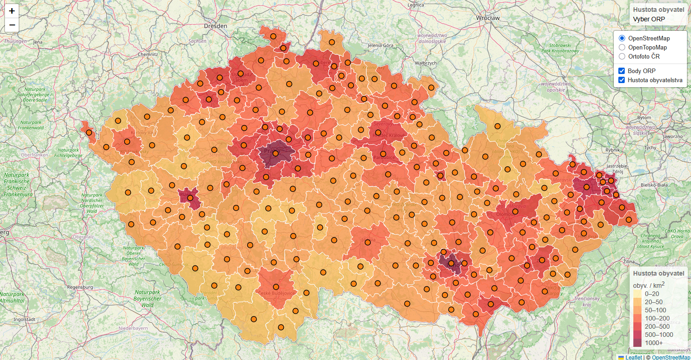{ width="800" }
    <figcaption>Vlastní styl bodové vrstvy</figcaption>
</figure>

??? note "&nbsp;<span style="color:#448aff">Stav kódu po dokončení kroku 1) Změna symbologie bodové vrstvy</span>"

    === "index.html – beze změny"

        ``` html
        <!DOCTYPE html> 
        <html> 
        <head> 
            <meta charset="UTF-8"> 
            <meta name="viewport" content="width=device-width, initial-scale=1.0">
            <link rel="stylesheet" href="style.css">

            <!-- Načtení souboru s body ORP GeoJSON-->
            <script src="ORP_body_GeoJSON.js"></script>

            <!-- Načtení souboru s ORP GeoJSON-->
            <script src="ORP_GeoJSON.js"></script>

            <!-- Externí připojení CSS symbologie Leaflet-->
            <link rel="stylesheet" href="https://unpkg.com/leaflet@1.9.4/dist/leaflet.css"
            integrity="sha256-p4NxAoJBhIIN+hmNHrzRCf9tD/miZyoHS5obTRR9BMY="
            crossorigin=""/>

            <!-- Externí připojení JS knihovny -> vložit až po připojení CSS souboru -->
            <script src="https://unpkg.com/leaflet@1.9.4/dist/leaflet.js"
            integrity="sha256-20nQCchB9co0qIjJZRGuk2/Z9VM+kNiyxNV1lvTlZBo="
            crossorigin=""></script>

            <!-- Připojení D3.js -->
            <script src="https://cdn.jsdelivr.net/npm/d3@7"></script>

            <title>Moje druhá Leaflet mapa</title> 
        </head>
        <body> 

            <h1>Propojení knihovny Leaflet s D3.js</h1> 

            <!-- Rozdělení stránky na mapu a graf, poměr je nastavený pomocí CSS -->
            <div id="container">
                <div id="map"></div>
                <div id="containerChart"></div>
            </div>
            
            <!-- Načtení skriptů ovládající mapu -->
            <script src="script.js"></script>

            <!-- Načtení skriptů ovládající graf -->
            <script type="module" src="script-chart.js"></script>

        </body>
        </html>
        ```


    === "script.js"

        ``` js
        // Nastavení mapy, jejího středu a úrovně přiblížení
        var map = L.map('map').setView([49.860, 15.315], 8); // Výběr bodu zhruba uprostřed republiky

        // Určení podkladové mapy, maximální úrovně přiblížení a zdroje dat
        var osm = L.tileLayer('https://tile.openstreetmap.org/{z}/{x}/{y}.png', {
            maxZoom: 19,
            attribution: '&copy; <a href="http://www.openstreetmap.org/copyright">OpenStreetMap</a>'
        }).addTo(map);

        // Definice podkladové OpenTopoMap
        var otm = L.tileLayer('https://{s}.tile.opentopomap.org/{z}/{x}/{y}.png', {
            maxZoom: 17,
            attribution: 'Map data: &copy; <a href="https://www.openstreetmap.org/copyright">OpenStreetMap</a> contributors, <a href="http://viewfinderpanoramas.org">SRTM</a> | Map style: &copy; <a href="https://opentopomap.org">OpenTopoMap</a> (<a href="https://creativecommons.org/licenses/by-sa/3.0/">CC-BY-SA</a>)'
        });

        // Přidání ortofota jako WMS služby, určení vrstvy, formátu a průhlednosti
        var ortofoto = L.tileLayer.wms("https://ags.cuzk.gov.cz/arcgis1/services/ORTOFOTO/MapServer/WMSServer", {
            layers: "0", 
            format: "image/png",
            transparent: true,
            attribution: "&copy ČÚZK"
        });

        // Výpočet nového atributu pro každý prvek ORP 
        // (hustota obyvatelstva = počet obyvatel / plocha), převod z m2 na km2 -> vynásobení 1 000 000
        ORP.features.forEach(function(feature){
            if(feature.properties.Shape_Area && feature.properties.poc_obyv_SLDB_2021){
                feature.properties.hustota = (feature.properties.poc_obyv_SLDB_2021/feature.properties.Shape_Area)*1000000
            }else{
                feature.properties.hustota = 0
            }
        })

        // Vytvoření barevné stupnice
        function getColor(d) {
        return d > 1000 ? '#800026' :
                d > 500  ? '#BD0026' :
                d > 200  ? '#E31A1C' :
                d > 100  ? '#FC4E2A' :
                d > 50   ? '#FD8D3C' :
                d > 20   ? '#FEB24C' :
                            '#FFEDA0'; // Výchozí barva
        }

        // Styl kartogramu
        function kartogram(feature) {
        return {
            fillColor: getColor(feature.properties.hustota), // Styl na základě atributu "hustota"
            weight: 1,
            opacity: 1,
            color: 'white',
            fillOpacity: 0.7
        };
        }

        // Výběr prvku po najetí kurzorem myši
        function highlightFeature(e) {
            var layer = e.target;

            // Úprava stylu vybraného prvku = jeho zvýraznění
            layer.setStyle({
                weight: 5,
                color: '#666',
                dashArray: '',
                fillOpacity: 0.7
            });

            layer.bringToFront();
            info.update(layer.feature.properties); // Aktualizace info pop-upu při výběru prvku
            ORPPoints.bringToFront(); // Vykreslení bodů ORP do popředí po výběru prvku
        }

        // Přiblížení na vybraný polygon po kliknutí myší
        function zoomToFeature(e) {
            map.fitBounds(e.target.getBounds());
        }

        // Resetování stylu kartogramu po zrušení jeho výběru myší
        function resetHighlight(e) {
            ORPLayer.resetStyle(e.target);
            info.update(); // Aktualizace info pop-upu při výběru prvku
        }

        // Přístup k jednotlivým polygonů ve vrstvě
        function onEachFeature(feature, layer) {
            layer.on({
                mouseover: highlightFeature,
                mouseout: resetHighlight,
                click: zoomToFeature
            });
        }

        // Vytvoření pop-upu s informacemi o vybraném prvku v mapě
        var info = L.control();

        info.onAdd = function (map) {
            this._div = L.DomUtil.create('div', 'info'); // Vytvoří div s třídou "info"
            this.update();
            return this._div;
        };

        // Funkce pro aktualizaci po-upu na základě předaných vlastností prvku
        info.update = function (props) {
            this._div.innerHTML = '<h4>Hustota obyvatel</h4>' +  (props ?
                '<b>' + props.nazev + '</b><br />' + props.hustota.toFixed(2) + ' obyv. / km<sup>2</sup>'
                : 'Vyber ORP'); // Výpis, pokud není vybraný prvek
        };

        // Vložení info pop-upu do mapy
        info.addTo(map); 

        // Vytvoření legendy a nastavení její pozice
        var legend = L.control({position: 'bottomright'});

        legend.onAdd = function (map) {

            var div = L.DomUtil.create('div', 'info legend'),
                grades = [0, 20, 50, 100, 200, 500, 1000], // Hranice intervalů - stejné jako v nastavení stylu kartogramu
                labels = [];

            div.innerHTML += '<h4>Hustota obyvatel</h4>' + 'obyv. / km<sup>2</sup><br />'; // Nadpis legendy

            // Procházení intervalů hustoty - pro každý interval se vygeneruje štítek s barevným čtvercem.
            for (var i = 0; i < grades.length; i++) {
                div.innerHTML +=
                    '<i style="background:' + getColor(grades[i] + 1) + '"></i> ' +
                    grades[i] + (grades[i + 1] ? '&ndash;' + grades[i + 1] + '<br>' : '+');
            }

            return div;
        };

        // Přidání legendy do mapy
        legend.addTo(map);

        // Načtení GeoJSONu s polygony ORP do mapy
        var ORPLayer = L.geoJSON(ORP,{
            style: kartogram, 
            onEachFeature: onEachFeature
        }).addTo(map);

        // Načtení GeoJSONu s body ORP do mapy
        var ORPPoints = L.geoJSON(ORP_body,{
            pointToLayer: function (feature, latlng) {
                return L.circleMarker(latlng, {
                    radius: 6,  // Velikost symbolu v px
                    fillColor: "#ff7800", // Barva výplně
                    color: "#000", // Barva ohraničení
                    weight: 1.5, // Šířka ohraničení v px
                    fillOpacity: 0.8, // Průhlednost výplně
                    opacity: 1, // Průhlednost ohraničení
                }); // Vykreslení kruhových symbolů na souřadnicích bodů
            }
        }).addTo(map);

        // Proměnná uchovávající podkladové mapy, mezi kterými chceme přepínat
        var baseMaps = {
            "OpenStreetMap": osm, // "popis mapy": nazevPromenne
            "OpenTopoMap": otm,
            "Ortofoto ČR": ortofoto
        };

        // Proměnná uchovávající mapové vrstvy, které chceme zobrazovat a skrývat
        var overlayMaps = {
            "Body ORP": ORPPoints,
            "Hustota obyvatelstva": ORPLayer
        };

        // Grafické přepínání podkladových map
        var layerControl = L.control.layers(baseMaps, overlayMaps, {collapsed: false}).addTo(map);
        ```

    === "script-chart.js – beze změny"

        ``` js
        // Určení velikosti grafu a jeho okrajů
        const width = 640;
        const height = 400;
        const marginTop = 20;
        const marginRight = 20;
        const marginBottom = 30;
        const marginLeft = 40;

        // Definice osy x
        const x = d3.scaleUtc()
            .domain([new Date("2023-01-01"), new Date("2024-01-01")]) // Hodnoty na ose x
            .range([marginLeft, width - marginRight]); // Šířka osy při vykreslení grafu

        // Definice osy y
        const y = d3.scaleLinear()
            .domain([0, 100]) // Hodnoty na ose y
            .range([height - marginBottom, marginTop]); // Výška osy při vykreslení grafu

        // Vytvoření SVG, do kterého se graf vykreslí
        const svg = d3.create("svg")
            .attr("width", width)
            .attr("height", height);

        // Přidání osy x do grafu (= vykreslení do SVG)
        svg.append("g")
            .attr("transform", `translate(0,${height - marginBottom})`)
            .call(d3.axisBottom(x));

        // Přidání osy y do grafu (= vykreslení do SVG)
        svg.append("g")
            .attr("transform", `translate(${marginLeft},0)`)
            .call(d3.axisLeft(y));

        // Připojení prvu SVG (= vykreslení ve webové stránce)
        containerChart.append(svg.node());
        ```


    === "style.css – beze změny"

        ``` css
        /* Rozdělení stránky */
        #container {
            display: flex;
            width: 100%;
        }


        /* Velikost mapového okna */
        #map {
            height: 800px;
            width: 60%;
        }

        /* Velikost divu pro graf a jeho vycentrování */
        #containerChart {
            width: 40%;
            justify-content: center;
            align-items: center;
            display: flex;
        }

        /* Div třídy info */
        .info {
            padding: 6px 8px;
            font: 14px/16px Arial, Helvetica, sans-serif;
            background: white;
            background: rgba(255,255,255,0.8);
            box-shadow: 0 0 15px rgba(0,0,0,0.2);
            border-radius: 5px;
        }

        /* Nadpis v divu info */
        .info h4 {
            margin: 0 0 5px;
            color: #777;
        }

        /* Úprava stylu legendy*/
        .legend {
            line-height: 18px;
            color: #555;
        }

        /* Zobrazení čtverců s barvou stylu každého atributu */
        .legend i {
            width: 18px;
            height: 18px;
            float: left;
            margin-right: 8px;
            opacity: 0.7;
        }
        ```

### 2) Vytvoření kartodiagramu zobrazujícího počet obyvatel

Pro vytvoření jednoduchého kartodiagramu využijeme atribut ```poc_obyv_SLDB_2021```, který představuje počet obyvatel daného ORP.

Kód upravíme tak, aby se **velikost bodových symbolů** přizpůsobila **počtu obyvatel**. Pro lidnatější ORP bude ukazatel tedy větší a naopak.

Data definující **velikost kartodiagramu** musíme nějakým vhodným způsobem **normalizovat**, což provedeme následovně:

$$
\text{size} = \frac{\sqrt{\text{population}}}{30}
$$

Vykreslení bodů tedy musíme poupravit:

=== "script.js"
``` js
// Načtení GeoJSONu s body ORP do mapy
var ORPPoints = L.geoJSON(ORP_body,{
    pointToLayer: function (feature, latlng) {
        // Výpis počtu obyvatel do proměnné
        var population = feature.properties.poc_obyv_SLDB_2021;
        
        // Úprava velikosti symbolu - výpočet poloměru
        var radiusDiagram = Math.sqrt(population)/30;

         return L.circleMarker(latlng, {
            radius: radiusDiagram,  // Velikost symbolu v px

            ... // Zbytek vlastností

         }); // Vykreslení kruhových symbolů na souřadnicích bodů
    }
}).addTo(map);
```

<figure markdown>
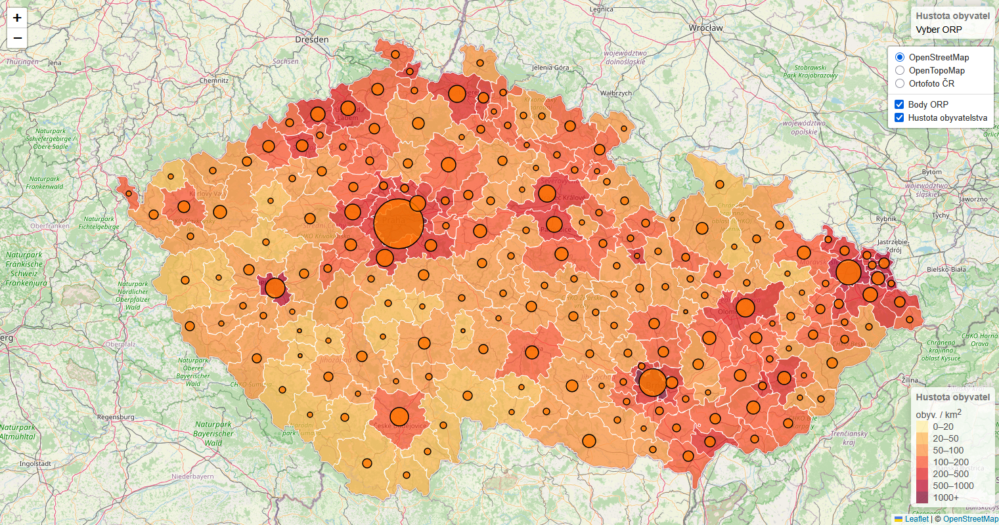{ width="800" }
    <figcaption>Nově vytvořený kartodiagram zobrazující počet obyvatel v každém ORP</figcaption>
</figure>

!!! warning "&nbsp;<span>Upozornění</span>"
    Pokud by se nějaké diagramy vykreslovaly opravdu malé či velké, můžeme nastavit jejich minimální nebo maxiální velikost.

    ``` js
    radius: radiusDiagram > 2 ? radiusDiagram : 2,  // Minimální poloměr 2 px

    radius: radiusDiagram < 15 ? radiusDiagram : 15,  // Maximální poloměr 15 px
    ```

    **Jak** v takovém případě výpočet velikosti **funguje**? Ukážeme si to na prvním příkladu, minimální velikosti. 

    - Pokud je vypočtený poloměr ```radiusDiagram``` **větší než 2**, vykreslí se velikost diagramu rovna dvojnásobku **této hodnoty** (dvojnásobek, protože pracujeme s poloměrem ```radiusDiagram```).

    - Pokud však podmínka **neplatí** a poloměr ```radiusDiagram``` je tedy **menší než 2**, pak se nastaví **velikost diagramu na 2*2 = 4 px**.


Pro novou vrstvu kartodiagramu přidáme záznam v legendě.

=== "script.js"
``` js
// Vytvoření legendy a určení její pozice
var diagramLegend = L.control({ position: 'bottomright' });

// Nastavení informací vykreslených v legendě
diagramLegend.onAdd = function (map) {
    var div = L.DomUtil.create('div', 'info legend'),
        populations = [10000, 50000, 100000, 500000, 1300000], // Rozsahy hodnot
        labels = []; // Prázdné pole pro popisy, které se vypíší následně

    div.innerHTML += '<h4>Počet obyvatel</h4>'; // Nadpis legendy

    for (var i = 0; i < populations.length; i++) {
        var radius = Math.sqrt(populations[i]) / 30; // Výpočet poloměru kruhu
        
        // Vytvoření popisu legendy - pro každý interval hodnot se vytvoří příslušně velká kružnice s popisem
        // Takto vytvořené kružnice jsou seřazené v legendě pomocí display:flex
        // V legendě musíme 
        labels.push(
            `<div style="display: flex; align-items: center; margin-bottom: 5px;">
                <i style="
                    background: #ff7800; 
                    width: ${radius * 2}px; 
                    height: ${radius * 2}px; 
                    border-radius: 50%;
                    display: inline-block;
                    margin-right: 10px;
                    flex-shrink: 0;
                    border: 1.5px solid black;"> <!-- Přidáno černé ohraničení -->
                </i> 
                <span>${populations[i].toLocaleString()} obyv.</span>
            </div>`
        );
    }

    div.innerHTML += labels.join(''); // Vložení všech popisků do legendy
    return div;
};

// Přidání legendy pro kartodiagramy do mapy
diagramLegend.addTo(map);
```

<figure markdown>
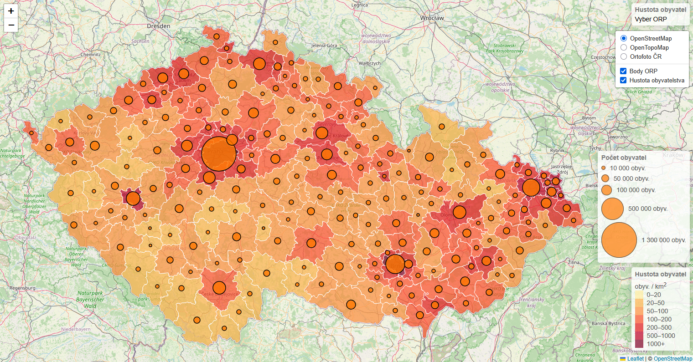{ width="800" }
    <figcaption>Mapa po přidání legendy kartodiagramu</figcaption>
</figure>

??? note "&nbsp;<span style="color:#448aff">Stav kódu po dokončení kroku 2) Vytvoření kartodiagramu zobrazujícího počet obyvatel</span>"

    === "index.html – beze změny"

        ``` html
        <!DOCTYPE html> 
        <html> 
        <head> 
            <meta charset="UTF-8"> 
            <meta name="viewport" content="width=device-width, initial-scale=1.0">
            <link rel="stylesheet" href="style.css">

            <!-- Načtení souboru s body ORP GeoJSON-->
            <script src="ORP_body_GeoJSON.js"></script>

            <!-- Načtení souboru s ORP GeoJSON-->
            <script src="ORP_GeoJSON.js"></script>

            <!-- Externí připojení CSS symbologie Leaflet-->
            <link rel="stylesheet" href="https://unpkg.com/leaflet@1.9.4/dist/leaflet.css"
            integrity="sha256-p4NxAoJBhIIN+hmNHrzRCf9tD/miZyoHS5obTRR9BMY="
            crossorigin=""/>

            <!-- Externí připojení JS knihovny -> vložit až po připojení CSS souboru -->
            <script src="https://unpkg.com/leaflet@1.9.4/dist/leaflet.js"
            integrity="sha256-20nQCchB9co0qIjJZRGuk2/Z9VM+kNiyxNV1lvTlZBo="
            crossorigin=""></script>

            <!-- Připojení D3.js -->
            <script src="https://cdn.jsdelivr.net/npm/d3@7"></script>

            <title>Moje druhá Leaflet mapa</title> 
        </head>
        <body> 

            <h1>Propojení knihovny Leaflet s D3.js</h1> 

            <!-- Rozdělení stránky na mapu a graf, poměr je nastavený pomocí CSS -->
            <div id="container">
                <div id="map"></div>
                <div id="containerChart"></div>
            </div>
            
            <!-- Načtení skriptů ovládající mapu -->
            <script src="script.js"></script>

            <!-- Načtení skriptů ovládající graf -->
            <script type="module" src="script-chart.js"></script>

        </body>
        </html>
        ```


    === "script.js"

        ``` js
        // Nastavení mapy, jejího středu a úrovně přiblížení
        var map = L.map('map').setView([49.860, 16.000], 8); // Výběr bodu zhruba uprostřed republiky

        // Určení podkladové mapy, maximální úrovně přiblížení a zdroje dat
        var osm = L.tileLayer('https://tile.openstreetmap.org/{z}/{x}/{y}.png', {
            maxZoom: 19,
            attribution: '&copy; <a href="http://www.openstreetmap.org/copyright">OpenStreetMap</a>'
        }).addTo(map);

        // Definice podkladové OpenTopoMap
        var otm = L.tileLayer('https://{s}.tile.opentopomap.org/{z}/{x}/{y}.png', {
            maxZoom: 17,
            attribution: 'Map data: &copy; <a href="https://www.openstreetmap.org/copyright">OpenStreetMap</a> contributors, <a href="http://viewfinderpanoramas.org">SRTM</a> | Map style: &copy; <a href="https://opentopomap.org">OpenTopoMap</a> (<a href="https://creativecommons.org/licenses/by-sa/3.0/">CC-BY-SA</a>)'
        });

        // Přidání ortofota jako WMS služby, určení vrstvy, formátu a průhlednosti
        var ortofoto = L.tileLayer.wms("https://ags.cuzk.gov.cz/arcgis1/services/ORTOFOTO/MapServer/WMSServer", {
            layers: "0", 
            format: "image/png",
            transparent: true,
            attribution: "&copy ČÚZK"
        });

        // Výpočet nového atributu pro každý prvek ORP 
        // (hustota obyvatelstva = počet obyvatel / plocha), převod z m2 na km2 -> vynásobení 1 000 000
        ORP.features.forEach(function(feature){
            if(feature.properties.Shape_Area && feature.properties.poc_obyv_SLDB_2021){
                feature.properties.hustota = (feature.properties.poc_obyv_SLDB_2021/feature.properties.Shape_Area)*1000000
            }else{
                feature.properties.hustota = 0
            }
        })

        // Vytvoření barevné stupnice
        function getColor(d) {
        return d > 1000 ? '#800026' :
                d > 500  ? '#BD0026' :
                d > 200  ? '#E31A1C' :
                d > 100  ? '#FC4E2A' :
                d > 50   ? '#FD8D3C' :
                d > 20   ? '#FEB24C' :
                            '#FFEDA0'; // Výchozí barva
        }

        // Styl kartogramu
        function kartogram(feature) {
        return {
            fillColor: getColor(feature.properties.hustota), // Styl na základě atributu "hustota"
            weight: 1,
            opacity: 1,
            color: 'white',
            fillOpacity: 0.7
        };
        }

        // Výběr prvku po najetí kurzorem myši
        function highlightFeature(e) {
            var layer = e.target;

            // Úprava stylu vybraného prvku = jeho zvýraznění
            layer.setStyle({
                weight: 5,
                color: '#666',
                dashArray: '',
                fillOpacity: 0.7
            });

            layer.bringToFront();
            info.update(layer.feature.properties); // Aktualizace info pop-upu při výběru prvku
            ORPPoints.bringToFront(); // Vykreslení bodů ORP do popředí po výběru prvku
        }

        // Přiblížení na vybraný polygon po kliknutí myší
        function zoomToFeature(e) {
            map.fitBounds(e.target.getBounds());
        }

        // Resetování stylu kartogramu po zrušení jeho výběru myší
        function resetHighlight(e) {
            ORPLayer.resetStyle(e.target);
            info.update(); // Aktualizace info pop-upu při výběru prvku
        }

        // Přístup k jednotlivým polygonů ve vrstvě
        function onEachFeature(feature, layer) {
            layer.on({
                mouseover: highlightFeature,
                mouseout: resetHighlight,
                click: zoomToFeature
            });
        }

        // Vytvoření pop-upu s informacemi o vybraném prvku v mapě
        var info = L.control();

        info.onAdd = function (map) {
            this._div = L.DomUtil.create('div', 'info'); // Vytvoří div s třídou "info"
            this.update();
            return this._div;
        };

        // Funkce pro aktualizaci po-upu na základě předaných vlastností prvku
        info.update = function (props) {
            this._div.innerHTML = '<h4>Hustota obyvatel</h4>' +  (props ?
                '<b>' + props.nazev + '</b><br />' + props.hustota.toFixed(2) + ' obyv. / km<sup>2</sup>'
                : 'Vyber ORP'); // Výpis, pokud není vybraný prvek
        };

        // Vložení info pop-upu do mapy
        info.addTo(map); 

        // Vytvoření legendy a nastavení její pozice
        var legend = L.control({position: 'bottomright'});

        legend.onAdd = function (map) {

            var div = L.DomUtil.create('div', 'info legend'),
                grades = [0, 20, 50, 100, 200, 500, 1000], // Hranice intervalů - stejné jako v nastavení stylu kartogramu
                labels = [];

            div.innerHTML += '<h4>Hustota obyvatel</h4>' + 'obyv. / km<sup>2</sup><br />'; // Nadpis legendy

            // Procházení intervalů hustoty - pro každý interval se vygeneruje štítek s barevným čtvercem.
            for (var i = 0; i < grades.length; i++) {
                div.innerHTML +=
                    '<i style="background:' + getColor(grades[i] + 1) + '"></i> ' +
                    grades[i] + (grades[i + 1] ? '&ndash;' + grades[i + 1] + '<br>' : '+');
            }

            return div;
        };

        // Přidání legendy do mapy
        legend.addTo(map);

        // Načtení GeoJSONu s polygony ORP do mapy
        var ORPLayer = L.geoJSON(ORP,{
            style: kartogram, 
            onEachFeature: onEachFeature
        }).addTo(map);

        // Načtení GeoJSONu s body ORP do mapy
        var ORPPoints = L.geoJSON(ORP_body,{
            pointToLayer: function (feature, latlng) {
                // Výpis počtu obyvatel do proměnné
                var population = feature.properties.poc_obyv_SLDB_2021;

                // Úprava velikosti symbolu - výpočet poloměru
                var radiusDiagram = Math.sqrt(population)/30;

                return L.circleMarker(latlng, {
                    radius: radiusDiagram,  // Velikost symbolu v px
                    fillColor: "#ff7800", // Barva výplně
                    color: "#000", // Barva ohraničení
                    weight: 1.5, // Šířka ohraničení v px
                    fillOpacity: 0.8, // Průhlednost výplně
                    opacity: 1, // Průhlednost ohraničení
                }); // Vykreslení kruhových symbolů na souřadnicích bodů
            }
        }).addTo(map);

        // Vytvoření legendy a určení její pozice
        var diagramLegend = L.control({ position: 'bottomright' });

        // Nastavení informací vykreslených v legendě
        diagramLegend.onAdd = function (map) {
            var div = L.DomUtil.create('div', 'info legend'),
                populations = [10000, 50000, 100000, 500000, 1300000], // Rozsahy hodnot
                labels = []; // Prázdné pole pro popisy, které se vypíší následně

            div.innerHTML += '<h4>Počet obyvatel</h4>'; // Nadpis legendy

            for (var i = 0; i < populations.length; i++) {
                var radius = Math.sqrt(populations[i]) / 30; // Výpočet poloměru kruhu

                // Vytvoření popisu legendy - pro každý interval hodnot se vytvoří příslušně velká kružnice s popisem
                // Takto vytvořené kružnice jsou seřazené v legendě pomocí display:flex
                // V legendě musíme 
                labels.push(
                    `<div style="display: flex; align-items: center; margin-bottom: 5px;">
                        <i style="
                            background: #ff7800; 
                            width: ${radius * 2}px; 
                            height: ${radius * 2}px; 
                            border-radius: 50%;
                            display: inline-block;
                            margin-right: 10px;
                            flex-shrink: 0;
                            border: 1.5px solid black;"> <!-- Přidáno černé ohraničení -->
                        </i> 
                        <span>${populations[i].toLocaleString()} obyv.</span>
                    </div>`
                );
            }

            div.innerHTML += labels.join(''); // Vložení všech popisků do legendy
            return div;
        };

        // Přidání legendy pro kartodiagramy do mapy
        diagramLegend.addTo(map);

        // Proměnná uchovávající podkladové mapy, mezi kterými chceme přepínat
        var baseMaps = {
            "OpenStreetMap": osm, // "popis mapy": nazevPromenne
            "OpenTopoMap": otm,
            "Ortofoto ČR": ortofoto
        };

        // Proměnná uchovávající mapové vrstvy, které chceme zobrazovat a skrývat
        var overlayMaps = {
            "Body ORP": ORPPoints,
            "Hustota obyvatelstva": ORPLayer
        };

        // Grafické přepínání podkladových map
        var layerControl = L.control.layers(baseMaps, overlayMaps, {collapsed: false}).addTo(map);
        ```

    === "script-chart.js – beze změny"

        ``` js
        // Určení velikosti grafu a jeho okrajů
        const width = 640;
        const height = 400;
        const marginTop = 20;
        const marginRight = 20;
        const marginBottom = 30;
        const marginLeft = 40;

        // Definice osy x
        const x = d3.scaleUtc()
            .domain([new Date("2023-01-01"), new Date("2024-01-01")]) // Hodnoty na ose x
            .range([marginLeft, width - marginRight]); // Šířka osy při vykreslení grafu

        // Definice osy y
        const y = d3.scaleLinear()
            .domain([0, 100]) // Hodnoty na ose y
            .range([height - marginBottom, marginTop]); // Výška osy při vykreslení grafu

        // Vytvoření SVG, do kterého se graf vykreslí
        const svg = d3.create("svg")
            .attr("width", width)
            .attr("height", height);

        // Přidání osy x do grafu (= vykreslení do SVG)
        svg.append("g")
            .attr("transform", `translate(0,${height - marginBottom})`)
            .call(d3.axisBottom(x));

        // Přidání osy y do grafu (= vykreslení do SVG)
        svg.append("g")
            .attr("transform", `translate(${marginLeft},0)`)
            .call(d3.axisLeft(y));

        // Připojení prvu SVG (= vykreslení ve webové stránce)
        containerChart.append(svg.node());
        ```


    === "style.css – beze změny"

        ``` css
        /* Rozdělení stránky */
        #container {
            display: flex;
            width: 100%;
        }


        /* Velikost mapového okna */
        #map {
            height: 800px;
            width: 60%;
        }

        /* Velikost divu pro graf a jeho vycentrování */
        #containerChart {
            width: 40%;
            justify-content: center;
            align-items: center;
            display: flex;
        }

        /* Div třídy info */
        .info {
            padding: 6px 8px;
            font: 14px/16px Arial, Helvetica, sans-serif;
            background: white;
            background: rgba(255,255,255,0.8);
            box-shadow: 0 0 15px rgba(0,0,0,0.2);
            border-radius: 5px;
        }

        /* Nadpis v divu info */
        .info h4 {
            margin: 0 0 5px;
            color: #777;
        }

        /* Úprava stylu legendy*/
        .legend {
            line-height: 18px;
            color: #555;
        }

        /* Zobrazení čtverců s barvou stylu každého atributu */
        .legend i {
            width: 18px;
            height: 18px;
            float: left;
            margin-right: 8px;
            opacity: 0.7;
        }
        ```

### 3) Strukturní kartodiagram zobrazující věkové složení

V posledním kroku si vytvoříme strukturní kartodiagram, který bude mít sice pro všechny ORP stejnou velikost, ale bude zobrazovat poměr věkového složení na daném území, tedy **věkovou strukturu**.

Nejprve si skryjeme vykreslování předchozího kartodiagramu. Případně můžeme pracovat s novým kódem.

V první fázi definujeme, které atributy budou v diagramu vykreslené, tedy ```poc_obyv_0_14```, ```poc_obyv_15_64``` a ```poc_obyv_nad_65```.

Zároveň definujeme, že se jedná o koláčový graf (pie chart).

=== "script.js"
``` js
// Vytvoření diagramu pro věkové skupiny 
var ageGroups = ORP_body.features.map(function(feature) {
    return {
        ...feature, // 3 tečky značí zkopírování vlastností mezi objekty
        pieData: d3.pie()([feature.properties.poc_obyv_0_14, feature.properties.poc_obyv_15_64, feature.properties.poc_obyv_nad_65])
    };
});
```

Následně vytvoříme funkci ```createPieCharts```, pomocí které definujeme vstupní data pro diagramy, jejich barvy a velikosti.

Zároveň nastavíme aktualizaci diagramů při posunu mapy funkcí ```updatePieCharts```.

=== "script.js"
``` js
// Vytvoření grafů v mapě
function createPieCharts() {
    const overlayPane = map.getPanes().overlayPane;

    // Vykreslení do SVG
    const svg = d3.select(overlayPane).select('svg');

    // Vykreslení dat z proměnné ageGroups
    const pies = svg.selectAll('g.pie-chart')
        .data(ageGroups)
        .enter()
        .append('g')
        .attr('opacity', 0.8)
        .attr('class', 'pie-chart');

    // Nastavení velikosti grafu
    const arcGenerate = d3.arc()
        .innerRadius(0) // Vnitřní poloměr
        .outerRadius(15); // Vnější poloměr

    // Použité barvy v diagramu    
    const getColor = (d, i) => {
        const colors = ['blue', 'green', 'red'];
        return colors[i];
    };

    // Generování diagramu
    pies.selectAll('path')
        .data(d => d.pieData)
        .enter()
        .append('path')
        .attr('d', arcGenerate)
        .attr('fill', getColor)
        .attr('stroke', 'white');
}

// Aktualizace pozice diagramů při posunu mapy
function updatePieCharts() {
    const overlayPane = map.getPanes().overlayPane;
    const svg = d3.select(overlayPane).select('svg');

    svg.selectAll('g.pie-chart')
        .attr('transform', d => {
            const point = map.latLngToLayerPoint([d.geometry.coordinates[1], d.geometry.coordinates[0]]);
            return `translate(${point.x}, ${point.y})`;
        });
}
```

Dále musíme vykreslit diagramy na **správných pozicích v mapě**.

=== "script.js"
``` js
// Vytvoření diagramů a prvotní aktualizace (načtení)
createPieCharts();
updatePieCharts(); // Při vynechání tohoto kódu by se diagramy načetly až po posunu mapy nebo zoomu

// Aktualizace pozice diagramů při posunu mapy nebo zoomování
map.on('zoomend', updatePieCharts);

// Funkce pro vykreslení SVG vrstvy, která obsahuje všechny diagramy
map.on('layeradd', function (event) {
    if (event.layer === map) {
        const overlayPane = map.getPanes().overlayPane;
        overlayPane.append('svg')  // Přidání SVG pro vykreslení diagramů
            .attr('width', map.getSize().x)
            .attr('height', map.getSize().y);
    }
});
```

<figure markdown>
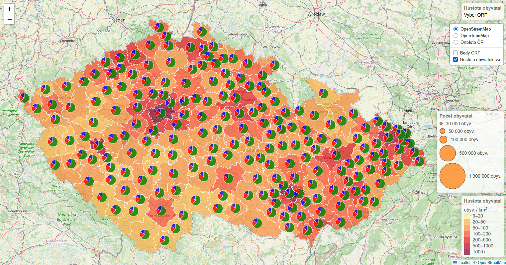{ width="800" }
    <figcaption>Strukturní kartodiagram vytvořený pomocí knihovny D3.js</figcaption>
</figure>

Závěrem přidáme opět **legendu**.

=== "script.js"
``` js
// Vytvoření legendy pro pie chart
var pieChartLegend = L.control({ position: 'bottomright' });

pieChartLegend.onAdd = function (map) {
    var div = L.DomUtil.create('div', 'info legend'),
        ageGroups = ['0-14', '15-64', 'nad 65'], // Popisky pro věkové skupiny
        colors = ['blue', 'green', 'red'], // Barvy pro jednotlivé věkové skupiny
        labels = [];

    div.innerHTML += '<h4>Věkové skupiny</h4>'; // Nadpis legendy

    // Vytvoření popisků pro jednotlivé věkové skupiny
    for (var i = 0; i < ageGroups.length; i++) {
        labels.push(
            `<div style="display: flex; align-items: center; margin-bottom: 5px;">
                <i style="
                    background: ${colors[i]}; 
                    width: 20px; 
                    height: 20px; 
                    border-radius: 50%;
                    display: inline-block;
                    margin-right: 10px;
                    flex-shrink: 0;">
                </i> 
                <span>${ageGroups[i]}</span>
            </div>`
        );
    }

    div.innerHTML += labels.join(''); // Vložení všech popisků do legendy
    return div;
};

// Přidání legendy pro pie chart do mapy
pieChartLegend.addTo(map);
```

<figure markdown>
{ width="800" }
    <figcaption>Přidání legendy pro strukturní kartodiagram</figcaption>
</figure>

??? note "&nbsp;<span style="color:#448aff">Stav kódu po dokončení kroku 3) Strukturní kartodiagram zobrazující věkové složení</span>"

    === "index.html – beze změny"

        ``` html
        <!DOCTYPE html> 
        <html> 
        <head> 
            <meta charset="UTF-8"> 
            <meta name="viewport" content="width=device-width, initial-scale=1.0">
            <link rel="stylesheet" href="style.css">

            <!-- Načtení souboru s body ORP GeoJSON-->
            <script src="ORP_body_GeoJSON.js"></script>

            <!-- Načtení souboru s ORP GeoJSON-->
            <script src="ORP_GeoJSON.js"></script>

            <!-- Externí připojení CSS symbologie Leaflet-->
            <link rel="stylesheet" href="https://unpkg.com/leaflet@1.9.4/dist/leaflet.css"
            integrity="sha256-p4NxAoJBhIIN+hmNHrzRCf9tD/miZyoHS5obTRR9BMY="
            crossorigin=""/>

            <!-- Externí připojení JS knihovny -> vložit až po připojení CSS souboru -->
            <script src="https://unpkg.com/leaflet@1.9.4/dist/leaflet.js"
            integrity="sha256-20nQCchB9co0qIjJZRGuk2/Z9VM+kNiyxNV1lvTlZBo="
            crossorigin=""></script>

            <!-- Připojení D3.js -->
            <script src="https://cdn.jsdelivr.net/npm/d3@7"></script>

            <title>Moje druhá Leaflet mapa</title> 
        </head>
        <body> 

            <h1>Propojení knihovny Leaflet s D3.js</h1> 

            <!-- Rozdělení stránky na mapu a graf, poměr je nastavený pomocí CSS -->
            <div id="container">
                <div id="map"></div>
                <div id="containerChart"></div>
            </div>
            
            <!-- Načtení skriptů ovládající mapu -->
            <script src="script.js"></script>

            <!-- Načtení skriptů ovládající graf -->
            <script type="module" src="script-chart.js"></script>

        </body>
        </html>
        ```


    === "script.js"

        ``` js
        // Nastavení mapy, jejího středu a úrovně přiblížení
        var map = L.map('map').setView([49.860, 16.000], 8); // Výběr bodu zhruba uprostřed republiky

        // Určení podkladové mapy, maximální úrovně přiblížení a zdroje dat
        var osm = L.tileLayer('https://tile.openstreetmap.org/{z}/{x}/{y}.png', {
            maxZoom: 19,
            attribution: '&copy; <a href="http://www.openstreetmap.org/copyright">OpenStreetMap</a>'
        }).addTo(map);

        // Definice podkladové OpenTopoMap
        var otm = L.tileLayer('https://{s}.tile.opentopomap.org/{z}/{x}/{y}.png', {
            maxZoom: 17,
            attribution: 'Map data: &copy; <a href="https://www.openstreetmap.org/copyright">OpenStreetMap</a> contributors, <a href="http://viewfinderpanoramas.org">SRTM</a> | Map style: &copy; <a href="https://opentopomap.org">OpenTopoMap</a> (<a href="https://creativecommons.org/licenses/by-sa/3.0/">CC-BY-SA</a>)'
        });

        // Přidání ortofota jako WMS služby, určení vrstvy, formátu a průhlednosti
        var ortofoto = L.tileLayer.wms("https://ags.cuzk.gov.cz/arcgis1/services/ORTOFOTO/MapServer/WMSServer", {
            layers: "0", 
            format: "image/png",
            transparent: true,
            attribution: "&copy ČÚZK"
        });

        // Výpočet nového atributu pro každý prvek ORP 
        // (hustota obyvatelstva = počet obyvatel / plocha), převod z m2 na km2 -> vynásobení 1 000 000
        ORP.features.forEach(function(feature){
            if(feature.properties.Shape_Area && feature.properties.poc_obyv_SLDB_2021){
                feature.properties.hustota = (feature.properties.poc_obyv_SLDB_2021/feature.properties.Shape_Area)*1000000
            }else{
                feature.properties.hustota = 0
            }
        })

        // Vytvoření barevné stupnice
        function getColor(d) {
        return d > 1000 ? '#800026' :
                d > 500  ? '#BD0026' :
                d > 200  ? '#E31A1C' :
                d > 100  ? '#FC4E2A' :
                d > 50   ? '#FD8D3C' :
                d > 20   ? '#FEB24C' :
                            '#FFEDA0'; // Výchozí barva
        }

        // Styl kartogramu
        function kartogram(feature) {
        return {
            fillColor: getColor(feature.properties.hustota), // Styl na základě atributu "hustota"
            weight: 1,
            opacity: 1,
            color: 'white',
            fillOpacity: 0.7
        };
        }

        // Výběr prvku po najetí kurzorem myši
        function highlightFeature(e) {
            var layer = e.target;

            // Úprava stylu vybraného prvku = jeho zvýraznění
            layer.setStyle({
                weight: 5,
                color: '#666',
                dashArray: '',
                fillOpacity: 0.7
            });

            layer.bringToFront();
            info.update(layer.feature.properties); // Aktualizace info pop-upu při výběru prvku
            ORPPoints.bringToFront(); // Vykreslení bodů ORP do popředí po výběru prvku
        }

        // Přiblížení na vybraný polygon po kliknutí myší
        function zoomToFeature(e) {
            map.fitBounds(e.target.getBounds());
        }

        // Resetování stylu kartogramu po zrušení jeho výběru myší
        function resetHighlight(e) {
            ORPLayer.resetStyle(e.target);
            info.update(); // Aktualizace info pop-upu při výběru prvku
        }

        // Přístup k jednotlivým polygonů ve vrstvě
        function onEachFeature(feature, layer) {
            layer.on({
                mouseover: highlightFeature,
                mouseout: resetHighlight,
                click: zoomToFeature
            });
        }

        // Vytvoření pop-upu s informacemi o vybraném prvku v mapě
        var info = L.control();

        info.onAdd = function (map) {
            this._div = L.DomUtil.create('div', 'info'); // Vytvoří div s třídou "info"
            this.update();
            return this._div;
        };

        // Funkce pro aktualizaci po-upu na základě předaných vlastností prvku
        info.update = function (props) {
            this._div.innerHTML = '<h4>Hustota obyvatel</h4>' +  (props ?
                '<b>' + props.nazev + '</b><br />' + props.hustota.toFixed(2) + ' obyv. / km<sup>2</sup>'
                : 'Vyber ORP'); // Výpis, pokud není vybraný prvek
        };

        // Vložení info pop-upu do mapy
        info.addTo(map); 

        // Vytvoření legendy a nastavení její pozice
        var legend = L.control({position: 'bottomright'});

        legend.onAdd = function (map) {

            var div = L.DomUtil.create('div', 'info legend'),
                grades = [0, 20, 50, 100, 200, 500, 1000], // Hranice intervalů - stejné jako v nastavení stylu kartogramu
                labels = [];

            div.innerHTML += '<h4>Hustota obyvatel</h4>' + 'obyv. / km<sup>2</sup><br />'; // Nadpis legendy

            // Procházení intervalů hustoty - pro každý interval se vygeneruje štítek s barevným čtvercem.
            for (var i = 0; i < grades.length; i++) {
                div.innerHTML +=
                    '<i style="background:' + getColor(grades[i] + 1) + '"></i> ' +
                    grades[i] + (grades[i + 1] ? '&ndash;' + grades[i + 1] + '<br>' : '+');
            }

            return div;
        };

        // Přidání legendy do mapy
        legend.addTo(map);

        // Načtení GeoJSONu s polygony ORP do mapy
        var ORPLayer = L.geoJSON(ORP,{
            style: kartogram, 
            onEachFeature: onEachFeature
        }).addTo(map);

        // Načtení GeoJSONu s body ORP do mapy
        var ORPPoints = L.geoJSON(ORP_body,{
            pointToLayer: function (feature, latlng) {
                // Výpis počtu obyvatel do proměnné
                var population = feature.properties.poc_obyv_SLDB_2021;

                // Úprava velikosti symbolu - výpočet poloměru
                var radiusDiagram = Math.sqrt(population)/30;

                return L.circleMarker(latlng, {
                    radius: radiusDiagram,  // Velikost symbolu v px
                    fillColor: "#ff7800", // Barva výplně
                    color: "#000", // Barva ohraničení
                    weight: 1.5, // Šířka ohraničení v px
                    fillOpacity: 0.8, // Průhlednost výplně
                    opacity: 1, // Průhlednost ohraničení
                }); // Vykreslení kruhových symbolů na souřadnicích bodů
            }
        });

        // Vytvoření legendy a určení její pozice
        var diagramLegend = L.control({ position: 'bottomright' });

        // Nastavení informací vykreslených v legendě
        diagramLegend.onAdd = function (map) {
            var div = L.DomUtil.create('div', 'info legend'),
                populations = [10000, 50000, 100000, 500000, 1300000], // Rozsahy hodnot
                labels = []; // Prázdné pole pro popisy, které se vypíší následně

            div.innerHTML += '<h4>Počet obyvatel</h4>'; // Nadpis legendy

            for (var i = 0; i < populations.length; i++) {
                var radius = Math.sqrt(populations[i]) / 30; // Výpočet poloměru kruhu

                // Vytvoření popisu legendy - pro každý interval hodnot se vytvoří příslušně velká kružnice s popisem
                // Takto vytvořené kružnice jsou seřazené v legendě pomocí display:flex
                // V legendě musíme 
                labels.push(
                    `<div style="display: flex; align-items: center; margin-bottom: 5px;">
                        <i style="
                            background: #ff7800; 
                            width: ${radius * 2}px; 
                            height: ${radius * 2}px; 
                            border-radius: 50%;
                            display: inline-block;
                            margin-right: 10px;
                            flex-shrink: 0;
                            border: 1.5px solid black;"> <!-- Přidáno černé ohraničení -->
                        </i> 
                        <span>${populations[i].toLocaleString()} obyv.</span>
                    </div>`
                );
            }

            div.innerHTML += labels.join(''); // Vložení všech popisků do legendy
            return div;
        };

        // Přidání legendy pro kartodiagramy do mapy
        diagramLegend.addTo(map);

        // Vytvoření diagramu pro věkové skupiny 
        var ageGroups = ORP_body.features.map(function(feature) {
            return {
                ...feature, // 3 tečky značí zkopírování vlastností mezi objekty
                pieData: d3.pie()([feature.properties.poc_obyv_0_14, feature.properties.poc_obyv_15_64, feature.properties.poc_obyv_nad_65])
            };
        });

        // Vytvoření grafů v mapě
        function createPieCharts() {
            const overlayPane = map.getPanes().overlayPane;

            // Vykreslení do SVG
            const svg = d3.select(overlayPane).select('svg');

            // Vykreslení dat z proměnné ageGroups
            const pies = svg.selectAll('g.pie-chart')
                .data(ageGroups)
                .enter()
                .append('g')
                .attr('opacity', 0.8)
                .attr('class', 'pie-chart');

            // Nastavení velikosti grafu
            const arcGenerate = d3.arc()
                .innerRadius(0) // Vnitřní poloměr
                .outerRadius(15); // Vnější poloměr

            // Použité barvy v diagramu    
            const getColor = (d, i) => {
                const colors = ['blue', 'green', 'red'];
                return colors[i];
            };

            // Generování diagramu
            pies.selectAll('path')
                .data(d => d.pieData)
                .enter()
                .append('path')
                .attr('d', arcGenerate)
                .attr('fill', getColor)
                .attr('stroke', 'white');
        }

        // Aktualizace pozice diagramů při posunu mapy
        function updatePieCharts() {
            const overlayPane = map.getPanes().overlayPane;
            const svg = d3.select(overlayPane).select('svg');

            svg.selectAll('g.pie-chart')
                .attr('transform', d => {
                    const point = map.latLngToLayerPoint([d.geometry.coordinates[1], d.geometry.coordinates[0]]);
                    return `translate(${point.x}, ${point.y})`;
                });
        }

        // Vytvoření diagramů a prvotní aktualizace (načtení)
        createPieCharts();
        updatePieCharts(); // Při vynechání tohoto kódu by se diagramy načetly až po posunu mapy nebo zoomu

        // Aktualizace pozice diagramů při posunu mapy nebo zoomování
        map.on('zoomend', updatePieCharts);

        // Funkce pro vykreslení SVG vrstvy, která obsahuje všechny diagramy
        map.on('layeradd', function (event) {
            if (event.layer === map) {
                const overlayPane = map.getPanes().overlayPane;
                overlayPane.append('svg')  // Přidání SVG pro vykreslení diagramů
                    .attr('width', map.getSize().x)
                    .attr('height', map.getSize().y);
            }
        });

        // Vytvoření legendy pro pie chart
        var pieChartLegend = L.control({ position: 'bottomright' });

        pieChartLegend.onAdd = function (map) {
            var div = L.DomUtil.create('div', 'info legend'),
                ageGroups = ['0-14', '15-64', 'nad 65'], // Popisky pro věkové skupiny
                colors = ['blue', 'green', 'red'], // Barvy pro jednotlivé věkové skupiny
                labels = [];

            div.innerHTML += '<h4>Věkové skupiny</h4>'; // Nadpis legendy

            // Vytvoření popisků pro jednotlivé věkové skupiny
            for (var i = 0; i < ageGroups.length; i++) {
                labels.push(
                    `<div style="display: flex; align-items: center; margin-bottom: 5px;">
                        <i style="
                            background: ${colors[i]}; 
                            width: 20px; 
                            height: 20px; 
                            border-radius: 50%;
                            display: inline-block;
                            margin-right: 10px;
                            flex-shrink: 0;">
                        </i> 
                        <span>${ageGroups[i]}</span>
                    </div>`
                );
            }

            div.innerHTML += labels.join(''); // Vložení všech popisků do legendy
            return div;
        };

        // Přidání legendy pro pie chart do mapy
        pieChartLegend.addTo(map);

        // Proměnná uchovávající podkladové mapy, mezi kterými chceme přepínat
        var baseMaps = {
            "OpenStreetMap": osm, // "popis mapy": nazevPromenne
            "OpenTopoMap": otm,
            "Ortofoto ČR": ortofoto
        };

        // Proměnná uchovávající mapové vrstvy, které chceme zobrazovat a skrývat
        var overlayMaps = {
            "Body ORP": ORPPoints,
            "Hustota obyvatelstva": ORPLayer
        };

        // Grafické přepínání podkladových map
        var layerControl = L.control.layers(baseMaps, overlayMaps, {collapsed: false}).addTo(map);
        ```

    === "script-chart.js – beze změny"

        ``` js
        // Určení velikosti grafu a jeho okrajů
        const width = 640;
        const height = 400;
        const marginTop = 20;
        const marginRight = 20;
        const marginBottom = 30;
        const marginLeft = 40;

        // Definice osy x
        const x = d3.scaleUtc()
            .domain([new Date("2023-01-01"), new Date("2024-01-01")]) // Hodnoty na ose x
            .range([marginLeft, width - marginRight]); // Šířka osy při vykreslení grafu

        // Definice osy y
        const y = d3.scaleLinear()
            .domain([0, 100]) // Hodnoty na ose y
            .range([height - marginBottom, marginTop]); // Výška osy při vykreslení grafu

        // Vytvoření SVG, do kterého se graf vykreslí
        const svg = d3.create("svg")
            .attr("width", width)
            .attr("height", height);

        // Přidání osy x do grafu (= vykreslení do SVG)
        svg.append("g")
            .attr("transform", `translate(0,${height - marginBottom})`)
            .call(d3.axisBottom(x));

        // Přidání osy y do grafu (= vykreslení do SVG)
        svg.append("g")
            .attr("transform", `translate(${marginLeft},0)`)
            .call(d3.axisLeft(y));

        // Připojení prvu SVG (= vykreslení ve webové stránce)
        containerChart.append(svg.node());
        ```


    === "style.css – beze změny"

        ``` css
        /* Rozdělení stránky */
        #container {
            display: flex;
            width: 100%;
        }


        /* Velikost mapového okna */
        #map {
            height: 800px;
            width: 60%;
        }

        /* Velikost divu pro graf a jeho vycentrování */
        #containerChart {
            width: 40%;
            justify-content: center;
            align-items: center;
            display: flex;
        }

        /* Div třídy info */
        .info {
            padding: 6px 8px;
            font: 14px/16px Arial, Helvetica, sans-serif;
            background: white;
            background: rgba(255,255,255,0.8);
            box-shadow: 0 0 15px rgba(0,0,0,0.2);
            border-radius: 5px;
        }

        /* Nadpis v divu info */
        .info h4 {
            margin: 0 0 5px;
            color: #777;
        }

        /* Úprava stylu legendy*/
        .legend {
            line-height: 18px;
            color: #555;
        }

        /* Zobrazení čtverců s barvou stylu každého atributu */
        .legend i {
            width: 18px;
            height: 18px;
            float: left;
            margin-right: 8px;
            opacity: 0.7;
        }
        ```

---
## Propojení grafu a mapy

V této části si ukážeme, jak propojit mapu s grafem tak, abychom do grafu interaktivně vykreslovali hodnoty na základě výběru v mapě. Tedy například hodnoty pro vybraný polygon ORP. 

<!---

-->
!!! warning "Volitelný domácí úkol - řešení níže"
    Do příštího cvičení do kódu zapracujte **propojení mapy s grafem v pravé části stránky**.

    **Výsledkem bude:**

    - sloupcový graf zobrazující vývoj zástavby na daném ORP v průběhu let

    - využijte atributy ```vystavba_pred1919```, ```vystavba_1920_1945```, ```vystavba_1946_1970```, ```vystavba_1971_1980```, ```vystavba_1981_1990```, ```vystavba_1991_2000```, ```vystavba_2001_2010```, ```vystavba_2011_2015``` a ```vystavba_po2016```, které obsahuje polygonová vrstva ORP.

    - graf vhodně popište, přizpůsobte mu osy a barvy

    Po výběru polygonu ORP myší v mapě se v grafu vykreslí údaje o výstavbě v průběhu let pro vybrané ORP.


Budeme vycházet z drobně upraveného kódu ze začátku cvičení před tvorbou kartodiagramů. Využijeme polygonová data ORP.


??? note "&nbsp;<span style="color:#448aff">Připravený kód (bez souborů načítaných dat ORP)</span>"

    === "index.html"

        ``` html
        <!DOCTYPE html> 
        <html> 
        <head> 
            <meta charset="UTF-8"> 
            <meta name="viewport" content="width=device-width, initial-scale=1.0">
            <link rel="stylesheet" href="style.css">

            <!-- Načtení souboru s body ORP GeoJSON-->
            <script src="ORP_body_GeoJSON.js"></script>

            <!-- Načtení souboru s ORP GeoJSON-->
            <script src="ORP_GeoJSON.js"></script>

            <!-- Externí připojení CSS symbologie Leaflet-->
            <link rel="stylesheet" href="https://unpkg.com/leaflet@1.9.4/dist/leaflet.css"
            integrity="sha256-p4NxAoJBhIIN+hmNHrzRCf9tD/miZyoHS5obTRR9BMY="
            crossorigin=""/>

            <!-- Externí připojení JS knihovny -> vložit až po připojení CSS souboru -->
            <script src="https://unpkg.com/leaflet@1.9.4/dist/leaflet.js"
            integrity="sha256-20nQCchB9co0qIjJZRGuk2/Z9VM+kNiyxNV1lvTlZBo="
            crossorigin=""></script>

            <!-- Připojení D3.js -->
            <script src="https://cdn.jsdelivr.net/npm/d3@7"></script>

            <title>Moje druhá Leaflet mapa</title> 
        </head>
        <body> 

            <h1>Propojení knihovny Leaflet s D3.js</h1> 

            <!-- Rozdělení stránky na mapu a graf, poměr je nastavený pomocí CSS -->
            <div id="container">
                <div id="map"></div>
                <div id="containerChart"></div>
            </div>
            
            <!-- Načtení skriptů ovládající mapu -->
            <script src="script.js"></script>

            <!-- Načtení skriptů ovládající graf -->
            <script type="module" src="script-chart.js"></script>

        </body>
        </html>
        ```


    === "script.js"

        ``` js
        // Nastavení mapy, jejího středu a úrovně přiblížení
        var map = L.map('map').setView([49.860, 15.315], 8); // Výběr bodu zhruba uprostřed republiky

        // Určení podkladové mapy, maximální úrovně přiblížení a zdroje dat
        var osm = L.tileLayer('https://tile.openstreetmap.org/{z}/{x}/{y}.png', {
            maxZoom: 19,
            attribution: '&copy; <a href="http://www.openstreetmap.org/copyright">OpenStreetMap</a>'
        }).addTo(map);

        // Definice podkladové OpenTopoMap
        var otm = L.tileLayer('https://{s}.tile.opentopomap.org/{z}/{x}/{y}.png', {
            maxZoom: 17,
            attribution: 'Map data: &copy; <a href="https://www.openstreetmap.org/copyright">OpenStreetMap</a> contributors, <a href="http://viewfinderpanoramas.org">SRTM</a> | Map style: &copy; <a href="https://opentopomap.org">OpenTopoMap</a> (<a href="https://creativecommons.org/licenses/by-sa/3.0/">CC-BY-SA</a>)'
        });

        // Přidání ortofota jako WMS služby, určení vrstvy, formátu a průhlednosti
        var ortofoto = L.tileLayer.wms("https://ags.cuzk.gov.cz/arcgis1/services/ORTOFOTO/MapServer/WMSServer", {
            layers: "0", 
            format: "image/png",
            transparent: true,
            attribution: "&copy ČÚZK"
        });

        // Výpočet nového atributu pro každý prvek ORP 
        // (hustota obyvatelstva = počet obyvatel / plocha), převod z m2 na km2 -> vynásobení 1 000 000
        ORP.features.forEach(function(feature){
            if(feature.properties.Shape_Area && feature.properties.poc_obyv_SLDB_2021){
                feature.properties.hustota = (feature.properties.poc_obyv_SLDB_2021/feature.properties.Shape_Area)*1000000
            }else{
                feature.properties.hustota = 0
            }
        })

        // Vytvoření barevné stupnice
        function getColor(d) {
        return d > 1000 ? '#800026' :
                d > 500  ? '#BD0026' :
                d > 200  ? '#E31A1C' :
                d > 100  ? '#FC4E2A' :
                d > 50   ? '#FD8D3C' :
                d > 20   ? '#FEB24C' :
                            '#FFEDA0'; // Výchozí barva
        }

        // Styl kartogramu
        function kartogram(feature) {
        return {
            fillColor: getColor(feature.properties.hustota), // Styl na základě atributu "hustota"
            weight: 1,
            opacity: 1,
            color: 'white',
            fillOpacity: 0.7
        };
        }

        // Výběr prvku po najetí kurzorem myši
        function highlightFeature(e) {
            var layer = e.target;

            // Úprava stylu vybraného prvku = jeho zvýraznění
            layer.setStyle({
                weight: 5,
                color: '#666',
                dashArray: '',
                fillOpacity: 0.7
            });

            layer.bringToFront();
            info.update(layer.feature.properties); // Aktualizace info pop-upu při výběru prvku
        }

        // Přiblížení na vybraný polygon po kliknutí myší
        function zoomToFeature(e) {
            map.fitBounds(e.target.getBounds());
        }

        // Resetování stylu kartogramu po zrušení jeho výběru myší
        function resetHighlight(e) {
            ORPLayer.resetStyle(e.target);
            info.update(); // Aktualizace info pop-upu při výběru prvku
        }

        // Přístup k jednotlivým polygonů ve vrstvě
        function onEachFeature(feature, layer) {
            layer.on({
                mouseover: highlightFeature,
                mouseout: resetHighlight,
                click: zoomToFeature
            });
        }

        // Vytvoření pop-upu s informacemi o vybraném prvku v mapě
        var info = L.control();

        info.onAdd = function (map) {
            this._div = L.DomUtil.create('div', 'info'); // Vytvoří div s třídou "info"
            this.update();
            return this._div;
        };

        // Funkce pro aktualizaci po-upu na základě předaných vlastností prvku
        info.update = function (props) {
            this._div.innerHTML = '<h4>Hustota obyvatel</h4>' +  (props ?
                '<b>' + props.nazev + '</b><br />' + props.hustota.toFixed(2) + ' obyv. / km<sup>2</sup>'
                : 'Vyber ORP'); // Výpis, pokud není vybraný prvek
        };

        // Vložení info pop-upu do mapy
        info.addTo(map); 

        // Vytvoření legendy a nastavení její pozice
        var legend = L.control({position: 'bottomright'});

        legend.onAdd = function (map) {

            var div = L.DomUtil.create('div', 'info legend'),
                grades = [0, 20, 50, 100, 200, 500, 1000], // Hranice intervalů - stejné jako v nastavení stylu kartogramu
                labels = [];

            div.innerHTML += '<h4>Hustota obyvatel</h4>' + 'obyv. / km<sup>2</sup><br />'; // Nadpis legendy

            // Procházení intervalů hustoty - pro každý interval se vygeneruje štítek s barevným čtvercem.
            for (var i = 0; i < grades.length; i++) {
                div.innerHTML +=
                    '<i style="background:' + getColor(grades[i] + 1) + '"></i> ' +
                    grades[i] + (grades[i + 1] ? '&ndash;' + grades[i + 1] + '<br>' : '+');
            }

            return div;
        };

        // Přidání legendy do mapy
        legend.addTo(map);

        // Načtení GeoJSONu s polygony ORP do mapy
        var ORPLayer = L.geoJSON(ORP,{
            style: kartogram, 
            onEachFeature: onEachFeature
        }).addTo(map);

        // Proměnná uchovávající podkladové mapy, mezi kterými chceme přepínat
        var baseMaps = {
            "OpenStreetMap": osm, // "popis mapy": nazevPromenne
            "OpenTopoMap": otm,
            "Ortofoto ČR": ortofoto
        };

        // Proměnná uchovávající mapové vrstvy, které chceme zobrazovat a skrývat
        var overlayMaps = {
            "Hustota obyvatelstva": ORPLayer
        };

        // Grafické přepínání podkladových map
        var layerControl = L.control.layers(baseMaps, overlayMaps, {collapsed: false}).addTo(map);
        ```

    === "script-chart.js"

        ``` js
        // Určení velikosti grafu a jeho okrajů
        const width = 800;
        const height = 450;
        const marginTop = 50;
        const marginRight = 20;
        const marginBottom = 40;
        const marginLeft = 40;

        // Definice osy x
        const x = d3.scaleUtc()
            .domain([new Date("2023-01-01"), new Date("2024-01-01")]) // Hodnoty na ose x
            .range([marginLeft, width - marginRight]); // Šířka osy při vykreslení grafu

        // Definice osy y
        const y = d3.scaleLinear()
            .domain([0, 100]) // Hodnoty na ose y
            .range([height - marginBottom, marginTop]); // Výška osy při vykreslení grafu

        // Vytvoření SVG, do kterého se graf vykreslí
        const svg = d3.create("svg")
            .attr("width", width)
            .attr("height", height);

        // Přidání osy x do grafu (= vykreslení do SVG)
        svg.append("g")
            .attr("transform", `translate(0,${height - marginBottom})`)
            .call(d3.axisBottom(x));

        // Přidání osy y do grafu (= vykreslení do SVG)
        svg.append("g")
            .attr("transform", `translate(${marginLeft},0)`)
            .call(d3.axisLeft(y));

        // Připojení prvu SVG (= vykreslení ve webové stránce)
        containerChart.append(svg.node());
        ```


    === "style.css"

        ``` css
        /* Rozdělení stránky */
        #container {
            display: flex;
            width: 100%;
        }


        /* Velikost mapového okna */
        #map {
            height: 800px;
            width: 60%;
        }

        /* Velikost divu pro graf a jeho vycentrování */
        #containerChart {
            width: 40%;
            justify-content: center;
            align-items: center;
            display: flex;
        }

        /* Div třídy info */
        .info {
            padding: 6px 8px;
            font: 14px/16px Arial, Helvetica, sans-serif;
            background: white;
            background: rgba(255,255,255,0.8);
            box-shadow: 0 0 15px rgba(0,0,0,0.2);
            border-radius: 5px;
        }

        /* Nadpis v divu info */
        .info h4 {
            margin: 0 0 5px;
            color: #777;
        }

        /* Úprava stylu legendy*/
        .legend {
            line-height: 18px;
            color: #555;
        }

        /* Zobrazení čtverců s barvou stylu každého atributu */
        .legend i {
            width: 18px;
            height: 18px;
            float: left;
            margin-right: 8px;
            opacity: 0.7;
        }
        ```

### 1) Čtení dat z mapy

Nejprve je nutné zajistit **čtení vybraných dat z mapy**. To nastavíme uvnitř funkce ```onEachFeature```. 

Do ní přidáme volání funkce ```updateChart```, jejíž úkolem je vykreslit nebo aktualizovat graf podle atributů prvku, na který uživatel **klikne myší** (v našem případě polygony ORP). 

Pro účely testování si do konzole vypíšeme předávané atributy.

=== "script.js"

    ``` js
    // Přístup k jednotlivým polygonů ve vrstvě
    function onEachFeature(feature, layer) {
        layer.on({
            mouseover: highlightFeature,
            mouseout: resetHighlight,
            click: function(e) {
                // zoomToFeature(e); // Přibližování na prvek můžeme nyní vypnout
                console.table(feature.properties); // Výpis atributů vybraného prvku do konzole
                updateChart(feature.properties); // Propojení s grafem
            }
        });
    }
    ```

Po otevření **konzole** (tlačítko F12) můžeme sledovat vypisování předávaných atributů. 

Vzhledem k tomu, že funkce ```updateChart``` není definovaná a přesto ji voláme, vypisuje konzole chybovou hlášku. Definici této funkce provedeme následně ve skriptu s grafem ```script-chart.js```.

<figure markdown>
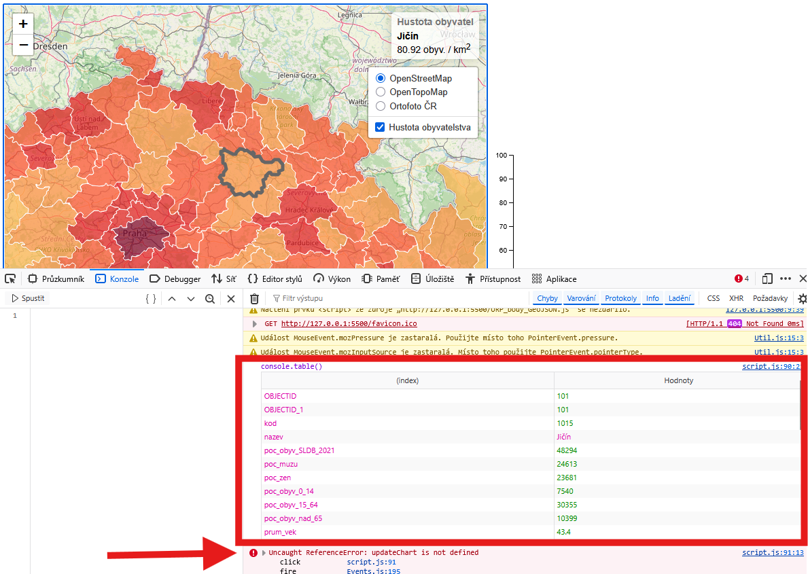{ width="800" }
    <figcaption>Výpis atributů vybraného prvku do konzole</figcaption>
</figure>


??? note "&nbsp;<span style="color:#448aff">Stav kódu po dokončení kroku 1) Čtení dat z mapy</span>"

    === "index.html – beze změny"

        ``` html
        <!DOCTYPE html> 
        <html> 
        <head> 
            <meta charset="UTF-8"> 
            <meta name="viewport" content="width=device-width, initial-scale=1.0">
            <link rel="stylesheet" href="style.css">

            <!-- Načtení souboru s body ORP GeoJSON-->
            <script src="ORP_body_GeoJSON.js"></script>

            <!-- Načtení souboru s ORP GeoJSON-->
            <script src="ORP_GeoJSON.js"></script>

            <!-- Externí připojení CSS symbologie Leaflet-->
            <link rel="stylesheet" href="https://unpkg.com/leaflet@1.9.4/dist/leaflet.css"
            integrity="sha256-p4NxAoJBhIIN+hmNHrzRCf9tD/miZyoHS5obTRR9BMY="
            crossorigin=""/>

            <!-- Externí připojení JS knihovny -> vložit až po připojení CSS souboru -->
            <script src="https://unpkg.com/leaflet@1.9.4/dist/leaflet.js"
            integrity="sha256-20nQCchB9co0qIjJZRGuk2/Z9VM+kNiyxNV1lvTlZBo="
            crossorigin=""></script>

            <!-- Připojení D3.js -->
            <script src="https://cdn.jsdelivr.net/npm/d3@7"></script>

            <title>Moje druhá Leaflet mapa</title> 
        </head>
        <body> 

            <h1>Propojení knihovny Leaflet s D3.js</h1> 

            <!-- Rozdělení stránky na mapu a graf, poměr je nastavený pomocí CSS -->
            <div id="container">
                <div id="map"></div>
                <div id="containerChart"></div>
            </div>
            
            <!-- Načtení skriptů ovládající mapu -->
            <script src="script.js"></script>

            <!-- Načtení skriptů ovládající graf -->
            <script type="module" src="script-chart.js"></script>

        </body>
        </html>
        ```


    === "script.js"

        ``` js
        // Nastavení mapy, jejího středu a úrovně přiblížení
        var map = L.map('map').setView([49.860, 15.315], 8); // Výběr bodu zhruba uprostřed republiky

        // Určení podkladové mapy, maximální úrovně přiblížení a zdroje dat
        var osm = L.tileLayer('https://tile.openstreetmap.org/{z}/{x}/{y}.png', {
            maxZoom: 19,
            attribution: '&copy; <a href="http://www.openstreetmap.org/copyright">OpenStreetMap</a>'
        }).addTo(map);

        // Definice podkladové OpenTopoMap
        var otm = L.tileLayer('https://{s}.tile.opentopomap.org/{z}/{x}/{y}.png', {
            maxZoom: 17,
            attribution: 'Map data: &copy; <a href="https://www.openstreetmap.org/copyright">OpenStreetMap</a> contributors, <a href="http://viewfinderpanoramas.org">SRTM</a> | Map style: &copy; <a href="https://opentopomap.org">OpenTopoMap</a> (<a href="https://creativecommons.org/licenses/by-sa/3.0/">CC-BY-SA</a>)'
        });

        // Přidání ortofota jako WMS služby, určení vrstvy, formátu a průhlednosti
        var ortofoto = L.tileLayer.wms("https://ags.cuzk.gov.cz/arcgis1/services/ORTOFOTO/MapServer/WMSServer", {
            layers: "0", 
            format: "image/png",
            transparent: true,
            attribution: "&copy ČÚZK"
        });

        // Výpočet nového atributu pro každý prvek ORP 
        // (hustota obyvatelstva = počet obyvatel / plocha), převod z m2 na km2 -> vynásobení 1 000 000
        ORP.features.forEach(function(feature){
            if(feature.properties.Shape_Area && feature.properties.poc_obyv_SLDB_2021){
                feature.properties.hustota = (feature.properties.poc_obyv_SLDB_2021/feature.properties.Shape_Area)*1000000
            }else{
                feature.properties.hustota = 0
            }
        })

        // Vytvoření barevné stupnice
        function getColor(d) {
        return d > 1000 ? '#800026' :
                d > 500  ? '#BD0026' :
                d > 200  ? '#E31A1C' :
                d > 100  ? '#FC4E2A' :
                d > 50   ? '#FD8D3C' :
                d > 20   ? '#FEB24C' :
                            '#FFEDA0'; // Výchozí barva
        }

        // Styl kartogramu
        function kartogram(feature) {
        return {
            fillColor: getColor(feature.properties.hustota), // Styl na základě atributu "hustota"
            weight: 1,
            opacity: 1,
            color: 'white',
            fillOpacity: 0.7
        };
        }

        // Výběr prvku po najetí kurzorem myši
        function highlightFeature(e) {
            var layer = e.target;

            // Úprava stylu vybraného prvku = jeho zvýraznění
            layer.setStyle({
                weight: 5,
                color: '#666',
                dashArray: '',
                fillOpacity: 0.7
            });

            layer.bringToFront();
            info.update(layer.feature.properties); // Aktualizace info pop-upu při výběru prvku
        }

        // Přiblížení na vybraný polygon po kliknutí myší
        function zoomToFeature(e) {
            map.fitBounds(e.target.getBounds());
        }

        // Resetování stylu kartogramu po zrušení jeho výběru myší
        function resetHighlight(e) {
            ORPLayer.resetStyle(e.target);
            info.update(); // Aktualizace info pop-upu při výběru prvku
        }

        // Přístup k jednotlivým polygonů ve vrstvě
        function onEachFeature(feature, layer) {
            layer.on({
                mouseover: highlightFeature,
                mouseout: resetHighlight,
                click: function(e) {
                    // zoomToFeature(e); // Přibližování na prvek můžeme nyní vypnout
                    console.table(feature.properties); // Výpis atributů vybraného prvku do konzole
                    updateChart(feature.properties); // Propojení s grafem
                }
            });
        }

        // Vytvoření pop-upu s informacemi o vybraném prvku v mapě
        var info = L.control();

        info.onAdd = function (map) {
            this._div = L.DomUtil.create('div', 'info'); // Vytvoří div s třídou "info"
            this.update();
            return this._div;
        };

        // Funkce pro aktualizaci po-upu na základě předaných vlastností prvku
        info.update = function (props) {
            this._div.innerHTML = '<h4>Hustota obyvatel</h4>' +  (props ?
                '<b>' + props.nazev + '</b><br />' + props.hustota.toFixed(2) + ' obyv. / km<sup>2</sup>'
                : 'Vyber ORP'); // Výpis, pokud není vybraný prvek
        };

        // Vložení info pop-upu do mapy
        info.addTo(map); 

        // Vytvoření legendy a nastavení její pozice
        var legend = L.control({position: 'bottomright'});

        legend.onAdd = function (map) {

            var div = L.DomUtil.create('div', 'info legend'),
                grades = [0, 20, 50, 100, 200, 500, 1000], // Hranice intervalů - stejné jako v nastavení stylu kartogramu
                labels = [];

            div.innerHTML += '<h4>Hustota obyvatel</h4>' + 'obyv. / km<sup>2</sup><br />'; // Nadpis legendy

            // Procházení intervalů hustoty - pro každý interval se vygeneruje štítek s barevným čtvercem.
            for (var i = 0; i < grades.length; i++) {
                div.innerHTML +=
                    '<i style="background:' + getColor(grades[i] + 1) + '"></i> ' +
                    grades[i] + (grades[i + 1] ? '&ndash;' + grades[i + 1] + '<br>' : '+');
            }

            return div;
        };

        // Přidání legendy do mapy
        legend.addTo(map);

        // Načtení GeoJSONu s polygony ORP do mapy
        var ORPLayer = L.geoJSON(ORP,{
            style: kartogram, 
            onEachFeature: onEachFeature
        }).addTo(map);

        // Proměnná uchovávající podkladové mapy, mezi kterými chceme přepínat
        var baseMaps = {
            "OpenStreetMap": osm, // "popis mapy": nazevPromenne
            "OpenTopoMap": otm,
            "Ortofoto ČR": ortofoto
        };

        // Proměnná uchovávající mapové vrstvy, které chceme zobrazovat a skrývat
        var overlayMaps = {
            "Hustota obyvatelstva": ORPLayer
        };

        // Grafické přepínání podkladových map
        var layerControl = L.control.layers(baseMaps, overlayMaps, {collapsed: false}).addTo(map);
        ```

    === "script-chart.js – beze změny"

        ``` js
        // Určení velikosti grafu a jeho okrajů
        const width = 800;
        const height = 450;
        const marginTop = 50;
        const marginRight = 20;
        const marginBottom = 40;
        const marginLeft = 40;

        // Definice osy x
        const x = d3.scaleUtc()
            .domain([new Date("2023-01-01"), new Date("2024-01-01")]) // Hodnoty na ose x
            .range([marginLeft, width - marginRight]); // Šířka osy při vykreslení grafu

        // Definice osy y
        const y = d3.scaleLinear()
            .domain([0, 100]) // Hodnoty na ose y
            .range([height - marginBottom, marginTop]); // Výška osy při vykreslení grafu

        // Vytvoření SVG, do kterého se graf vykreslí
        const svg = d3.create("svg")
            .attr("width", width)
            .attr("height", height);

        // Přidání osy x do grafu (= vykreslení do SVG)
        svg.append("g")
            .attr("transform", `translate(0,${height - marginBottom})`)
            .call(d3.axisBottom(x));

        // Přidání osy y do grafu (= vykreslení do SVG)
        svg.append("g")
            .attr("transform", `translate(${marginLeft},0)`)
            .call(d3.axisLeft(y));

        // Připojení prvu SVG (= vykreslení ve webové stránce)
        containerChart.append(svg.node());
        ```


    === "style.css – beze změny"

        ``` css
        /* Rozdělení stránky */
        #container {
            display: flex;
            width: 100%;
        }


        /* Velikost mapového okna */
        #map {
            height: 800px;
            width: 60%;
        }

        /* Velikost divu pro graf a jeho vycentrování */
        #containerChart {
            width: 40%;
            justify-content: center;
            align-items: center;
            display: flex;
        }

        /* Div třídy info */
        .info {
            padding: 6px 8px;
            font: 14px/16px Arial, Helvetica, sans-serif;
            background: white;
            background: rgba(255,255,255,0.8);
            box-shadow: 0 0 15px rgba(0,0,0,0.2);
            border-radius: 5px;
        }

        /* Nadpis v divu info */
        .info h4 {
            margin: 0 0 5px;
            color: #777;
        }

        /* Úprava stylu legendy*/
        .legend {
            line-height: 18px;
            color: #555;
        }

        /* Zobrazení čtverců s barvou stylu každého atributu */
        .legend i {
            width: 18px;
            height: 18px;
            float: left;
            margin-right: 8px;
            opacity: 0.7;
        }
        ```

### 2) Příprava os grafu a jeho popis

V první fázi musíme upravit základy grafu, a to jeho osy. Pracovat budeme v souboru ```script-chart.js```.

Před definováním **osy x** určímě popis a zdrojový atribut všech intervalů výstavby, které získáváme z mapové vrstvy polygonů ORP. 

=== "script-chart.js"

    ``` js
    // Příprava jednotlivých vykreslovaných atributů na ose x
    const yearKeys = [
        { label: "před 1919", key: "vystavba_pred1919" },
        { label: "1920–1945", key: "vystavba_1920_1945" },
        { label: "1946–1970", key: "vystavba_1946_1970" },
        { label: "1971–1980", key: "vystavba_1971_1980" },
        { label: "1981–1990", key: "vystavba_1981_1990" },
        { label: "1991–2000", key: "vystavba_1991_2000" },
        { label: "2001–2010", key: "vystavba_2001_2010" },
        { label: "2011–2015", key: "vystavba_2011_2015" },
        { label: "po 2016", key: "vystavba_po2016" }
    ];

    // Definice osy x
    const x = d3.scaleBand()
        .domain(yearKeys.map(d => d.label)) // Hodnoty na ose x
        .range([marginLeft, width - marginRight]) // Šířka osy při vykreslení grafu
        .padding(0.1); // Mezera mezi jednotlivými sloupci grafu
    ```

Následně definujeme **osu y**, které ponecháme automatické nastavení hodnot dle zvoleného polygonu ORP. 

=== "script-chart.js"

    ``` js
    // Definice osy y
    const y = d3.scaleLinear()
        .range([height - marginBottom, marginTop]); // Výška osy při vykreslení grafu
    ```

Závěrem tohoto kroku pro osu y definujeme třídu. Dále vytvoříme nadpis grafu a přidáme informaci o zdroji dat. Tyto úpravy je potřeba přidat v kódu až **za vytvoření SVG**, do kterého se graf vykreslí.

=== "script-chart.js"

    ``` js
    // Přidání osy y do grafu (= vykreslení do SVG)
    svg.append("g")
        .attr("transform", `translate(${marginLeft},0)`)
        .attr("class", "y-axis")
        .call(d3.axisLeft(y));

    // Přidání názvu grafu
    svg.append("text")
        .attr("class", "title")
        .attr("x", width / 2) // x-ová pozice 
        .attr("y", 30) // y-ová pozice
        .style("font-size", "24px") // Velikost fontu
        .style("font-weight", "bold") // Typ fontu
        .style("font-family", "sans-serif") // Typ fontu
        .attr("text-anchor", "middle") // Vztažný bod
        .text("Vývoj výstavby v Česku od roku 1919 do současnosti"); // Text nadpisu

    // Přidání zdroje dat
    svg.append("text")
        .attr("class", "source-credit")
        .attr("x", width/2)
        .attr("y", height)
        .style("font-size", "9px")
        .style("font-family", "sans-serif")
        .text("Zdroj dat: ArcČR 4.3");
    ```

<figure markdown>
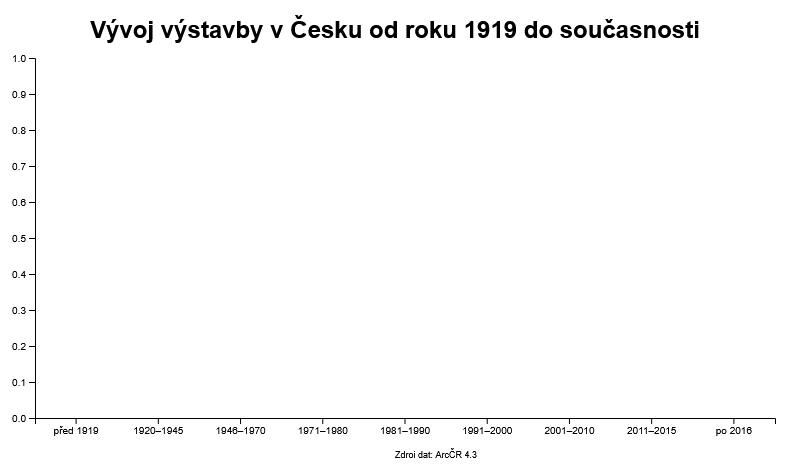{ width="600" }
    <figcaption>Graf připravený pro vykreslení sloupců s hodnotami výstavby</figcaption>
</figure>

!!! warning "&nbsp;<span>Upozornění</span>"

    Pokud se popisy os překrývají s nadpisem či s textem popisujícím zdroj dat, pak je nutné dle potřeby zvětšit okraje ```marginTop```, ```marginRight```, ```marginBottom``` nebo ```marginLeft```. 

    Případně je možné upravit celkové rozměry grafu ```width``` a ```height```.

??? note "&nbsp;<span style="color:#448aff">Stav kódu po dokončení kroku 2) Příprava os grafu a jeho popis</span>"

    === "index.html – beze změny"

        ``` html
        <!DOCTYPE html> 
        <html> 
        <head> 
            <meta charset="UTF-8"> 
            <meta name="viewport" content="width=device-width, initial-scale=1.0">
            <link rel="stylesheet" href="style.css">

            <!-- Načtení souboru s body ORP GeoJSON-->
            <script src="ORP_body_GeoJSON.js"></script>

            <!-- Načtení souboru s ORP GeoJSON-->
            <script src="ORP_GeoJSON.js"></script>

            <!-- Externí připojení CSS symbologie Leaflet-->
            <link rel="stylesheet" href="https://unpkg.com/leaflet@1.9.4/dist/leaflet.css"
            integrity="sha256-p4NxAoJBhIIN+hmNHrzRCf9tD/miZyoHS5obTRR9BMY="
            crossorigin=""/>

            <!-- Externí připojení JS knihovny -> vložit až po připojení CSS souboru -->
            <script src="https://unpkg.com/leaflet@1.9.4/dist/leaflet.js"
            integrity="sha256-20nQCchB9co0qIjJZRGuk2/Z9VM+kNiyxNV1lvTlZBo="
            crossorigin=""></script>

            <!-- Připojení D3.js -->
            <script src="https://cdn.jsdelivr.net/npm/d3@7"></script>

            <title>Moje druhá Leaflet mapa</title> 
        </head>
        <body> 

            <h1>Propojení knihovny Leaflet s D3.js</h1> 

            <!-- Rozdělení stránky na mapu a graf, poměr je nastavený pomocí CSS -->
            <div id="container">
                <div id="map"></div>
                <div id="containerChart"></div>
            </div>
            
            <!-- Načtení skriptů ovládající mapu -->
            <script src="script.js"></script>

            <!-- Načtení skriptů ovládající graf -->
            <script type="module" src="script-chart.js"></script>

        </body>
        </html>
        ```


    === "script.js – beze změny"

        ``` js
        // Nastavení mapy, jejího středu a úrovně přiblížení
        var map = L.map('map').setView([49.860, 15.315], 8); // Výběr bodu zhruba uprostřed republiky

        // Určení podkladové mapy, maximální úrovně přiblížení a zdroje dat
        var osm = L.tileLayer('https://tile.openstreetmap.org/{z}/{x}/{y}.png', {
            maxZoom: 19,
            attribution: '&copy; <a href="http://www.openstreetmap.org/copyright">OpenStreetMap</a>'
        }).addTo(map);

        // Definice podkladové OpenTopoMap
        var otm = L.tileLayer('https://{s}.tile.opentopomap.org/{z}/{x}/{y}.png', {
            maxZoom: 17,
            attribution: 'Map data: &copy; <a href="https://www.openstreetmap.org/copyright">OpenStreetMap</a> contributors, <a href="http://viewfinderpanoramas.org">SRTM</a> | Map style: &copy; <a href="https://opentopomap.org">OpenTopoMap</a> (<a href="https://creativecommons.org/licenses/by-sa/3.0/">CC-BY-SA</a>)'
        });

        // Přidání ortofota jako WMS služby, určení vrstvy, formátu a průhlednosti
        var ortofoto = L.tileLayer.wms("https://ags.cuzk.gov.cz/arcgis1/services/ORTOFOTO/MapServer/WMSServer", {
            layers: "0", 
            format: "image/png",
            transparent: true,
            attribution: "&copy ČÚZK"
        });

        // Výpočet nového atributu pro každý prvek ORP 
        // (hustota obyvatelstva = počet obyvatel / plocha), převod z m2 na km2 -> vynásobení 1 000 000
        ORP.features.forEach(function(feature){
            if(feature.properties.Shape_Area && feature.properties.poc_obyv_SLDB_2021){
                feature.properties.hustota = (feature.properties.poc_obyv_SLDB_2021/feature.properties.Shape_Area)*1000000
            }else{
                feature.properties.hustota = 0
            }
        })

        // Vytvoření barevné stupnice
        function getColor(d) {
        return d > 1000 ? '#800026' :
                d > 500  ? '#BD0026' :
                d > 200  ? '#E31A1C' :
                d > 100  ? '#FC4E2A' :
                d > 50   ? '#FD8D3C' :
                d > 20   ? '#FEB24C' :
                            '#FFEDA0'; // Výchozí barva
        }

        // Styl kartogramu
        function kartogram(feature) {
        return {
            fillColor: getColor(feature.properties.hustota), // Styl na základě atributu "hustota"
            weight: 1,
            opacity: 1,
            color: 'white',
            fillOpacity: 0.7
        };
        }

        // Výběr prvku po najetí kurzorem myši
        function highlightFeature(e) {
            var layer = e.target;

            // Úprava stylu vybraného prvku = jeho zvýraznění
            layer.setStyle({
                weight: 5,
                color: '#666',
                dashArray: '',
                fillOpacity: 0.7
            });

            layer.bringToFront();
            info.update(layer.feature.properties); // Aktualizace info pop-upu při výběru prvku
        }

        // Přiblížení na vybraný polygon po kliknutí myší
        function zoomToFeature(e) {
            map.fitBounds(e.target.getBounds());
        }

        // Resetování stylu kartogramu po zrušení jeho výběru myší
        function resetHighlight(e) {
            ORPLayer.resetStyle(e.target);
            info.update(); // Aktualizace info pop-upu při výběru prvku
        }

        // Přístup k jednotlivým polygonů ve vrstvě
        function onEachFeature(feature, layer) {
            layer.on({
                mouseover: highlightFeature,
                mouseout: resetHighlight,
                click: function(e) {
                    // zoomToFeature(e); // Přibližování na prvek můžeme nyní vypnout
                    console.table(feature.properties); // Výpis atributů vybraného prvku do konzole
                    updateChart(feature.properties); // Propojení s grafem
                }
            });
        }

        // Vytvoření pop-upu s informacemi o vybraném prvku v mapě
        var info = L.control();

        info.onAdd = function (map) {
            this._div = L.DomUtil.create('div', 'info'); // Vytvoří div s třídou "info"
            this.update();
            return this._div;
        };

        // Funkce pro aktualizaci po-upu na základě předaných vlastností prvku
        info.update = function (props) {
            this._div.innerHTML = '<h4>Hustota obyvatel</h4>' +  (props ?
                '<b>' + props.nazev + '</b><br />' + props.hustota.toFixed(2) + ' obyv. / km<sup>2</sup>'
                : 'Vyber ORP'); // Výpis, pokud není vybraný prvek
        };

        // Vložení info pop-upu do mapy
        info.addTo(map); 

        // Vytvoření legendy a nastavení její pozice
        var legend = L.control({position: 'bottomright'});

        legend.onAdd = function (map) {

            var div = L.DomUtil.create('div', 'info legend'),
                grades = [0, 20, 50, 100, 200, 500, 1000], // Hranice intervalů - stejné jako v nastavení stylu kartogramu
                labels = [];

            div.innerHTML += '<h4>Hustota obyvatel</h4>' + 'obyv. / km<sup>2</sup><br />'; // Nadpis legendy

            // Procházení intervalů hustoty - pro každý interval se vygeneruje štítek s barevným čtvercem.
            for (var i = 0; i < grades.length; i++) {
                div.innerHTML +=
                    '<i style="background:' + getColor(grades[i] + 1) + '"></i> ' +
                    grades[i] + (grades[i + 1] ? '&ndash;' + grades[i + 1] + '<br>' : '+');
            }

            return div;
        };

        // Přidání legendy do mapy
        legend.addTo(map);

        // Načtení GeoJSONu s polygony ORP do mapy
        var ORPLayer = L.geoJSON(ORP,{
            style: kartogram, 
            onEachFeature: onEachFeature
        }).addTo(map);

        // Proměnná uchovávající podkladové mapy, mezi kterými chceme přepínat
        var baseMaps = {
            "OpenStreetMap": osm, // "popis mapy": nazevPromenne
            "OpenTopoMap": otm,
            "Ortofoto ČR": ortofoto
        };

        // Proměnná uchovávající mapové vrstvy, které chceme zobrazovat a skrývat
        var overlayMaps = {
            "Hustota obyvatelstva": ORPLayer
        };

        // Grafické přepínání podkladových map
        var layerControl = L.control.layers(baseMaps, overlayMaps, {collapsed: false}).addTo(map);
        ```

    === "script-chart.js"

        ``` js
        // Určení velikosti grafu a jeho okrajů
        const width = 800;
        const height = 450;
        const marginTop = 50;
        const marginRight = 20;
        const marginBottom = 40;
        const marginLeft = 40;

        // Příprava jednotlivých vykreslovaných atributů na ose x
        const yearKeys = [
            { label: "před 1919", key: "vystavba_pred1919" },
            { label: "1920–1945", key: "vystavba_1920_1945" },
            { label: "1946–1970", key: "vystavba_1946_1970" },
            { label: "1971–1980", key: "vystavba_1971_1980" },
            { label: "1981–1990", key: "vystavba_1981_1990" },
            { label: "1991–2000", key: "vystavba_1991_2000" },
            { label: "2001–2010", key: "vystavba_2001_2010" },
            { label: "2011–2015", key: "vystavba_2011_2015" },
            { label: "po 2016", key: "vystavba_po2016" }
        ];

        // Definice osy x
        const x = d3.scaleBand()
            .domain(yearKeys.map(d => d.label)) // Hodnoty na ose x
            .range([marginLeft, width - marginRight]) // Šířka osy při vykreslení grafu
            .padding(0.1); // Mezera mezi jednotlivými sloupci grafu

        // Definice osy y
        const y = d3.scaleLinear()
            .range([height - marginBottom, marginTop]); // Výška osy při vykreslení grafu

        // Vytvoření SVG, do kterého se graf vykreslí
        const svg = d3.create("svg")
            .attr("width", width)
            .attr("height", height);

        // Přidání názvu grafu
        svg.append("text")
            .attr("class", "title")
            .attr("x", width / 2) // x-ová pozice 
            .attr("y", 30) // y-ová pozice
            .style("font-size", "24px") // Velikost fontu
            .style("font-weight", "bold") // Typ fontu
            .style("font-family", "sans-serif") // Typ fontu
            .attr("text-anchor", "middle") // Vztažný bod
            .text("Vývoj výstavby v Česku od roku 1919 do současnosti"); // Text nadpisu

        // Přidání zdroje dat
        svg.append("text")
            .attr("class", "source-credit")
            .attr("x", width/2)
            .attr("y", height)
            .style("font-size", "9px")
            .style("font-family", "sans-serif")
            .text("Zdroj dat: ArcČR 4.3");

        // Přidání osy x do grafu (= vykreslení do SVG)
        svg.append("g")
            .attr("transform", `translate(0,${height - marginBottom})`)
            .call(d3.axisBottom(x));

        // Přidání osy y do grafu (= vykreslení do SVG)
        svg.append("g")
            .attr("transform", `translate(${marginLeft},0)`)
            .attr("class", "y-axis")
            .call(d3.axisLeft(y));

        // Připojení prvu SVG (= vykreslení ve webové stránce)
        containerChart.append(svg.node());
        ```


    === "style.css – beze změny"

        ``` css
        /* Rozdělení stránky */
        #container {
            display: flex;
            width: 100%;
        }


        /* Velikost mapového okna */
        #map {
            height: 800px;
            width: 60%;
        }

        /* Velikost divu pro graf a jeho vycentrování */
        #containerChart {
            width: 40%;
            justify-content: center;
            align-items: center;
            display: flex;
        }

        /* Div třídy info */
        .info {
            padding: 6px 8px;
            font: 14px/16px Arial, Helvetica, sans-serif;
            background: white;
            background: rgba(255,255,255,0.8);
            box-shadow: 0 0 15px rgba(0,0,0,0.2);
            border-radius: 5px;
        }

        /* Nadpis v divu info */
        .info h4 {
            margin: 0 0 5px;
            color: #777;
        }

        /* Úprava stylu legendy*/
        .legend {
            line-height: 18px;
            color: #555;
        }

        /* Zobrazení čtverců s barvou stylu každého atributu */
        .legend i {
            width: 18px;
            height: 18px;
            float: left;
            margin-right: 8px;
            opacity: 0.7;
        }
        ```

### 3) Propojení s mapou

V dalším kroku musíme vytvořit funkci, která bude **převádět data** z mapy do **vhodného formátu** k vykreslení uvnitř grafu.

=== "script-chart.js"

    ``` js
    // Načtení informací o vybraném polygonu pro jejich vykreslení do grafu
    function extractBuildingData(properties) {
        return yearKeys.map(d => ({
            label: d.label,
            value: properties[d.key] || 0 // Pokud atribut neexistuje, zobrazí se jako 0
        }));
    }
    ```

Pro propojení mapy s grafem je následně potřeba definovat **aktualizaci dat na základě výběru** polygonu ORP.

Ve funkci ```updateChart```, do které vstupují atributy vybraného prvku z mapy, provedeme **automatizované přepočtení hodnot osy y** dle maximální hodnoty výstavby pro vybraný polygon.

Následně definujeme **vykreslení sloupců** v grafu dle vybraných hodnot.

=== "script-chart.js"

    ``` js
    // Aktualizace grafu na základě vybraného polygonu ORP
    function updateChart(properties) {
        const data = extractBuildingData(properties); // Získání načtených dat
        const maxValue = d3.max(data, d => d.value); // Nalezení maximální hodnoty pro vykreslení hodnot na ose y
        y.domain([0, maxValue]); // Nastavení rozsahu osy y
    
        // Animovaný přepočet hodnot na ose y při změně vybraného polygonu
        svg.select(".y-axis")
        .transition()
        .duration(500)
        .call(d3.axisLeft(y));
    
        // Výběr všech sloupců pro vykreslení hodnot výstavby
        const bars = svg.selectAll(".bar")
        .data(data, d => d.label);
        
        // Přidání nových sloupců do grafu (pokud ještě nejsou vykresleny)
        bars.enter()
        .append("rect")
        .attr("class", "bar")
        .attr("x", d => x(d.label))
        .attr("y", y(0))
        .attr("width", x.bandwidth())
        .attr("height", 0)
        .attr("fill", "#3182bd") // Barevná výplň všech sloupců
        .transition()
        .duration(500)
        .attr("y", d => y(d.value))
        .attr("height", d => y(0) - y(d.value));
    
        // Aktualizace existujících sloupců v grafu
        bars.transition()
        .duration(500)
        .attr("x", d => x(d.label))
        .attr("y", d => y(d.value))
        .attr("height", d => y(0) - y(d.value));
    
        // Odstranění nepotřebných sloupců z předchozího vybraného polygonu
        bars.exit()
        .transition()
        .duration(500)
        .attr("y", y(0))
        .attr("height", 0)
        .remove();
    }

    // Umožnění přístupu k aktualizaci grafu z jiných skriptů
    window.updateChart = updateChart;
    ```

<figure markdown>
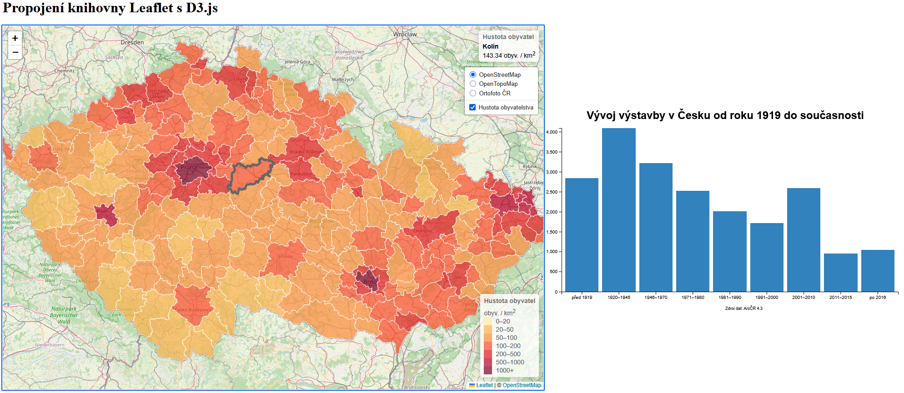{ width="1000" }
    <figcaption>Interaktivní zobrazení hodnot výstavby na základě výběru polygonu v mapě</figcaption>
</figure>


Závěrem do funkce ```updateChart``` přidáme **změnu nadpisu grafu** s výpisem aktuálně vybraného ORP.

=== "script-chart.js"

    ``` js
    // Aktualizace grafu na základě vybraného polygonu ORP
    function updateChart(properties) {
        ... // Zbytek funkce

        // Změna nadpisu grafu podle názvu ORP
        svg.select(".title")
            .text(`Vývoj výstavby v ORP ${properties.nazev}`);
    
        ... // Zbytek funkce
    }
    ```

<figure markdown>
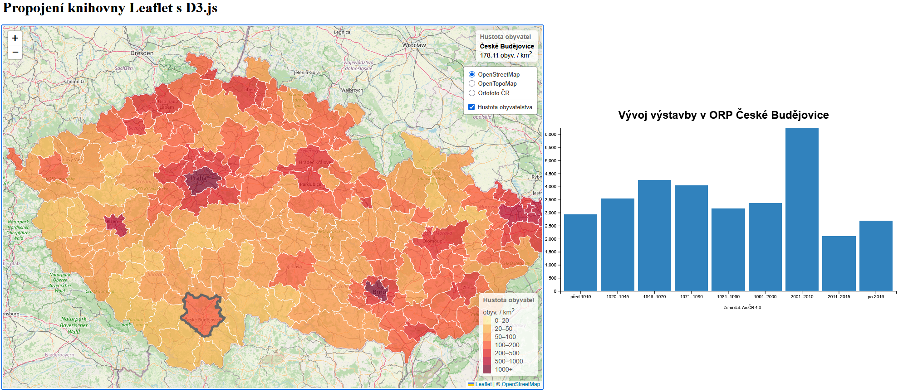{ width="1000" }
    <figcaption>Aktualizace nadpisu na základě vybraného ORP</figcaption>
</figure>

??? note "&nbsp;<span style="color:#448aff">Stav kódu po dokončení kroku 3) Propojení s mapou</span>"

    === "index.html – beze změny"

        ``` html
        <!DOCTYPE html> 
        <html> 
        <head> 
            <meta charset="UTF-8"> 
            <meta name="viewport" content="width=device-width, initial-scale=1.0">
            <link rel="stylesheet" href="style.css">

            <!-- Načtení souboru s body ORP GeoJSON-->
            <script src="ORP_body_GeoJSON.js"></script>

            <!-- Načtení souboru s ORP GeoJSON-->
            <script src="ORP_GeoJSON.js"></script>

            <!-- Externí připojení CSS symbologie Leaflet-->
            <link rel="stylesheet" href="https://unpkg.com/leaflet@1.9.4/dist/leaflet.css"
            integrity="sha256-p4NxAoJBhIIN+hmNHrzRCf9tD/miZyoHS5obTRR9BMY="
            crossorigin=""/>

            <!-- Externí připojení JS knihovny -> vložit až po připojení CSS souboru -->
            <script src="https://unpkg.com/leaflet@1.9.4/dist/leaflet.js"
            integrity="sha256-20nQCchB9co0qIjJZRGuk2/Z9VM+kNiyxNV1lvTlZBo="
            crossorigin=""></script>

            <!-- Připojení D3.js -->
            <script src="https://cdn.jsdelivr.net/npm/d3@7"></script>

            <title>Moje druhá Leaflet mapa</title> 
        </head>
        <body> 

            <h1>Propojení knihovny Leaflet s D3.js</h1> 

            <!-- Rozdělení stránky na mapu a graf, poměr je nastavený pomocí CSS -->
            <div id="container">
                <div id="map"></div>
                <div id="containerChart"></div>
            </div>
            
            <!-- Načtení skriptů ovládající mapu -->
            <script src="script.js"></script>

            <!-- Načtení skriptů ovládající graf -->
            <script type="module" src="script-chart.js"></script>

        </body>
        </html>
        ```


    === "script.js – beze změny"

        ``` js
        // Nastavení mapy, jejího středu a úrovně přiblížení
        var map = L.map('map').setView([49.860, 15.315], 8); // Výběr bodu zhruba uprostřed republiky

        // Určení podkladové mapy, maximální úrovně přiblížení a zdroje dat
        var osm = L.tileLayer('https://tile.openstreetmap.org/{z}/{x}/{y}.png', {
            maxZoom: 19,
            attribution: '&copy; <a href="http://www.openstreetmap.org/copyright">OpenStreetMap</a>'
        }).addTo(map);

        // Definice podkladové OpenTopoMap
        var otm = L.tileLayer('https://{s}.tile.opentopomap.org/{z}/{x}/{y}.png', {
            maxZoom: 17,
            attribution: 'Map data: &copy; <a href="https://www.openstreetmap.org/copyright">OpenStreetMap</a> contributors, <a href="http://viewfinderpanoramas.org">SRTM</a> | Map style: &copy; <a href="https://opentopomap.org">OpenTopoMap</a> (<a href="https://creativecommons.org/licenses/by-sa/3.0/">CC-BY-SA</a>)'
        });

        // Přidání ortofota jako WMS služby, určení vrstvy, formátu a průhlednosti
        var ortofoto = L.tileLayer.wms("https://ags.cuzk.gov.cz/arcgis1/services/ORTOFOTO/MapServer/WMSServer", {
            layers: "0", 
            format: "image/png",
            transparent: true,
            attribution: "&copy ČÚZK"
        });

        // Výpočet nového atributu pro každý prvek ORP 
        // (hustota obyvatelstva = počet obyvatel / plocha), převod z m2 na km2 -> vynásobení 1 000 000
        ORP.features.forEach(function(feature){
            if(feature.properties.Shape_Area && feature.properties.poc_obyv_SLDB_2021){
                feature.properties.hustota = (feature.properties.poc_obyv_SLDB_2021/feature.properties.Shape_Area)*1000000
            }else{
                feature.properties.hustota = 0
            }
        })

        // Vytvoření barevné stupnice
        function getColor(d) {
        return d > 1000 ? '#800026' :
                d > 500  ? '#BD0026' :
                d > 200  ? '#E31A1C' :
                d > 100  ? '#FC4E2A' :
                d > 50   ? '#FD8D3C' :
                d > 20   ? '#FEB24C' :
                            '#FFEDA0'; // Výchozí barva
        }

        // Styl kartogramu
        function kartogram(feature) {
        return {
            fillColor: getColor(feature.properties.hustota), // Styl na základě atributu "hustota"
            weight: 1,
            opacity: 1,
            color: 'white',
            fillOpacity: 0.7
        };
        }

        // Výběr prvku po najetí kurzorem myši
        function highlightFeature(e) {
            var layer = e.target;

            // Úprava stylu vybraného prvku = jeho zvýraznění
            layer.setStyle({
                weight: 5,
                color: '#666',
                dashArray: '',
                fillOpacity: 0.7
            });

            layer.bringToFront();
            info.update(layer.feature.properties); // Aktualizace info pop-upu při výběru prvku
        }

        // Přiblížení na vybraný polygon po kliknutí myší
        function zoomToFeature(e) {
            map.fitBounds(e.target.getBounds());
        }

        // Resetování stylu kartogramu po zrušení jeho výběru myší
        function resetHighlight(e) {
            ORPLayer.resetStyle(e.target);
            info.update(); // Aktualizace info pop-upu při výběru prvku
        }

        // Přístup k jednotlivým polygonů ve vrstvě
        function onEachFeature(feature, layer) {
            layer.on({
                mouseover: highlightFeature,
                mouseout: resetHighlight,
                click: function(e) {
                    // zoomToFeature(e); // Přibližování na prvek můžeme nyní vypnout
                    console.table(feature.properties); // Výpis atributů vybraného prvku do konzole
                    updateChart(feature.properties); // Propojení s grafem
                }
            });
        }

        // Vytvoření pop-upu s informacemi o vybraném prvku v mapě
        var info = L.control();

        info.onAdd = function (map) {
            this._div = L.DomUtil.create('div', 'info'); // Vytvoří div s třídou "info"
            this.update();
            return this._div;
        };

        // Funkce pro aktualizaci po-upu na základě předaných vlastností prvku
        info.update = function (props) {
            this._div.innerHTML = '<h4>Hustota obyvatel</h4>' +  (props ?
                '<b>' + props.nazev + '</b><br />' + props.hustota.toFixed(2) + ' obyv. / km<sup>2</sup>'
                : 'Vyber ORP'); // Výpis, pokud není vybraný prvek
        };

        // Vložení info pop-upu do mapy
        info.addTo(map); 

        // Vytvoření legendy a nastavení její pozice
        var legend = L.control({position: 'bottomright'});

        legend.onAdd = function (map) {

            var div = L.DomUtil.create('div', 'info legend'),
                grades = [0, 20, 50, 100, 200, 500, 1000], // Hranice intervalů - stejné jako v nastavení stylu kartogramu
                labels = [];

            div.innerHTML += '<h4>Hustota obyvatel</h4>' + 'obyv. / km<sup>2</sup><br />'; // Nadpis legendy

            // Procházení intervalů hustoty - pro každý interval se vygeneruje štítek s barevným čtvercem.
            for (var i = 0; i < grades.length; i++) {
                div.innerHTML +=
                    '<i style="background:' + getColor(grades[i] + 1) + '"></i> ' +
                    grades[i] + (grades[i + 1] ? '&ndash;' + grades[i + 1] + '<br>' : '+');
            }

            return div;
        };

        // Přidání legendy do mapy
        legend.addTo(map);

        // Načtení GeoJSONu s polygony ORP do mapy
        var ORPLayer = L.geoJSON(ORP,{
            style: kartogram, 
            onEachFeature: onEachFeature
        }).addTo(map);

        // Proměnná uchovávající podkladové mapy, mezi kterými chceme přepínat
        var baseMaps = {
            "OpenStreetMap": osm, // "popis mapy": nazevPromenne
            "OpenTopoMap": otm,
            "Ortofoto ČR": ortofoto
        };

        // Proměnná uchovávající mapové vrstvy, které chceme zobrazovat a skrývat
        var overlayMaps = {
            "Hustota obyvatelstva": ORPLayer
        };

        // Grafické přepínání podkladových map
        var layerControl = L.control.layers(baseMaps, overlayMaps, {collapsed: false}).addTo(map);
        ```

    === "script-chart.js"

        ``` js
        // Určení velikosti grafu a jeho okrajů
        const width = 800;
        const height = 450;
        const marginTop = 50;
        const marginRight = 20;
        const marginBottom = 40;
        const marginLeft = 40;

        // Příprava jednotlivých vykreslovaných atributů na ose x
        const yearKeys = [
            { label: "před 1919", key: "vystavba_pred1919" },
            { label: "1920–1945", key: "vystavba_1920_1945" },
            { label: "1946–1970", key: "vystavba_1946_1970" },
            { label: "1971–1980", key: "vystavba_1971_1980" },
            { label: "1981–1990", key: "vystavba_1981_1990" },
            { label: "1991–2000", key: "vystavba_1991_2000" },
            { label: "2001–2010", key: "vystavba_2001_2010" },
            { label: "2011–2015", key: "vystavba_2011_2015" },
            { label: "po 2016", key: "vystavba_po2016" }
        ];

        // Definice osy x
        const x = d3.scaleBand()
            .domain(yearKeys.map(d => d.label)) // Hodnoty na ose x
            .range([marginLeft, width - marginRight]) // Šířka osy při vykreslení grafu
            .padding(0.1); // Mezera mezi jednotlivými sloupci grafu

        // Definice osy y
        const y = d3.scaleLinear()
            .range([height - marginBottom, marginTop]); // Výška osy při vykreslení grafu

        // Vytvoření SVG, do kterého se graf vykreslí
        const svg = d3.create("svg")
            .attr("width", width)
            .attr("height", height);

        // Přidání názvu grafu
        svg.append("text")
            .attr("class", "title")
            .attr("x", width / 2) // x-ová pozice 
            .attr("y", 30) // y-ová pozice
            .style("font-size", "24px") // Velikost fontu
            .style("font-weight", "bold") // Typ fontu
            .style("font-family", "sans-serif") // Typ fontu
            .attr("text-anchor", "middle") // Vztažný bod
            .text("Vývoj výstavby v Česku od roku 1919 do současnosti"); // Text nadpisu

        // Přidání zdroje dat
        svg.append("text")
            .attr("class", "source-credit")
            .attr("x", width/2)
            .attr("y", height)
            .style("font-size", "9px")
            .style("font-family", "sans-serif")
            .text("Zdroj dat: ArcČR 4.3");

        // Přidání osy x do grafu (= vykreslení do SVG)
        svg.append("g")
            .attr("transform", `translate(0,${height - marginBottom})`)
            .call(d3.axisBottom(x));

        // Přidání osy y do grafu (= vykreslení do SVG)
        svg.append("g")
            .attr("transform", `translate(${marginLeft},0)`)
            .attr("class", "y-axis")
            .call(d3.axisLeft(y));

        // Načtení informací o vybraném polygonu pro jejich vykreslení do grafu
        function extractBuildingData(properties) {
            return yearKeys.map(d => ({
                label: d.label,
                value: properties[d.key] || 0 // Pokud atribut neexistuje, zobrazí se jako 0
            }));
        }

        // Aktualizace grafu na základě vybraného polygonu ORP
        function updateChart(properties) {
            const data = extractBuildingData(properties); // Získání načtených dat
            const maxValue = d3.max(data, d => d.value); // Nalezení maximální hodnoty pro vykreslení hodnot na ose y
            y.domain([0, maxValue]); // Nastavení rozsahu osy y
        
            // Animovaný přepočet hodnot na ose y při změně vybraného polygonu
            svg.select(".y-axis")
            .transition()
            .duration(500)
            .call(d3.axisLeft(y));

            //  Změna nadpisu grafu podle názvu ORP
            svg.select(".title")
                .text(`Vývoj výstavby v ORP ${properties.nazev}`);
        
            // Výběr všech sloupců pro vykreslení hodnot výstavby
            const bars = svg.selectAll(".bar")
            .data(data, d => d.label);
            
            // Přidání nových sloupců do grafu (pokud ještě nejsou vykresleny)
            bars.enter()
            .append("rect")
            .attr("class", "bar")
            .attr("x", d => x(d.label))
            .attr("y", y(0))
            .attr("width", x.bandwidth())
            .attr("height", 0)
            .attr("fill", "#3182bd") // Barevná výplň všech sloupců
            .transition()
            .duration(500)
            .attr("y", d => y(d.value))
            .attr("height", d => y(0) - y(d.value));
        
            // Aktualizace existujících sloupců v grafu
            bars.transition()
            .duration(500)
            .attr("x", d => x(d.label))
            .attr("y", d => y(d.value))
            .attr("height", d => y(0) - y(d.value));
        
            // Odstranění nepotřebných sloupců z předchozího vybraného polygonu
            bars.exit()
            .transition()
            .duration(500)
            .attr("y", y(0))
            .attr("height", 0)
            .remove();
        }

        // Umožnění přístupu k aktualizaci grafu z jiných skriptů
        window.updateChart = updateChart;
        

        // Připojení prvu SVG (= vykreslení ve webové stránce)
        containerChart.append(svg.node());
        ```


    === "style.css – beze změny"

        ``` css
        /* Rozdělení stránky */
        #container {
            display: flex;
            width: 100%;
        }


        /* Velikost mapového okna */
        #map {
            height: 800px;
            width: 60%;
        }

        /* Velikost divu pro graf a jeho vycentrování */
        #containerChart {
            width: 40%;
            justify-content: center;
            align-items: center;
            display: flex;
        }

        /* Div třídy info */
        .info {
            padding: 6px 8px;
            font: 14px/16px Arial, Helvetica, sans-serif;
            background: white;
            background: rgba(255,255,255,0.8);
            box-shadow: 0 0 15px rgba(0,0,0,0.2);
            border-radius: 5px;
        }

        /* Nadpis v divu info */
        .info h4 {
            margin: 0 0 5px;
            color: #777;
        }

        /* Úprava stylu legendy*/
        .legend {
            line-height: 18px;
            color: #555;
        }

        /* Zobrazení čtverců s barvou stylu každého atributu */
        .legend i {
            width: 18px;
            height: 18px;
            float: left;
            margin-right: 8px;
            opacity: 0.7;
        }
        ```

!!! info "&nbsp;<span>Užitečné odkazy</span>"
    - Leaflet + D3 popup: [https://gist.github.com/Andrew-Reid/11602fac1ea66c2a6d7f78067b2deddb#file-thumbnail-png](https://gist.github.com/Andrew-Reid/11602fac1ea66c2a6d7f78067b2deddb#file-thumbnail-png)
    - D3 + Leaflet: [https://observablehq.com/@sfu-iat355/intro-to-leaflet-d3-interactivity](https://observablehq.com/@sfu-iat355/intro-to-leaflet-d3-interactivity)

