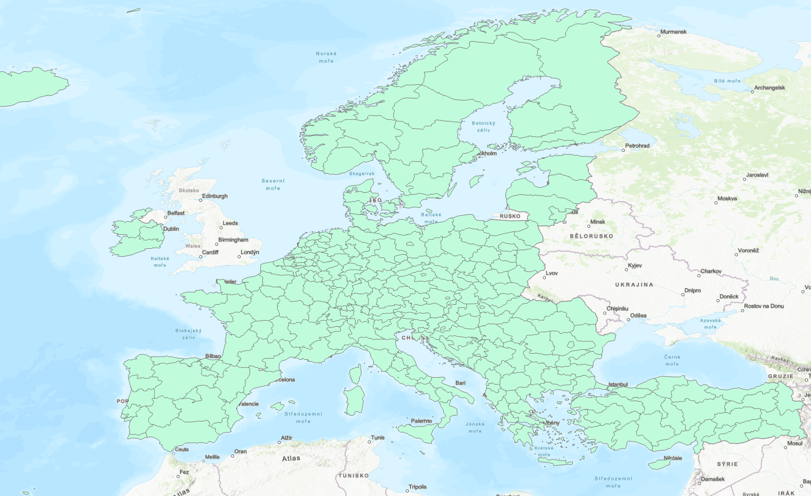
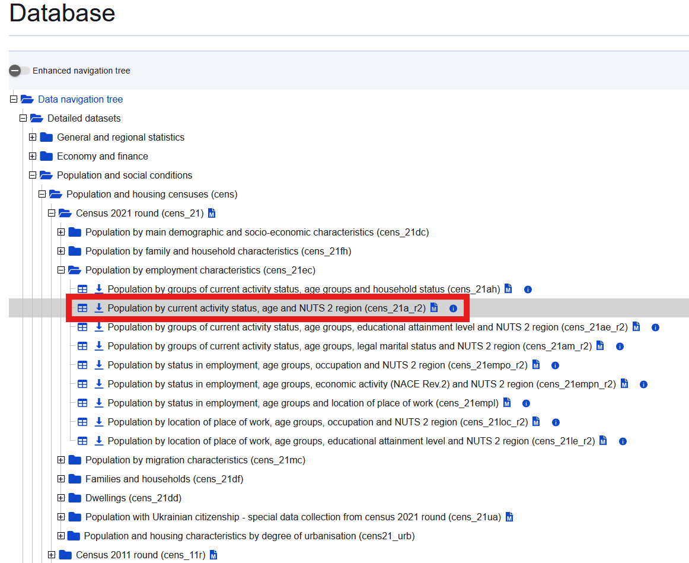
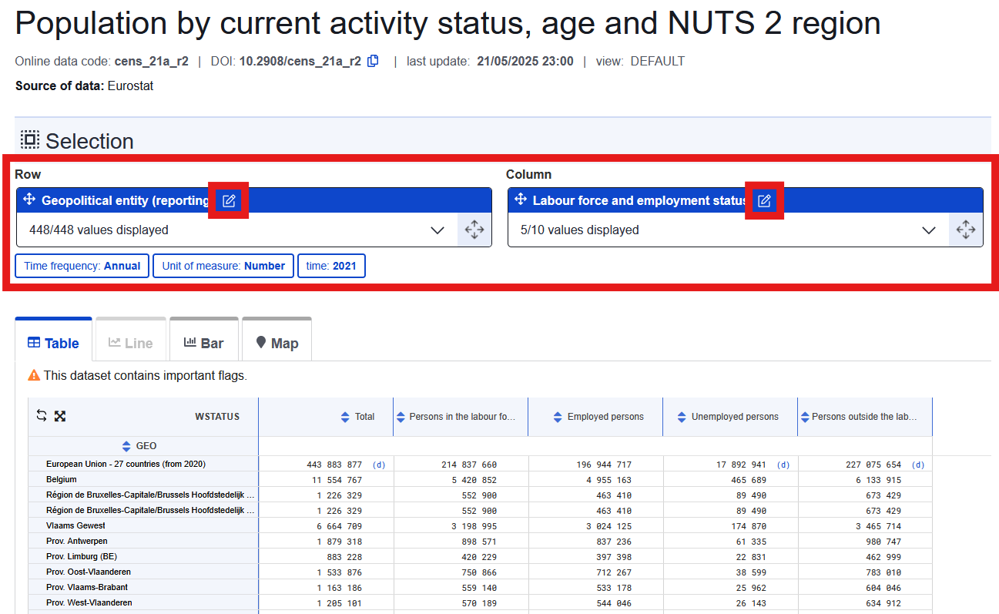
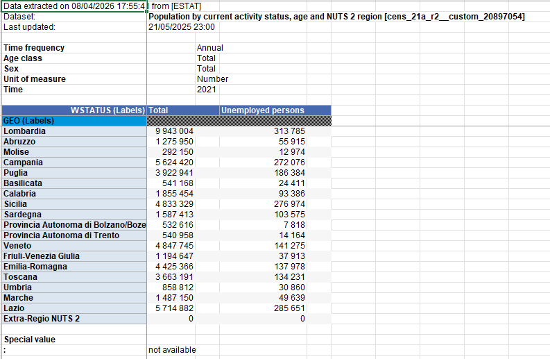
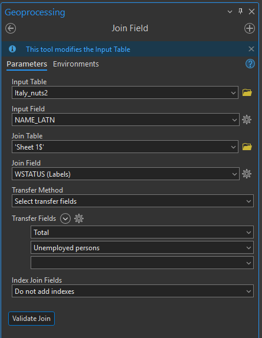

Cílem tohoto cvičení je tvorba mapové aplikace vytvořené pomocí knihovny Leaflet, ve které budou zobrazeny vybrané vrstvy pro určitou zemi Evropské unie. V tomto příkladu budeme pracovat s daty pro Itálii, nicméně postup je obdobný pro další členské státy.

## Nalezení vhodných dat a jejich příprava pro zobrazení na webu
V prvním kroku musíme najít vhodná data, která bychom chtěli vizualizovat v mapové aplikaci. 

!!! info "&nbsp;<span>Příprava dat</span>"

    Velká část volně dostupných prostorových dat o členských státech EU je k dispozici ze stránek [Eurostatu](https://ec.europa.eu/eurostat) (statistický úřad Evropské unie). Tento úřad poskytuje validované **statistické údaje ve standardizovaných formátech**.

    Vzhledem k tomu, že datasety bývají rozdělené podle zaměření sledovaných jevů, bude nutné data pro webovou aplikaci spojit, protřídit a případně upravit v GIS.

### 1) Získání hranic regionů NUTS2
Jednou ze zbrazených vrstev budou regiony NUTS2 pro vybraný stát. Jedná se o rozdělení států na menší správní celky, které jsou vzájemně porovnatelné napříč členskými státy. NUTS2 jednotky mohou mít v různých státech však jiné významy. Například Česko se takto dělí na sdružení krajů (Jihozápad = Jihočeský + Plzeňský, Severozápad = Karlovarský + Ústecký atd.), ale pro větší země se zpravidla jedná o rozdělení na reálné správní obvody. Pro území Itálie se jedná o historické regiony. 

Stažení hranic regionů NUTS2 v různých souřadnicových systémech, měřítkách či typech geometrie je možné přímo z webu Eurosatu.

[:material-layers-plus: Stažení regionů NUTS2](https://gisco-services.ec.europa.eu/distribution/v2/nuts/nuts-2024-files.html){ .md-button .md-button--primary .center}
    {: .button_array}

Pro lepší orientaci v různých vrstvách mohou pomoci tyto vysvětlující tabulky: 

**1. Typ geometrie**

| Kód | Význam | Typ geometrie |
|-----|----------|-------------|
| **RG** | **Region** | **Polygon** |
| **BN** | Boundary | Linie – pouze hranice mezi státy |
| **LB** | Label | Body – těžiště zemí |

**2. Měřítko**


| Kód | Měřítko | Využití |
|-----|---------|-----------------|
| **01M** | 1 : 1 000 000 | Velký detail |
| **03M** | 1 : 3 000 000 | Střední detail |
| **10M** | **1 : 10 000 000** | **Mapa jednoho státu v okně prohlížeče** |
| **20M** | 1 : 20 000 000 | Mapa celé EU |
| **60M** | 1 : 60 000 000 | Přehledová mapa světa |

**3. Souřadnicový systém**

| Kód EPSG | Název | Použití |
|----------|-------|------------|
| **4326** | **WGS 84 (lat/lon)** | **Webové mapy** |
| **3857** | Web Mercator | Google Maps, OpenStreetMap |
| **3035** | ETRS89-LAEA | Evropské tematické mapy, zachovává plochy |

**4. Varianta hranic**

Týká se pouze vrstev **BN** (hranice).

| Varianta | Obsah |
|----------|-------|
| **(bez přípony)** | **Všechny hranice dohromady** |
| **COASTL** | Pouze pobřežní hranice |
| **INLAND** | Pouze pozemní hranice mezi státy |

Data budeme upravovat v GISu, tudíž není nutné v tuto chvíli stahovat přímo formát GeoJSON, ale lze stáhnout například i Shapefile (SHP). Pro naše účely však využijeme data regionů (RB), v měřítku 10M, souřadnicovém systému 4326, se všemi hranicemi a pro NUTS2. Hledaný soubor bude mít název **NUTS_RG_10M_2024_4326_LEVL_2**. 

Stažená data regionů NUTS2 otevřeme v GIS a zobrazíme v mapě. Jestliže jsme data stáhli v GeoJSONu, bude nutné pro import použít funkci [JSON to Features](https://pro.arcgis.com/en/pro-app/latest/tool-reference/conversion/json-to-features.htm).

<figure markdown>
{width=800}
    <figcaption>Zobrazení NUTS2 v ArcGIS Pro.</figcaption> 
</figure>

Pomocí funkce Select by Attributes si vyfiltrujeme data pouze pro vybranou zemi, které vyexportujeme do samostatné vrstvy. 

### 2) Získání dat o nezaměstnanosti a propojení obou datasetů
Ze [statistického portálu Eurostat](https://ec.europa.eu/eurostat/databrowser/explore/all/all_themes) si stáhneme data o nezaměstnanosti za jednotlivé regiony NUTS2. V kompletní databázi je však musíme nejdříve najít. Nacházejí se v sekci *Population and social conditions* ->  *Population and housing censuses* ->  *Census 2021 round* -> *Population by employment characteristics*. Jedná se o tabulku s názvem [**Population by current activity status, age and NUTS 2 region**](https://doi.org/10.2908/CENS_21A_R2). Tabulku otevřeme kliknutím na ikonu tabulky. Před stažením si data profiltrujeme.

<figure markdown>
{width=600}
    <figcaption>Nazelení tabulky s údaji o zaměstanosti.</figcaption> 
</figure>

V základním zobrazení data obsahují údaje pro různé státy i regiony v EU. Musíme nejdříve profiltrovat sloupce a řádky, abychom dostali požadovaný dataset. 

<figure markdown>
{width=800}
    <figcaption>Filtrování tabulky.</figcaption> 
</figure>

Uvnitř filtrace dat nejprve odškrtneme veškerý výběr tlačítkem *Unselect All*. Následně vybereme pouze horní záložku *NUTS 2 regions*, kterou ještě protřídíme kliknutím na ikonu filtru přímo vpravo od ní. Po rozbalení filtru se zobrazí možnost výběru země na základě jejího kódu, který zaklikneme. Jestliže kód neznáme, zjistíme ho z náhledu dat z předchozího kroku v ArcGISu. Pro tuto ukázku tedy volíme *IT* pro Itálii. Tím se zobrazí pouze italské regiony, které tlačítkem *Sellect All* všechny vybereme. Výběr uložíme vpravo dole tlačítkem *Save and go to data view*.

Filtraci sloupců provedeme obdobně, přičemž ve výběru zaškrtneme pouze atributy *Total* (celková populace) a *Unemployed persons* (nezaměstnaní). Opět uložíme tlačítkem *Save and go to data view*.

Takto připravená data můžeme nyní tlačítkem *Download* stáhnout. Výstupní formát zvolíme *.xlsx* a *Data Scope - All selected dimensions*. Ve výběru pak všechny čtyři možnosti odškrtneme, nechceme ani jednu z nich. 

<figure markdown>
{width=600}
    <figcaption>Náhled na stažená data.</figcaption> 
</figure>

Z tabulky odstaníme v Excelu přebytečné řádky a přidáme ji do ArcGISu. Pomocí funkce [Join Field](https://pro.arcgis.com/en/pro-app/latest/tool-reference/data-management/join-field.htm) ji připojíme k připraveným regionům dle obrázku níže. Regiony následně vyexportujeme do GeoJSONu funkcí [Feature to JSON](https://pro.arcgis.com/en/pro-app/latest/tool-reference/conversion/features-to-json.htm).

<figure markdown>
{width=400}
    <figcaption>Připojení dat z Eurostatu.</figcaption> 
</figure>

### 3) Zobrazení hranic regionů v mapě
Závěrem si regiony zobrazíme v mapě v jednoduché Leaflet aplikaci, která bude zabírat celou stránku.

<figure markdown>
{width=1000}
    <figcaption>Zobrazení regionů NUTS2 v mapě.</figcaption> 
</figure>

??? note "&nbsp;<span style="color:#448aff">Stav kódu po kroku 3) Zobrazení hranic regionů v mapě</span>"

    === "index.html"

        ``` html
        <!DOCTYPE html> 
        <html> 
        <head> 
            <meta charset="UTF-8"> 
            <meta name="viewport" content="width=device-width, initial-scale=1.0">
            <link rel="stylesheet" href="style.css">
            <script src="Italy_regions.js"></script>

            <!-- Externí připojení CSS symbologie Leaflet-->
            <link rel="stylesheet" href="https://unpkg.com/leaflet@1.9.4/dist/leaflet.css"
            integrity="sha256-p4NxAoJBhIIN+hmNHrzRCf9tD/miZyoHS5obTRR9BMY="
            crossorigin=""/>

            <!-- Externí připojení JS knihovny -> vložit až po připojení CSS souboru -->
            <script src="https://unpkg.com/leaflet@1.9.4/dist/leaflet.js"
            integrity="sha256-20nQCchB9co0qIjJZRGuk2/Z9VM+kNiyxNV1lvTlZBo="
            crossorigin=""></script>

            <title>Mapa Itálie</title> 
        </head>
        <body> 

            <div id="map"></div>
            <script src="script.js"></script>

        </body>
        </html>
        ```


    === "script.js"

        ``` js
        // Nastavení mapy, jejího středu a úrovně přiblížení
        var map = L.map('map');

        // Určení podkladové mapy, maximální úrovně přiblížení a zdroje dat
        L.tileLayer('https://tile.openstreetmap.org/{z}/{x}/{y}.png', {
            maxZoom: 19,
            attribution: '&copy; <a href="http://www.openstreetmap.org/copyright">OpenStreetMap</a>'
        }).addTo(map);

        // Načtení GeoJSONu s polygony ORP do mapy
        var reg = L.geoJSON(regions).addTo(map);    

        // Nastavení automatického určení výžezu mapového okna
        map.fitBounds(reg.getBounds());
        ```


    === "style.css"

        ``` css
        * {
            margin: 0;
            padding: 0;
            box-sizing: border-box;
        }

        html, body {
            height: 100%;
            width: 100%;
        }

        /* Velikost mapového okna */
        #map {
            height: 100%;
            width: 100%;
        }
        ```

### 4) Vyhledávání regionu pomocí pluginu

!!! info "&nbsp;<span>Pluginy v Leafletu</span>"

    Leaflet je záměrně odlehčená knihovna – obsahuje pouze základ pro zobrazení mapy a práci s vrstvami. Vše ostatní je řešeno pluginy, což jsou samostatné JavaScriptové soubory, které rozšiřují objekt ```L``` o nové funkce nebo ovládací prvky. Seznam pluginů je zde: [https://leafletjs.com/plugins.html](https://leafletjs.com/plugins.html).

    Mezi používané a zajímavé pluginy patří například tyto:

    - animace trasy: [https://github.com/Igor-Vladyka/leaflet.motion](https://github.com/Igor-Vladyka/leaflet.motion)

    - shlukování bodů: [https://github.com/Leaflet/Leaflet.markercluster](https://github.com/Leaflet/Leaflet.markercluster)
    
    - pokročilejší zobrazení georeferencovaných rastrů: [https://github.com/IvanSanchez/Leaflet.ImageOverlay.Rotated](https://github.com/IvanSanchez/Leaflet.ImageOverlay.Rotated)

Pro přidání vyhledávacího okna budeme využívat plugin [Leaflet-search](https://github.com/stefanocudini/leaflet-search).

Nejprve musíme plugin a jeho CSS soubor připojit do hlavičky ```index.html```. Pořadí připojených souborů je následující: Leaflet CSS, Leaflet-search CSS, Leaflet JS, Leaflet-search JS.

=== "index.html"
```html
<head> 
    <meta charset="UTF-8"> 
    <meta name="viewport" content="width=device-width, initial-scale=1.0">
    <link rel="stylesheet" href="style.css">
    <script src="Italy_regions.js"></script>

    <!-- Externí připojení CSS symbologie Leaflet-->
    <link rel="stylesheet" href="https://unpkg.com/leaflet@1.9.4/dist/leaflet.css"
    integrity="sha256-p4NxAoJBhIIN+hmNHrzRCf9tD/miZyoHS5obTRR9BMY="
    crossorigin=""/>

    <!-- Leaflet-search CSS symbologie-->
    <link rel="stylesheet" href="https://cdn.jsdelivr.net/npm/leaflet-search@3.0.9/dist/leaflet-search.min.css"/>

    <!-- Externí připojení JS knihovny -> vložit až po připojení CSS souboru -->
    <script src="https://unpkg.com/leaflet@1.9.4/dist/leaflet.js"
    integrity="sha256-20nQCchB9co0qIjJZRGuk2/Z9VM+kNiyxNV1lvTlZBo="
    crossorigin=""></script>

    <!-- Leaflet Search JS -->
    <script src="https://cdn.jsdelivr.net/npm/leaflet-search@3.0.9/dist/leaflet-search.min.js"></script>

    <title>Mapa Itálie</title> 
</head>

```

Na konec ```script.js``` pak zapíšeme inicializaci pluginu včetně přidání vyhledávací ikony do mapy a přiblížení na vyhledaný region.

=== "script.js"
```js
// Inicializace pluginu Leaflet-search
var searchControl = new L.Control.Search({
    layer:           reg,           // Mapová vrstva, ve které se hledá
    propertyName:    'NAME_LATN',  // Atribut podle kterého se hledá
    marker:          false,         // Nezobrazovat marker na vyhledaném místě
    autoCollapse:    true,          // Sbalit vyhledávací pole po výběru
    textPlaceholder: 'Hledat region...'
});

// Přidání vyhledávání do mapy
map.addControl(searchControl);

// Po nalezení regionu – přiblížení na jeho plochu
searchControl.on('search:locationfound', function(e) {
    map.flyToBounds(e.layer.getBounds(), {
        duration: 0.8,
        padding:  [40, 40]
    });
});
```

<figure markdown>
{width=800}
    <figcaption>Vyhledávání v datech.</figcaption> 
</figure>


!!! warning "Domácí úkol"
    Pro vybranou zemi vytvořte mapovou aplikaci v Leaflet, která bude obsahovat následující:

    - kartodiagram zobrazující podíl nezaměstnanosti + legendu

    - kartodiagram zobrazující celkový počet obyvatel v regionech (nutno převést na bodovou vrstvu v GIS) + legendu

    - 3 různé podkladové mapy

    - přepínání vrstev a podkladových map

    - upravené vyhledávání, které vyhledaný polygon zvýrazní

    - přidaný plugin [easyPrint](https://github.com/rowanwins/leaflet-easyPrint) pro tisk mapového okna


    Zip celé složky s aplikací zašlete na **frantisek.muzik@fsv.cvut.cz** do **neděle 19.4.**


